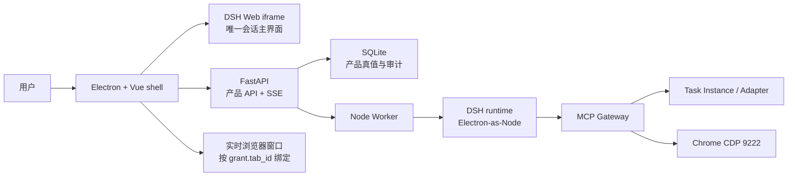

# Crawshrimp Harness / 抓虾智能体

Crawshrimp Harness 把抓虾桌面应用与 DeepSeek Harness（DSH）组合成一个本地优先的电商运营智能体。DSH Web 会话是唯一主界面；抓虾提供任务、Adapter、文件、浏览器 CDP、媒体、审批和审计能力。

本仓库是独立的 Harness 开发线，不是上游 `crawshrimp` 发布仓的 README 镜像。DSH 依赖族精确锁定在 `@deepseek-ai/*@0.1.0-rc.8`，升级时必须重新验证协议、插件和 hash 类名。

## 当前形态

- Electron 43.1.0 主进程启动 FastAPI、托管 Chrome 和 Node Worker。
- FastAPI 默认监听 `127.0.0.1:18765`；冲突时在 `+1..+100` 内漂移。
- MCP 网关使用 `API + 200`；DSH Web host 使用 `API + 300`，并按 `window.__DSH_BOOT__` 特征回查真实端口。
- Vite 开发服务器默认 `5173`；Electron 调试 CDP 为 `9223`；托管 Chrome CDP 为 `9222`。
- SQLite 保存产品投影和审计，DSH JSONL 保存模型会话真值。
- macOS arm64/x64 可构建；Windows unpacked 可在 macOS 验证，NSIS 安装器应在 Windows 构建机生成。

## 版本记录

### v0.1.2

- 修复 DSH composer 的 `📎` 附件与 `@` 命令 hover 标签：附件标签在深色主题中保持可读，命令标签只在 hover/focus 时显示，不再常驻或错位到附件按钮。
- 稳定 DSH 左侧注入菜单：展开全部时复用已有 DOM，只追加或移除必要按钮，避免整组重建造成侧栏闪烁。
- 去掉自定义菜单项入场动画，降低 DSH 原生会话列表刷新或展开时触发整栏闪一下的概率。
- 补充合同测试，锁定 tooltip、菜单 DOM 复用和无入场动画的行为。

### v0.1.1

- 升级桌面应用版本号到 `0.1.1`，用于承接 DSH rc.8 集成后的桌面构建。

### v0.1.0

- 首个独立 Harness 桌面版本，提供 macOS Apple Silicon / Intel 与 Windows x64 构建产物。
- 独立仓库发布，不发布到主抓虾项目的 Cloudflare R2 更新源。



## 产品约束

这些规则属于当前产品合同，维护时不要退回旧实现：

1. DSH Web 会话 iframe 常驻全幅；抓虾菜单注入会话侧边栏，其他页面显示为右侧 overlay，脚本详情是独立二级页面。
2. DSH 会话权限是审批真值。策略为 `never` 时抓虾侧自动批准并保留审计；策略为 `ask` 时使用 DSH 原生审批卡，不自造审批浮层。
3. `fs_read` / `fs_list` 全盘只读免审批；`browser_navigate` 自动执行不审批；`fs_write`、`fs_exec` 和风险任务受 DSH 权限策略控制。
4. 简单下载、找图、找款类任务自动批准，但上传、发布、删除和修改类任务不因名字相近而放行。
5. 智能体创建的脚本必须是抓虾 Adapter 包：`manifest.yaml` + 页面 JavaScript async IIFE，外层返回 `{ success, data, meta }`。草稿、隔离测试和发布三道入口都会拒绝不合规内容。
6. 图片、视频和附件出现在 DSH 消息流末尾；上传入口是 composer 原生加号改造的 `📎`，旁边保留 `@` 命令按钮。
7. 实时浏览器只聚合当前会话各 run 已绑定且仍存活的 `grant.tab_id`，一个页面一个窗口；活跃窗口置顶，页面关闭后自动清理。

## 权限与审批

| 操作 | 默认行为 |
| --- | --- |
| 本机文件/目录读取 | 全盘只读，免审批 |
| 写文件、执行命令 | 服从当前 DSH 会话权限；`ask` 显示原生卡，`never` 自动批准 |
| 浏览器观察、验证、请求捕获 | 已绑定 tab 内执行 |
| 浏览器导航 | 任意 `http(s)`；自动执行，不触发额外审批 |
| 凭证字段输入 | 默认阻断；用户明确授权并给出指令后可由智能体填写，审计记录脱敏 |
| 提交、上传、发布、支付、删除等点击 | 原生审批卡 |
| 简单下载、找图、找款 | 自动批准，审计保留 |

审批等待使用独立有界 executor，不占用 asyncio 默认线程池。DSH Web 多会话通过 runtime-session → run 映射和 MCP context lease 绑定，未知会话不会回退到“最近一次运行”。审批通过后更新的 grant 会在 lease 释放前写回 run 级缓存，因此下一次工具调用不会恢复旧授权。跨会话审批提示以 SQLite pending 列表定时校准，终态、后端重启或 SSE 中断都不会留下幽灵卡片。

## Adapter 创作与发布

最小包结构：

```text
my-adapter/
├── manifest.yaml
└── collect.js
```

页面脚本示例：

```js
;(async () => {
  const params = window.__CRAWSHRIMP_PARAMS__ || {}
  const data = [{ query: params.query || '', title: document.title }]
  return {
    success: true,
    data,
    meta: { has_more: false },
  }
})()
```

发布链路：

```text
创建完整 Adapter 草稿
  → 合同与 manifest schema 校验
  → DSH 原生发布审批
  → 安装到 review-<hash> 隔离命名空间
  → 在正式 TaskRunner 中真实测试
  → 测试后包哈希锁定
  → 人工批准发布
  → 正式 Adapter 事务安装 / 失败回滚
```

隔离测试不会覆盖同名生产 Adapter。首次智能体发布前会保存长期基线；清除智能体数据时恢复用户原包，原本不存在的 Adapter 才卸载。

## 附件与媒体

- 上传文件硬上限：200 MB；复制采用 1 MB 流式分块，并在复制过程中再次检查大小。
- `attachment_read` 解析上限：50 MB；附件只能被所属会话读取。
- 模型图片：PNG、JPEG、WebP、GIF；单张最多 8 MB，每轮最多 5 张。
- Excel：单文件 50 MB、解压后 256 MB、最多 10,000 个 ZIP 条目、32 个 sheet、100,000 行、512 列、2,000,000 个 cell。
- ZIP 媒体预览：单条目解压上限 64 MB；图片清单最多 20 条。
- 可执行安装文件按扩展名和 magic bytes 拒绝。

媒体 URL 不包含主 API token。前端先用认证 header 申请短期 HMAC capability；签名绑定 HTTP route、规范化文件路径、ZIP entry 和过期时间，只能读取 `/agent/artifacts/file` 或 `/agent/artifacts/entry`。

## 安全边界

- 本地 API 仅监听 loopback，默认要求 `X-Crawshrimp-Token`。
- token 从当前运行数据目录的 `api-token` 读取；不要把值写入文档、URL、命令历史、截图或 Git。
- preload 和开发 bridge 只允许访问 `127.0.0.1` / `localhost` 的 `18765..18865`，且不接受 query token。
- 浏览器观察会隐藏 password 及 name/id/autocomplete 命中凭证特征的输入值；网络请求 URL、body、审批摘要和工具结果都会脱敏。
- 仓库工具仅接受可解析为公网地址的 HTTP(S) Git URL，执行前重新解析并固定已验证 IP；仓库名只能是单个安全目录段。
- 第三方 README、源码和注释一律按不可信资料处理，不提升为系统或技能指令。

## 开发环境

要求：

- macOS 或 Windows
- Python 3.10+
- Node.js `^22.19.0 || >=24.0.0`
- Chrome

安装：

```bash
python3 -m venv venv
venv/bin/pip install -r core/requirements.txt
npm --prefix integrations/deepseek-harness ci
npm --prefix app ci
```

启动两个终端：

```bash
# 终端 1：FastAPI
bash dev.sh

# 终端 2：Vite + Electron
npm --prefix app run dev
```

`dev.sh` 会从运行数据目录读取或创建 API token，但不会打印其值。需要手工 curl 时，在 shell 变量中读取 token 并使用 `X-Crawshrimp-Token` header；不要回显变量。

数据目录默认由 `core.runtime_paths` 解析，常见位置为 `~/.crawshrimp`，也可用 `CRAWSHRIMP_DATA=/absolute/path` 显式指定。主要内容：

```text
crawshrimp.db
config.json
api-token
adapters/
agent/
├── attachments/
├── workspace/
├── harness-sessions/
├── runtime-workdir/
└── published-baselines/
```

## 验证

```bash
# Python 全量回归
venv/bin/python -m pytest tests/ -q

# Electron / renderer / 构建脚本测试
npm --prefix app test

# 前端生产构建
npm --prefix app run vite:build

# DSH 生产闭包 staging + Electron-as-Node boot check
npm --prefix app run stage:harness

# 空白与补丁检查
git diff --check
```

真实交付还需要：

- 从当前数据目录读取 token 后 curl 验证 `/health`、`/agent/runtime`、SSE cursor、媒体签名、附件会话绑定和脚本隔离测试。
- 用 Electron CDP `9223` 检查主 frame 与 DSH iframe；iframe 重载后必须重新创建 isolated world/context。
- 检查 DSH iframe 常驻、菜单注入、`📎` / `@`、媒体消息流、跨会话隔离、审批策略和 tab 窗口清理。

## 构建

```bash
# 仅 Vite
npm --prefix app run vite:build

# staging DSH + macOS 双架构安装包
npm --prefix app run build:mac:ci

# Windows（NSIS 推荐在 Windows 构建机运行）
npm --prefix app run build:win
```

`stage-runtime.mjs` 使用独立 `package-lock.json` 生成生产依赖闭包，并执行禁用能力检查与 Electron-as-Node boot check。不要把开发期 `.spike-*`、运行数据、token 或构建缓存提交到 Git。

## 桌面自动更新

独立仓库 `howtimeschange/crawshrimp-harness` 的正式客户端使用 GitHub Release 元数据用于应用内更新。本仓构建不发布到 `https://updates.crawshrimp.com/`，也不刷新主项目的 `desktop-latest`。

升级不需要卸载旧版：

- Windows 使用 NSIS 在原安装路径就地更新；未签名构建可能显示 `Unknown Publisher`。
- macOS 的应用内更新使用 ZIP/ShipIt；DMG 只用于首次安装、覆盖安装或应用内更新失败后的手动 fallback。
- 运行数据、Chrome profile、任务缓存和配置保存在系统用户数据目录，应用替换不会删除这些内容。
- 普通退出不会偷偷安装；下载完成后由用户点击 `重启安装` 才进入安装流程。

主界面把更新动作放在标题栏。进入具体脚本视图后，侧边栏保持展开，侧边栏底部默认只显示当前版本；只有检测到可用更新时才显示 `更新`。

## 目录

```text
app/                              Electron main、preload、Vue shell
core/agent/                       DSH 产品编排、MCP、SQLite、CDP、合同
integrations/deepseek-harness/    锁版 runtime、Worker、host/client 插件、skills
adapters/                         内置抓虾 Adapter
tests/                            Python 回归与安全/运行时合同测试
docs/crawshrimp-harness/          提案、交付、媒体和维护交接
SPEC.md                           v1 规范与 v2 Harness 增补
```

## 维护文档

- [交接与 code review 结论](docs/crawshrimp-harness/04-codex-handover.md)
- [会话内媒体实现与踩坑](docs/crawshrimp-harness/03-media-in-chat-handover.md)
- [交付能力与验证证据](docs/crawshrimp-harness/02-delivery.md)
- [DSH Agent v2 提案与实现落账](docs/crawshrimp-harness/01-dsh-agent-v2-proposal.md)
- [产品规范](SPEC.md)

## License

[Apache-2.0](LICENSE)。版权与第三方声明见 [NOTICE](NOTICE)。
