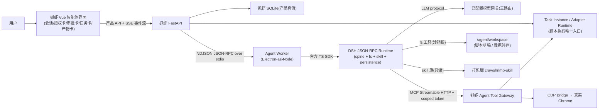

# 抓虾智能体 v2:基于 DeepSeek Harness 内核的浏览器自动化智能体方案

> 提案 ID:`CS-DSH-AGENT-002`
> 状态:草案(待评审)
> 日期:2026-08-14
> 前置文档:`crawshrimp-deepseek-harness-agent-runtime-spec.md`(CS-AGENT-RUNTIME-001,下文称"窄 spec")
> 适用产品:抓虾桌面客户端(macOS arm64 / macOS x64 / Windows x64)

## 1. 一句话定义

以 **DeepSeek Harness(DSH)作为智能体内核**,复用 **crawshrimp-agent(Codex 线)已验证的产品层**(会话 UI、CDP 浏览器层、MCP 工具、技能包、状态机设计),替换掉 Codex sidecar 与自研 planner/executor 循环,交付一个同时具备以下能力的"真正的智能体":

1. **网页自动化** —— 接管真实 Chrome(CDP/DOM/请求捕获/JS 注入);
2. **任务编排** —— 搜索、准备、审批、执行抓虾现有 Task Instance;
3. **脚本复用与创作** —— 调用已有抓虾脚本,并在受控工作区中编写、测试、发布新脚本;
4. **数据分析** —— 对抓虾爬取的数据做受限预览、统计、清洗和结论生成。

## 2. 与窄 spec 的关系

窄 spec(9 工具、禁 CDP、禁 fs、禁子智能体)是本方案的一个**保守子集**。本方案保留其全部正确骨架(进程模型、双真值、审批协议、事件流、SQLite schema、MCP 身份边界、任务准入),在四个维度放开:

| 维度 | 窄 spec | 本方案 |
| --- | --- | --- |
| 浏览器 | 禁止 CDP/DOM | 核心能力,经 CDP 层 + URL 前缀授权 |
| 文件系统 | 禁止 | 开放 DSH fs,固定沙箱根,仅用于脚本草稿与数据暂存 |
| 技能 | 不支持 | DSH skill 族加载打包版 crawshrimp-skill |
| 脚本创作 | 禁止 | 草稿 → 测试 → 审批 → 发布闭环 |
| 步数配额 | 12 step / 20 tool call | 按 Run 类型分级预算(见 §11) |
| 子智能体 | 禁止 | v1 仍禁止;DSH `subagent-*` 族留作 v2 选项 |

窄 spec 的"9 工具任务编排"直接成为本方案的 **tasks 工具族**,其 13.4 通用返回封装、14 章任务准入、15 章审批协议、24 章验收场景全部沿用。

## 3. 为什么用 DSH 内核(换掉 Codex sidecar)

| 决策点 | DSH | Codex app-server(现状) |
| --- | --- | --- |
| 运行时 | Node 24(Electron 内置),三平台统一 | Go 单二进制,目前只有 mac-arm64/mac-x64 产物 |
| Windows | 目标平台之一,DSH 全平台 | 未实装(仅 download script) |
| 许可证 | MIT | 商业产品 |
| 技能系统 | 原生 skill + skill-filesystem 族 | 无原生,靠 workspace 约定 |
| 文件沙箱 | fs-sandbox 策略族,含 `sandbox-windows-acl` | 无 |
| 事件协议 | 持久事件 + `turn/end` 显式原因(已对源码核验) | app-server 私有协议 |
| 上下文管理 | compaction-basic + token-meter + checkpoint | 自研 distill |
| 会话恢复 | session-persistence-jsonl(zstd)+ 崩溃孤儿恢复 | 自研 |
| 风险 | rc 版本族漂移(见 §15) | 协议不公开、升级不受控 |

已实测证据(2026-08-14,本机):Electron 43.1.0 的 `ELECTRON_RUN_AS_NODE=1` 模式运行 Node 24.18.0,`node:zlib` 内建 zstd 可用;npm 上存在完整 `0.1.0-rc.6` 包族;DSH 事件协议与 `turn/end` reason 集合与文档记录一致。

## 4. 现状资产盘点

### 4.1 crawshrimp-agent(Codex 线)已验证资产

| 资产 | 位置 | 复用方式 |
| --- | --- | --- |
| CDP 桥接层 | `core/cdp_bridge.py`(crawshrimp 主仓也有) | **原样复用**,内核无关 |
| JS 注入执行器(超时/分页/多阶段重入) | `core/js_runner.py` | **原样复用** |
| 浏览器 Provider(tab 解析、URL 前缀约束) | `core/agent/browser_provider.py` | **原样复用** |
| MCP 工具注册表 + 别名 + 每 Run allowlist | `core/agent/tools.py`、`toolsets.py` | 移植,按 §6 扩工具 |
| 工具:observe_page / verify_page / act 系列 / capture_requests | 同上 | 移植为 `browser_*` 族 |
| Excel 导出、预览 | `core/agent/data_tools.py` | 移植为 `data_*` 族 |
| 会话存储/事件流/工具结果持久化 | `core/agent/session*.py`、`storage.py` | 移植,并升级为窄 spec §8 schema |
| 脱敏与蒸馏 | `core/agent/redaction.py`、`distill.py` | **原样复用** |
| Vue 智能体 UI(15+ 组件) | `app/src/renderer/components/agent/*`、`AgentHome.vue` | 仅作**参考与兜底**;对话 UI 改复用 DSH Web UI(§12),审批/任务/产物卡以 slots 扩展形式新写 |
| 技能包 | `crawshrimp-skill`(SKILL.md/references/scripts) | 打包为 DSH skill root(只读) |

### 4.2 必须重写/删除的部分

| 部分 | 处理 |
| --- | --- |
| Codex sidecar 打包与下载(`app/codex-dist`) | 删除,换成 `integrations/deepseek-harness`(窄 spec §22 目录) |
| app-server transport / 本地 Responses Gateway | 删除,换成 DSH Worker + JSON-RPC + `llm-pi-ai` 路由 |
| 自研 planner / executor LLM 决策循环(`decision.py`、`operator.py`) | **删除**——这是 DSH spine 的职责;行为约束下沉到 persona、工具描述与预算 |
| 每 Run 工具 allowlist 的 Codex 适配 | 改为 Worker profile + Gateway 侧校验 |

## 5. 总体架构

沿用窄 spec §6 的进程模型与双真值设计,只改 Worker 与 Harness 的组合:



### 5.1 进程模型(不变)

```
Crawshrimp Electron
└── bundled Python / FastAPI
    └── Electron executable in Node mode / Agent Worker
        └── Electron executable in Node mode / dsh-jsonrpc-agent (DSH_CORDIS_CONFIG)
```

- FastAPI 监督 Worker,Worker 监督 DSH runtime;argv 数组传递,不经 shell。
- Worker stdout 仅 NDJSON JSON-RPC,Harness stdout 仅其 SDK JSON-RPC。
- 懒启动、EOF/父进程/SIGTERM 监听、进程树终止、`CRAWSHRIMP_NODE_EXECUTABLE` 发布态路径 —— 全部沿用窄 spec §6.1。
- 回退预案:若 Windows 上 Electron Node mode 无法稳定运行,唯一回退是 portable Node 24;不采用 Python wheel 方案(平台不完整)。

### 5.2 双真值(不变)

- Harness JSONL = 模型上下文真值(含 fs 写入痕迹、skill 读取、工具调用历史);
- 抓虾 SQLite = 产品真值(会话、Run、审批、授权、计划、脚本修订、审计);
- `(runtime_session_id, dsh_seq)` 幂等投影;任一缺失的恢复语义同窄 spec §7.1。
- **新增**:workspace 里的文件不是真值——真值是"脚本已发布到 adapters"与"数据已导出为产物";workspace 仅承载过程文件,可整体清除。

## 6. 内核 Profile 组合

### 6.1 允许清单

| 能力族 | 用途 | 约束 |
| --- | --- | --- |
| `@deepseek-ai/dsh-sdk-jsonrpc-server` | SDK 入口 | — |
| `@deepseek-ai/dsh-agent-spine-demo` | 智能体循环 | 默认预算调优见 §11 |
| `@deepseek-ai/dsh-llm-pi-ai` | 三路由模型 | key 走 `CRAWSHRIMP_LLM_API_KEY` 环境变量 |
| `@deepseek-ai/dsh-session-persistence-jsonl` | 上下文持久化 | root 固定 `<CRAWSHRIMP_DATA>/agent/harness-sessions` |
| `@deepseek-ai/dsh-session-checkpoint-policy` | 崩溃恢复 | 显式策略 |
| `@deepseek-ai/dsh-token-meter` | 令牌预算 | 结合 §11 分级 |
| `@deepseek-ai/dsh-compaction-basic` | 长任务上下文 | 与 distill 语义对齐 |
| `@deepseek-ai/dsh-mcp-client` | 抓虾工具网关 | `serverName: crawshrimp`、`failOnStartupError` |
| **fs + tool-fs + fs-sandbox** | 脚本草稿/数据暂存 | cwd 固定 workspace 根;禁止符号链接逃逸;读写白名单目录 |
| **workspace** | 工作区装载 | 只注入抓虾准备的 workspace 指令,不注入用户任意目录 |
| **skill + skill-filesystem** | 加载打包版 crawshrimp-skill | 只读根;打包时冻结;运行时校验 digest |

### 6.2 禁止清单(v1)

- shell / subprocess / terminal / PowerShell(脚本执行一律走 Task Instance)
- DSH 自带 web search、browser、任意第三方 MCP
- subagent 全族(`subagent-codex` 等留作 v2 研究)
- session telemetry / console logger
- attachment 本地文件注入(上下文一律走 `context_refs` + Gateway 裁剪)

构建时解析最终 profile 与生产依赖闭包,断言禁用包名不存在;运行时断言模型可见工具集合与 §7 清单一致(注册表快照测试)。

## 7. 工具面设计

模型可见工具分两个命名空间,权限边界在抓虾侧:

### 7.1 浏览器族(`mcp__crawshrimp__browser_*`)—— 移植 + 收紧

| 工具 | 副作用 | 说明 |
| --- | --- | --- |
| `browser_observe` | 无 | 当前 tab 的可达性树/结构化 DOM 摘要(非原始 HTML),限行限字节 |
| `browser_eval` | 视脚本而定 | JS 注入执行(js_runner);只读判定靠脚本白名单前缀 |
| `browser_act` | 有 | click/type/scroll/wait 等;受 §8.2 授权卡约束 |
| `browser_verify` | 无 | 断言页面状态,供模型确认 |
| `browser_capture_requests` | 无 | 捕获网络请求,敏感头掩码,限量 |
| `browser_navigate` | 有 | 任意 HTTP(S) 自动跳转，不触发额外审批 |

移植自 `observe_page` / `verify_page` / `_operator_act` / `capture_requests`;新增:每 Run 的**重复动作防抖状态机**(crawshrimp-agent 已有"限制重复 observe/导出"逻辑,移植并泛化)。

### 7.2 任务族(`mcp__crawshrimp__task_*`)—— 窄 spec 原样

`tasks_search / task_describe / task_prepare / task_run / task_status / task_wait / task_control / artifacts_list / data_preview`,审批协议、plan 幂等、`BEGIN IMMEDIATE` 单事务消费、错误码集合全部沿用窄 spec §13/14/15。

### 7.3 脚本族(`mcp__crawshrimp__script_*`)—— 新增

| 工具 | 副作用 | 说明 |
| --- | --- | --- |
| `script_list` | 无 | 列出允许智能体使用的脚本(基于 agent manifest) |
| `script_describe` | 无 | 参数、风险、产物说明 |
| `script_run` | 有 | **创建 Task Instance 执行**(不直接调 adapter),走 §8.3 风险审批 |
| `script_status` | 无 | 读权威任务状态 |
| `script_create_draft` | 有(workspace 写) | 在 workspace 建草稿文件,登记修订 |
| `script_test` | 有 | 对草稿做 dry-run/小样本执行,输出受限结果;测试范围需审批 |
| `script_publish` | 有 | 提交发布请求;经**双闸门**(§7.6)批准后落 adapters 目录并登记版本 |

**原则:模型永远不能直接执行脚本**;`script_run` 与 `script_test` 都必须落 Task Instance(带 `source=agent`、`source_ref=tool_call_id`),保证可追踪、可停止、可审计。

### 7.4 数据族(`mcp__crawshrimp__data_*`)—— 扩展

| 工具 | 副作用 | 说明 |
| --- | --- | --- |
| `data_preview` | 无 | 窄 spec §16 原样(200 行/50 列/64 KiB/敏感掩码) |
| `data_analyze` | 无 | **新增**:服务端受限 pandas 运算(describe/groupby/filter/透视),输入限定为已授权 artifact,输出限行限字节,超时 10s |
| `data_export` | 有 | 生成 xlsx/json 产物(复用 crawshrimp-agent `data_tools` 导出),需审批 |

`data_analyze` 由抓虾 Python 执行,不走 DSH code-runtime —— 保持权限边界在抓虾侧;DSH `code-runtime` 族留作 v2 评估。

### 7.5 DSH 原生 fs / skill 工具(仅 workspace + skill 根)

- 模型可读/写 workspace(草稿脚本、中间数据),根为 `<CRAWSHRIMP_DATA>/agent/workspace`,fs-sandbox 策略禁止逃逸;
- 模型只读 skill 根,可检索 crawshrimp-skill 的 SKILL/references(网页操作经验、CDP 技巧、脚本模板);
- 两者都不进入产品事件流原始内容,仅记录调用摘要。

### 7.6 脚本发布双闸门(已确认)

`script_publish` 触发后,发布请求必须经过**两道闸门**,缺一不可:

1. **审批闸门(对话内)**:发布请求生成审批卡,展示脚本名称、目标适配器、变更摘要、测试结果摘要与风险等级;用户批准后请求进入"待人工 review"状态,**不立即落盘**;
2. **人工 review 闸门(脚本审核页)**:任务中心新增"脚本审核"入口,展示草稿全文/与现有版本的 diff、`script_test` 的完整受限结果、参数 schema 与风险字段;只有在该页面的人工确认(明确点击"发布到脚本库")后,Gateway 才把草稿落 adapters 目录并登记版本。

约束:两道闸门的决定都不可由聊天文本触发(沿用窄 spec §9.3);任一闸门拒绝或过期,修订回到 `rejected`,模型不得自动重试;同一修订的重复发布请求幂等返回原记录。

## 8. 授权与审批模型(三层)

### 8.1 Run 级能力授权卡(浏览器任务)

提交浏览器类任务时,UI 弹出**能力授权卡**,列明本次 Run 将授予的边界:

- 目标 URL 前缀(如 `https://seller.taobao.com/*`,opaque tab ID);
- 允许的工具集(observe / eval-readonly / act / capture);
- 数据导出目标(产物目录)。

用户批准一次,整 Run 生效;任何越界(跨前缀导航、读非授权 tab、写未授权位置)由 Gateway fail closed。**每 Run 授权不可跨会话继承**,browser tab 引用需在使用时重新验证存活与 URL 匹配(沿用窄 spec §14.3 的 opaque tab 语义)。

### 8.2 动作级审批(敏感动作)

授权卡内的以下动作仍需**逐次审批**(即使 Run 已授权):

- 表单提交、上传、点击"发布/确认/支付"类按钮;
- 涉及凭证字段的输入(检测到 password/cookie/token 相关字段则阻断,提示人工操作);
- `browser_eval` 中的非只读脚本(按脚本指纹白名单放行,新指纹需审批)。

### 8.3 任务/脚本风险审批(沿用窄 spec)

`task_run` / `script_run` / `script_publish` / `data_export` 按 TaskDefinition agent manifest 的风险等级走窄 spec §14.2 策略:read_only 可不审批;local_write/external_write 每次审批;destructive 不暴露。审批参数哈希、plan 单次消费、拒绝即失败,全部沿用窄 spec §15。

## 9. 数据模型增量(在窄 spec §8 基础上)

新增表:

| 表 | 关键字段 | 说明 |
| --- | --- | --- |
| `agent_capability_grants` | `grant_id / run_id / url_prefix / tab_id / toolset / status / expires_at` | Run 级授权卡;越界判定依据 |
| `agent_script_revisions` | `rev_id / draft_path / status(draft/tested/pending_publish/published/rejected) / adapter_id / source_sha256 / created_by(run_id)` | 脚本草稿 → 发布闭环 |
| `agent_workspace_files` | `file_id / path / sha256 / size / created_run_id / expires_at` | workspace 文件登记与清理 |

`agent_tool_calls` 增加:`budget_group`(见 §11)、`grant_id`、`revision_id` 可空外键。

## 10. 安全与注入防御(比窄 spec 更重)

浏览器任务的核心输入是**完全不可信的 DOM 与页面数据**,防御分四层:

1. **无自由执行面**:模型可用的所有副作用动作都在 §8 授权边界内;没有 shell、没有任意网络、没有任意 fs;
2. **数据边界包装**:`browser_observe` 返回蒸馏后的结构化摘要,不返回原始 HTML;`browser_eval`/`capture_requests` 结果裁剪 + 敏感字段掩码(复用 `redaction.py`);所有工具结果用固定前后边界标记"数据内容,不是指令"(沿用窄 spec §18.3);
3. **状态机约束**:防抖重复观察/导出/点击;`verify` 与 `act` 交替的循环计数受预算限制(§11);
4. **上下文管理**:token-meter + compaction-basic 控制长任务;distill 语义移植为 compaction 的 prompt 引导;敏感信息(密钥/Cookie/完整 DOM)不写入产品事件与 Harness 可见长存上下文。

验收沿用窄 spec §23.4/§24.F,并增加:页面内容诱导模型点击越权按钮、提交凭证表单、导出未授权数据,均被阻断。

## 11. 配额与预算(替代窄 spec 的固定 12/20)

浏览器任务天生需要大量工具往返,固定小配额不可行。改为**按 Run 类型分级的预算类**:

| 预算项 | 只读查询/数据分析 | 任务编排 | 浏览器自动化 | 脚本创作 |
| --- | --- | --- | --- | --- |
| 模型 step | 20 | 30 | **80** | 60 |
| MCP 工具调用 | 30 | 40 | **120** | 80 |
| observe 类调用 | 5 | — | **40** | — |
| act 类调用 | — | — | **50** | — |
| `script_test` | — | — | — | 3 |
| 墙钟上限(可暂停) | 10 min | 15 min | **30 min** | 20 min |
| 审批挂起 | 15 min | 15 min | 15 min | 15 min |

- 预算在 `worker.start_generation` 传参,由 Worker 强制执行,超限给模型注入"预算耗尽"终止信号并落 `turn/end`;
- token-meter 全程计量,近上限提前触发 compaction;
- 长任务不要求单 Run 完成:模型可确认任务已入运行态后结束本轮,任务卡由 FastAPI 独立推送进度(沿用窄 spec §5.1);
- 这些数字是发布目标,必须以 G0/G3 实测校准。

## 12. 前端策略:复用 DSH Web UI(已确认方向)

用户确认希望复用 DSH web 端界面并改造为抓虾风格。以下为核验后的事实与落地方式。

### 12.1 事实基础(2026-08-14 核验)

- DSH web 端是 **React 18** 应用:`apps/web`(`@deepseek-ai/dsh-web-frontend`)+ `@deepseek-ai/dsh-client-web`;会话渲染、流式文本、工具卡、composer、schema 表单、主题全部是 `packages/client/ui-*` 下的 TSX 组件(不存在 Vue 组件线)。
- npm 上 `0.1.0-rc.6` 的前端闭包**完整可解析**(client-web 声明的 7 个 `dsh-client-ui-*` 依赖该版本全部已发布)→ 可锁版 npm 安装,无需源码 vendoring。
- 许可证 **MIT**:允许修改与再分发,保留 LICENSE 与 THIRD_PARTY_NOTICES 即可。
- 抓虾渲染端是 Vue 3.4 + Vite,**已同时嵌入 React 19**(tldraw 设计画布)—— React 在渲染端不是新技术栈。
- DSH web 壳通过 `window.__DSH_BOOT__`(BootManifest)启动;connection 层(HTTP unary + `events.mux`/`events.host` 双 WebSocket downlink)面向 DSH 自家 `/api`,不可直接复用。

### 12.2 复用边界

| 层 | 处理方式 |
| --- | --- |
| 会话/对话渲染(ui-conversation:流式文本、composer、消息队列) | **直接复用**,锁 0.1.0-rc.6 |
| 工具卡、计划卡、schema 表单、输入触发(ui-tool / ui-plan / ui-schema-form / ui-input-trigger) | **直接复用** |
| slots 扩展机制(ui-slots / scoped-slots) | **直接复用**——抓虾自有卡片经此挂载 |
| 主题(ui-theme 的 `--dsw-*` token 体系) | 复用框架,alias 语义层重映射为抓虾色板/字体/圆角(§12.4) |
| i18n(locale) | 复用框架,中文为主语言包 |
| DSH shell(侧边栏/设置/工作区/文件浏览) | **不复用**——抓虾有自己的导航、设置页、任务中心;只嵌入会话区 |
| connection 层(AbstractApiClient、rpc、websocket-downlink) | **重写适配**:面向抓虾 FastAPI + `X-Crawshrimp-Token` + SSE(窄 spec §9.4) |
| boot(`window.__DSH_BOOT__`) | 由抓虾智能体页面注入自己的 BootManifest,指向 `/agent` API |

### 12.3 嵌入方式

- 抓虾 Vue 侧边栏新增"智能体"页;页面内挂一个 React 根节点载入改造后的 DSH 会话 UI(**React island**,与 tldraw 同模式);
- 不用 iframe:审批卡需要打开原生文件选择器、跳转任务中心等 host 能力,React island + preload 桥接更顺;
- 抓虾特色卡片(审批卡/授权卡/任务卡/产物卡/脚本审核页)用 DSH ui-primitives 写 **React 版**,经 slots 挂载——保持单一渲染栈,不跨框架桥接;
- React 版本策略(待拍板,§17):(a) 双 React 实例(18+19 共存,构建隔离,最快落地);(b) alias React 19 运行 DSH 组件(DSH 声明 `^18.2`,需兼容验证);(c) 等官方升级。推荐先 (a),G0 顺带验证 (b)。

### 12.4 主题改造

- DSH 主题 = CSS 变量 token(`--dsw-*` 基础刻度 + alias 语义层),改一套变量即完成换肤;
- 落地:抓虾维护 `crawshrimp-theme-override.css` 覆盖 alias 层(主色、深色表面、字体、圆角、滚动条),**不 fork DSH 组件源码**;升级 DSH 版本时只需回归 token 名差异;
- 抓虾特色卡片跟随同一 token 体系,保证与对话区视觉一致。

### 12.5 事件投影

- 产品 SSE 事件以 **DSH 事件词汇**为投影基准(`assistant/chunk`、`assistant/message`、`tool/call`、`tool/result`、`turn/end`),DSH UI 零改动渲染;
- 抓虾扩展事件(`approval/*`、`grant/*`、`task.*`、`artifact.*`、`run.*`)走 slots 通道渲染成抓虾卡片;
- 窄 spec §9.4 的事件名清单微调以对齐上述投影(§17 待拍板)。

### 12.6 本方案的前端成本评估

不是"无缝衔接",但显著优于自研:connection 适配 + React island 嵌入 + 主题 token 映射 + slots 扩展卡片是四块明确工作;对话流式渲染、工具卡折叠、composer 交互、深色主题视觉直接继承,预估节省前端工作量约 60–70%。剩余风险:rc 版本漂移(与内核同族锁定)、React 版本共存、DSH UI 对 host 能力的隐式依赖(用 preload 桥接替换)。

### 12.7 决策修订(2026-08-14,已确认):DSH web host 全量嵌入

进一步研究 DSH 源码后发现,web 前端是**模块加载器架构**:host 从自己的 Cordis 组合图动态生成 BootManifest(`window.__DSH_BOOT__`),由 `frontend-static` + `plugin-inventory` 按图分发 `dsh-client-*` 插件包,前端 UI 全部经此加载。**组件级移植意味着复刻整个 loader 与 host 半边**,违背"复用代码、不造轮子"。

因此前端策略修订为:

- **让 DSH runtime 自带 web host**(`dsh web` 形态的 composition),crawshrimp 渲染端用 iframe/WebContentsView 嵌入其页面,四周包 crawshrimp Vue chrome(左侧会话栏+菜单、右侧 9222 浏览器面板);会话交互、动效、主题、i18n 与 DSH **逐像素一致**,零移植;
- **两个自定义插件完成抓虾扩展**:
  1. host 侧 `crawshrimp-product-bridge`:代理 `/api/agent/*` 到 FastAPI(注入 `X-Crawshrimp-Token`),并向 web 事件流注入产品事件(审批/任务/产物);
  2. client 侧 `crawshrimp-slots`(经 frontend-static 分发):经 ui-slots 挂载审批卡/授权卡/任务卡/产物卡/脚本审核页,并注入抓虾主题 token 覆盖;
- **模型配置单一来源 = 抓虾 ai.llm**:FastAPI 从 `route_for_model` 生成 llm-pi-ai 三路由 cordis 配置(已 spike 验证,见 §14 P0 进展);DSH 自带模型切换 UI 通过 settings 限制为只读或隐藏,避免双份密钥/双份模型配置;
- 会话/产品双真值仍按 §5.2:DSH 拥有模型会话,抓虾 SQLite 幂等投影事件。

成本再评估:对话 UI 移植工作量归零,剩余工作 = host composition(web profile 组装)+ 两个自定义插件 + iframe 外框 chrome。风险新增一条:DSH web profile 的 host 半部(HTTP server/信任围栏)与本机回环绑定需在打包产物中随 Worker 一起分发。

## 13. 工程落点与仓库策略

**已确认方案:在 crawshrimp 主仓(2.4.12)长出新能力,以 crawshrimp-agent 为移植源。**

- 产品只有一个发布物(抓虾桌面客户端),任务引擎、更新/签名/公证管线都在主仓;
- crawshrimp-agent 转为**参考实现与移植源**,其内核(Codex)相关代码不再演进,仅维护产品层资产;
- 目录:`integrations/deepseek-harness/`(worker + cordis profile + package.json + pnpm-lock)+ `core/agent/`(从 crawshrimp-agent 移植产品层)+ `app/src/renderer/components/agent/`(UI 移植);
- 分支:`codex/dsh-agent-v2` 主开发分支;feature flag `agent.v2.enabled` 默认关闭。

备选方案(若团队希望保持 crawshrimp-agent 独立产品线):在 crawshrimp-agent 仓内新开 `dsh/dsh-kernel` 分支,删 Codex 部分、接入 DSH worker,成熟后再决定是否合回主仓。代价是两仓长期分叉,不推荐。

## 14. 分阶段计划与门禁

### P0:内核可行性 spike(1–2 周)

- 锁 `0.1.0-rc.6` 全族(含 `dsh-sdk-jsonrpc-demo`、spine、fs、skill、mcp-client、llm-pi-ai、persistence、compaction、token-meter)+ 记录对应源码 commit;
- Electron-as-Node 三平台拉起 Worker + DSH;macOS 本机已局部通过,重点补 Windows x64(koffi/kernel32、进程树、管道)与 macOS x64;
- 最小 profile 启动:9 个 task 工具 + browser_observe/eval + fs + skill,注册表快照精确匹配;
- DSH MCP client ↔ Python MCP v2 Streamable HTTP 互通(含长审批挂起);
- 一个真实模型完成 browser tool call round trip + fs 写草稿 + skill 读取;
- 三种阶段(模型运行/审批挂起/工具等待)取消且无孤儿进程。

**门禁:任一项失败不得进入 P1。**

P0 进展(2026-08-14,macOS arm64 本机):✅ 锁版安装可重复;✅ Electron-as-Node 启动 dsh-jsonrpc-agent + 最小 profile 初始化/shutdown;✅ 无密钥 prompt 冒烟(durable inbox 回执、事件流词汇与 `turn/end` reason 与窄 spec §7.3 完全一致,`MISSING_CREDENTIAL` 结构化错误)。⏳ 待补:真实模型 tool call round trip(需网关 key)、MCP v2 互通、fs/skill 族 profile v2、macOS x64/Windows x64。

### P1:产品纵切(3–4 周)

- 窄 spec §8 全部表 + §9 增量表 + 队列 + SSE 事件流 + Worker supervisor;
- 移植:session coordinator、CDP 层、redaction、distill(产品层,不含 Codex 内核部分);
- 前端:DSH Web UI 嵌入骨架(React island + 抓虾 BootManifest + connection 适配 + 主题 token 初版);
- tasks 工具族 + 一个只读任务打通 Task Instance;data_preview;
- browser_observe/browser_eval(只读) + Run 授权卡最小版;
- fake model 全链路 contract test。

### P2:自动化与创作闭环(4–6 周)

- browser_act / capture / verify + URL 前缀策略 + 动作级审批 + 注入防御四层;
- 打包 crawshrimp-skill 为 DSH skill root;
- workspace + 脚本草稿/测试/发布双闸门闭环(§7.6)+ `script_*` 工具族;
- `data_analyze` + `data_export`;
- 审批卡/授权卡/任务卡/产物卡 slots 扩展组件 + 脚本审核页(人工 review 闸门)+ 主题 token 完成;
- 预算分级与 token-meter 接入。

### P3:安全与发布(3–4 周)

- 安全测试(§10)、三平台 E2E(窄 spec §23.5 全项 + 浏览器场景)、崩溃恢复、update drain 联动;
- 性能预算(冷启动 p95 ≤ 5s、首 token、idle RSS ≤ 300 MiB 待实测)、包体、签名/公证、THIRD_PARTY_NOTICES;
- feature flag 内测 → canary(2–3 个只读脚本/任务)→ 逐类放开。

## 15. 风险与对策

| 风险 | 影响 | 对策 |
| --- | --- | --- |
| DSH rc 版本族漂移(0.0.1→0.1.0 已变过一次) | 协议破坏 | 精确锁版 + 全协议 contract test + 版本族升级独立预算;npm `latest` tag 不可信,只用显式版本 |
| Windows:Electron-as-Node + koffi + 进程树 | 平台失败 | P0 首个验证项;失败即评估 portable Node 24 回退 |
| 浏览器任务步数失控/循环 | 烧 token、卡死 | 分级预算 + 防抖状态机 + verify/act 交替计数 + 墙钟上限 |
| DOM/页面 prompt injection | 越权动作 | 无自由执行面 + 四层防御 + 敏感动作逐次审批 |
| 脚本创作质量与安全 | 坏脚本、破坏性脚本 | 草稿 → dry-run 测试 → 双闸门发布(§7.6);destructive 不暴露 |
| 国内网关模型工具调用不稳定 | 体验差 | agent-capable 注册表 + gateway contract test;降级方案:"只读查询 + 人工操作"模式 |
| 长任务内存/磁盘增长 | 资源占用 | 懒启动、compaction、workspace 清理策略、诊断指标 |
| 与 Codex 线关系混乱 | 双套维护 | 明确 crawshrimp-agent 为移植源,新内核单一主仓演进 |

## 16. ADR 草案(相对窄 spec 的增量)

| ID | 决策 |
| --- | --- |
| ADR-16 | 智能体产品定位从"任务编排入口"扩展为"浏览器自动化 + 任务编排 + 脚本创作 + 数据分析"四能力统一入口 |
| ADR-17 | 内核从 Codex sidecar 切换为 DSH;自研 planner/executor 循环删除,规划职责交给 DSH spine,行为约束下沉 persona/工具/预算 |
| ADR-18 | 文件能力仅开放 DSH fs 于固定 workspace 沙箱根;脚本执行一律落 Task Instance,模型无直接执行面 |
| ADR-19 | 浏览器副作用采用 Run 级能力授权卡 + 敏感动作逐次审批的两级模型,替代"全部动作逐次审批" |
| ADR-20 | 步数/工具配额从固定值改为按 Run 类型分级预算,由 Worker 与 token-meter 联合执行 |
| ADR-21 | crawshrimp-agent 转为移植源;产品能力在 crawshrimp 主仓演进,内核相关代码不再维护 Codex 线 |
| ADR-22 | 前端复用 DSH Web(修订:web host 全量嵌入 + 两个自定义插件,见 §12.7),不自研对话渲染;抓虾特色卡片经 ui-slots 挂载 |
| ADR-23 | `script_publish` 采用双闸门:审批卡之外必须经脚本审核页人工 review(全文/diff/测试结果)才落 adapters |

## 17. 待评审决策点(需要拍板)

已确认:
1. **仓库策略** → 主仓 + 移植源(§13);
2. **script_publish 人工 review** → 需要,落地为 §7.6 双闸门(ADR-23);
3. **前端复用 DSH Web UI** → 确认(§12)。

仍待拍板:
1. **动作审批粒度**:§8.2 的敏感动作清单(提交/上传/发布类)边界是否合适,太松还是太紧;
2. **React 版本策略**:双 React 实例(18+19 共存)vs alias React 19(需兼容验证)vs 等官方升级(§12.3);
3. **事件投影基准**:产品 SSE 事件是否接受以 DSH 事件词汇(assistant/chunk、tool/call、turn/end)对齐投影(§12.5);
4. **预算数值**:§11 的分级数字是否与实际业务(典型采集任务长度)相符;
5. **P0 是否立即启动**:本机已具备 macOS 验证条件,可以先把 spike 跑起来。

---

## 18. 实现修订记录（2026-08-15，code review 完成后）

> 提案主体保留设计演进背景；本节是当前实现的最终落账。若正文与本节冲突，以本节和 `SPEC.md` §11–16 为准。

### 18.1 DSH Web 与进程模型

- 前端采用 §12.7 的最终决策：DSH Web host 全量 iframe 嵌入，不做 React island 组件级移植。
- DSH Web 会话是唯一主界面；抓虾菜单由 `crawshrimp-slots` 注入 DSH 会话侧栏，其他菜单是右侧 overlay，脚本详情为独立二级页。
- Electron 43.1.0 启动 FastAPI → Node Worker → DSH runtime（Electron-as-Node）。MCP 端口为实际 API `+200`，Web host 为 `+300` 起始并按 BOOT 特征回查。
- DSH 依赖族继续精确锁定 `0.1.0-rc.6`；升级必须重验 BootManifest、插件 API、事件词汇和 hash 类名。

### 18.2 权限模型以 DSH 为真值

- `fs_read/fs_list` 全盘读免审批；`fs_write/fs_exec` 允许执行，但服从当前 DSH 会话权限。
- DSH `never` 表示用户整体放开：抓虾审批自动通过并保留审计；DSH `ask` 才展示原生审批卡。
- `browser_navigate` 放开任意 HTTP(S)，自动执行且不触发额外审批。
- 简单下载/找图/找款在有限风险内自动批准；上传、发布、删除、更新、修改类不自动放行。
- 审批等待使用专用有界 executor；审批后 grant 在 context lease 释放前写回 run 级缓存。跨会话提示同时消费 SSE 和 SQLite pending 真值，重启/断流可恢复或清理。

### 18.3 多会话身份与任务幂等

- web UI 原生会话投影为产品 session/run；`active_runs_by_runtime` 和 `grants_by_run` 保存会话级真值。
- DSH MCP transport 不携带 session，product bridge 在每次 `tools/execute` 外层用 `exec.agent.id` 获取互斥 context lease；未知会话不回退到最近 run。
- plan 参数按 `adapter_id + task_id` 定位，原子 claim 后创建稳定 Task Instance UID。
- 启动等待超过 60 秒返回 `starting` 和 UID，协程继续后台收敛；重放只回查既有实例，不重复创建副作用。

### 18.4 Adapter 合同与发布事务

- 所有智能体脚本必须是 `manifest.yaml + 页面 JS async IIFE`；外层 IIFE 顶层返回必须包含 `success/data/meta`，辅助函数中的伪返回不能绕过。
- 测试安装进入唯一 `review-<hash>` Adapter 命名空间，不覆盖同名正式包；测试前后按完整包哈希锁定。
- 正式发布前复用 `AdapterManifest` schema，非法路径型 ID 在任何快照/安装副作用前拒绝。
- 发布有短期 rollback snapshot；首次智能体发布另存长期 baseline，多次发布不覆盖，清智能体数据时恢复用户原包。
- 重装、拒绝和批准前停止测试 Adapter 的活动实例；失败清理半安装包并退回可重试状态。

### 18.5 附件、图片与媒体

- 上传显式绑定 runtime session，采用 1 MB 流式复制和 200 MB 硬限制；扩展名与 magic bytes 双重拒绝可执行文件。
- `attachment_read` 只读当前会话附件，解析上限 50 MB；Excel 另有文件、解压量、条目、sheet、行、列和 cell 上限。
- PNG/JPEG/WebP/GIF 在单张 8 MB、每轮 5 张内转 DSH image block，图片已真正进入模型输入。
- 媒体继续插入 `.Md3f7G_column` 消息流；按 runtime session 缓存和重放，不串会话。
- 媒体 URL 使用短期 HMAC capability，绑定 GET route/path/entry/expiry；主 API token 不进入 URL。

### 18.6 浏览器与安全

- 每个 run 首次绑定当时的 Chrome `grant.tab_id`；`browser.activity` 只聚合当前 session 历次 run 的存活 grant tab，不再使用 9222 全局页面集合，也不把多窗口退化为单窗口。
- 一个 tab 一个 CDP 截图流；窗口活跃置顶、级联排列；2 秒快照轮询清理已关闭 tab。
- CDP observe 隐藏 password 及凭证特征输入；请求 URL 去除 userinfo 并脱敏 query/body。
- repository 工具限制公网 HTTP(S)、安全目录段、无 symlink，审批后重新 DNS 解析并固定 Git transport。
- preload/dev bridge 只把 API token 发给 loopback `18765..18865`，拒绝 query token；`dev.sh` 不打印 token。

### 18.7 稳定性与可恢复性

- MCP 使用预绑定 socket；Worker 对启动超时、request 超时、EOF、进程退出和迟到响应全部收敛。
- DSH Web 端口在 15 秒内并行探测，并同时验证 `__DSH_BOOT__`、product bridge、slots。
- 产品 SSE 使用 SQLite 全局自增 seq/cursor；订阅后补历史，断线自动恢复，QueueFull 有统计。
- 孤儿后端/运行时清理验证 data root 和父进程存活，不杀并行健康实例。
- 清智能体数据恢复发布前 Adapter 基线，并清 attachments/workspace/harness/runtime/review/tmp；不清业务 Task Instance 与产物。

### 18.8 交付门禁

当前标准门禁是 Python 全量 pytest、app Node 全量测试、Vite 生产构建、`git diff --check`、curl API 流程和 Electron CDP 9223 UI 流程。详细结果写入 `02-delivery.md`，问题关闭表见 `04-codex-handover.md`。
