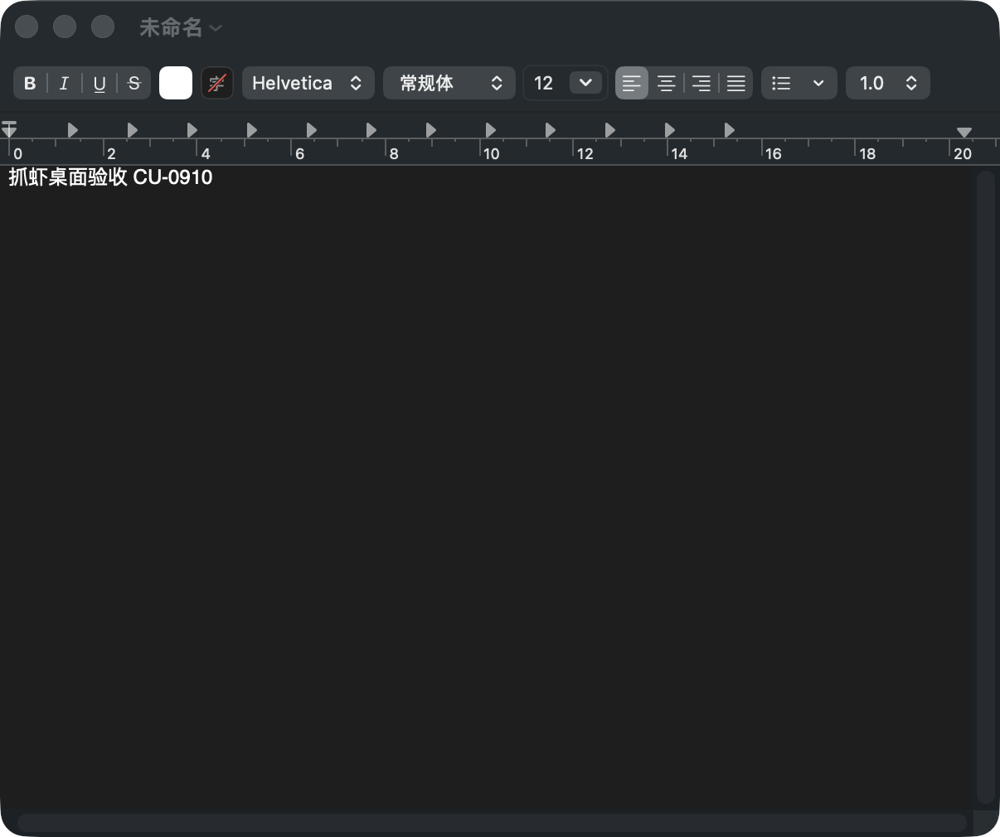

# Computer Use 内置技能与开发客户端验收

2026-09-10，源码开发客户端 v0.1.13，macOS arm64。未提交 Git、未推送或发布安装包。

## 接入

- 完整 vendoring 私有仓库 https://github.com/howtimeschange/crawshrimp-computer-use ，本地干净 HEAD 与远端 HEAD 一致：`5085999fab956c9ede896b66c707c41dea9d222f`。
- 内置位置：`integrations/deepseek-harness/skills/crawshrimp-computer-use`。保留来源、第三方声明、脚本、references、测试。
- Persona 与 Web preset fallback 明确路由：原生桌面应用/菜单/文件框读取 computer-use；网页继续读取 crawshrimp-skill 并使用抓虾 CDP。
- staging 校验完整技能入口，按 macOS 目标架构编译 Swift helper；开发环境复用相同 host helper。原生二进制和 Python 缓存不进入源码哈希/跨平台复制。
- Windows Python 声明及哈希锁补齐 pywinauto、comtypes、psutil；afterPack 检查所需文件。未做 Windows 实机调用测试。
- 真实 Electron 验收发现 upstream AX 深度 12 会截断嵌套页面，项目内调整为 32；500 节点、时间限额和截断拒写保护保留。

## 真实客户端

实际开发进程来自本项目 `app/node_modules/electron`，渲染页 `127.0.0.1:5173`，Agent 页 `127.0.0.1:19069`。会话 `session-784f1e66-f070-4b8d-88eb-e8b1117160f4`，模型 DeepSeek V4.1 Flash / High。从原生客户端输入并提交以下任务，没有在 prompt 中指定技能名。

### 桌面

“请在 macOS 文本编辑中新建一个独立测试文稿，写入‘抓虾桌面验收 CU-0910’，然后读回正文并截图核验。不改动现有文稿，不发送任何消息。请自行选择合适的内置技能与控制通道，实际执行，结束清理本次视觉提示层。”

结果：通过。模型读取 computer-use 技能、doctor、windows/probe/observe，选择 TextEdit 独立实例，通过 `NewDocumentButton` 的 AX invoke 创建文稿，再用 `set_value` 写入中文。收据 `verified_control`，独立 verify 与再次 observe 一致，模型调用 read_image 看图，本次集成也再次人工式视觉核验图片。原实例窗口清单未改变。模型 feedback stop 返回 stopped。

宿主 AppleScript 返回 -10004；模型未更改系统权限，使用已经授权可用的 AX 通道完成。文稿保留为未保存的“未命名”，没有把 UI 写入声称为磁盘保存。

前置客户端驱动还验证了保护分支：被会议窗口遮挡的坐标点击被拒绝；AXValue 对 Electron contenteditable 未生效时，读回为空且发送按钮禁用，没有误报输入成功。随后用键盘输入并 expect 精确读回，再 AX invoke 发送按钮成功提交。

### 网页

“请打开 https://example.com ，读取页面标题与主标题，并说明实际使用的技能和工具通道。只读，不填写或提交表单。”

结果：通过。模型切换读取 `crawshrimp-skill/SKILL.md`，经抓虾 CDP `browser_navigate → browser_observe → browser_eval → browser_verify`；标题与 h1 均为 `Example Domain`，forms.length 为 0。客户端资源面板出现本会话 Example Domain 页面。没有使用桌面坐标操作网页。

## 检查与证据

- Python 内置发现、迁移路径执行、路由及技能测试：66 passed。
- Node staging/内置运行时测试：15 passed；afterPack：17 passed。
- 干净 `stage-runtime.mjs --force` 与 Web profile config check 通过。
- 本次验证范围是 macOS 源码客户端；Windows、Intel Mac 和签名安装包尚未实机验收。

证据目录：[qa-2026-09-10-computer-use](qa-2026-09-10-computer-use/)。包含中文文稿截图、客户端桌面与网页结果截图、单步收据、报告和测试日志。

## AppleScript 授权流程与本机应用列表（最终界面）

设置 → 应用 → 桌面自动化权限列出当前用户 Mac 的应用，支持搜索、多选、仅看已选和分页。来源为 /Applications、/System/Applications、~/Applications、当前运行的 .app，以及 System Events/Finder；不遍历 app 内嵌组件。其他目录的软件可先运行，再刷新。按 Bundle ID 去重。没有把开发机应用清单写入产品。

每次进入页面/刷新时，原生助手在使用者自己的 Mac 调用 NSWorkspace.icon(forFile:) 获取真实应用图标，转成 64px PNG 后通过可信 IPC 返回。数据只在当次内存清单中使用，不把本机图标素材打包，也不联网下载。图标读取失败才显示文字占位。本机真实客户端列出 157 项，已目视确认备忘录、钉钉、豆包等真实图标。

只保留一个 **授权所选应用** 按钮：用户点击后按所选顺序逐个检查；已授权直接更新状态，不弹窗；not_determined 才调用原生 AEDeterminePermissionToAutomateTarget 的请求模式，系统选择结束后再次只读预检。拒绝/受限不自动重复弹窗。可停止尚未开始的后续请求；当前系统弹窗仍由用户处理。勾选与清空选择不改变已有系统权限。

目标名称、路径、用途和状态可查看。用途说明缺失、Hardened Runtime entitlement 缺失、App Sandbox、目标未运行/未安装、不明拒绝分别诊断；-1743/-10004 不一律认定用户未授予 TCC。设置页通过主窗口主 frame 的可信 IPC 发起请求；模型先执行无弹窗的 `automation-status --bundle-id`，需要申请时可通过 `automation-request --bundle-id … --purpose … --run-dir …` 调用宿主的本地能力令牌桥接。桥接仅接受目标与用途，不能执行脚本，校验令牌并拒绝 Origin 请求；用户自行选择系统弹窗。任务侧保存申请凭据，拒绝或结果不明不重复申请。

补入 NSAppleEventsUsageDescription 与签名 Apple Events entitlement；开发 staging 给项目内 Electron plist 加入同样用途说明。没有更改 TCC 数据库或全局系统配置。任务侧允许后仍在原执行环境复检；受限时按实际可用控件回退 AX，不通过换通道重投 unknown 写入。

面板使用与现有设置页共用的 settingsPanel.css，标题分隔、橙色分类、状态徽章、表单、按钮、主题颜色和响应式布局一致。顶部文案与合并按钮同步更新。

### 验证

- 原生真实预检与客户端设置页：TextEdit 已授权，OSStatus=0、request_attempted=false。
- 智能体 QA-AE-0910 新会话在实际执行环境调用新增流程，返回 authorized，正确判断无需重复申请；未写文稿、未切换沙箱、未弹窗。授权预检不是具体 AppleScript 业务指令的执行证明。
- 首次申请、允许后重新查询、拒绝后 AX 回退、配置缺失、沙箱/不明拒绝、非法目标、并发限制、应用枚举不申请、已授权跳过弹窗，以及批处理顺序/去重/停止/异常不重试由自动测试覆盖。
- 本机已授权的 TextEdit 不需要弹窗；未重置 TCC 或替用户选择允许/拒绝，首次系统弹窗及用户选择尚未实机验收。
- 授权与 staging/afterPack：35 项 Node 测试通过；内置技能与迁移路径：66 项 Python 测试通过；Vite 生产构建和干净 staging/config check 通过。

最终界面截图：`qa-2026-09-10-computer-use/automation-app-list-final.png`。单目标真实预检与智能体执行截图分别为 `automation-permissions-authorized.png`、`automation-task-preflight.png`。

### macOS 菜单限制与权限管理补充

- preload 提供实际 `process.platform`；仅 darwin 显示桌面自动化权限菜单并挂载面板。Windows、Linux 和无桌面 preload 环境均隐藏，旧面板入口回退到外观设置。
- 对实际菜单及入口解析源码执行 darwin/win32/linux/无 preload 分支校验通过，Vite 构建通过；这不是 Windows 实机验收。macOS 开发客户端已重启加载。
- 管理系统授权按钮打开 macOS 自动化设置，返回窗口时刷新状态。单项撤销由用户在系统设置完成，应用内没有伪造撤销开关。
- 新增桥接后的授权相关 Node 测试 11 项通过。首次系统弹窗和用户允许/拒绝仍未实机验收。
