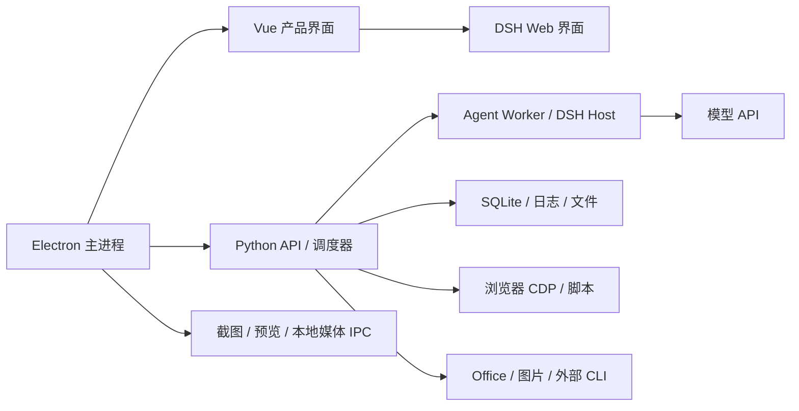

# 抓虾 Harness 跨平台性能优化方案

日期：2026-09-18。范围：Windows ARM64、Windows x64、macOS Apple Silicon、macOS Intel。

## 1. 决策建议

**有明显优化空间，建议先消除跨平台卡顿，再收敛后台开销，同时启动 Windows ARM 原生依赖可行性验证。** 优先级最高的是主进程同步 PDF/文件操作、首屏静态加载重依赖、隐藏页面的重复工作；其次是流式事件持久化与模型上下文成本。Windows ARM 原生发行是独立工程，不能用一个 `--arm64` 参数替代。

不建议重写框架，也不建议统一提高并发。现有 Electron + Vue + Python + DSH 架构可以渐进优化。先保留功能语义和安全边界，分别测量响应性、完成耗时、内存和电量，避免“吞吐稍快、界面更卡”或“页面更快、任务丢失”。

本报告是**源码扫描、构建分析、本机隔离微基准和已有 Windows 证据复核**。未在本轮操作 Windows 虚拟机，未测 Windows x64 真机或 Intel Mac，也未实施以下优化。所有收益目标均为待验证目标，不是已经实现的收益。下一次实际操控虚拟机，按用户要求新建 **Astra / 轻度推理任务**测试。

## 2. 证据与当前基线

### 2.1 证据分级

| 标记 | 含义 | 可以支持的结论 |
|---|---|---|
| S | 当前工作区源码、配置、调用链 | 确定执行方式、依赖和潜在阻塞；不能单独证明用户延迟 |
| M | 本轮 macOS ARM64 隔离微基准/生产构建 | 对应函数/构建的本机结果；不能外推 Windows 或整机启动 |
| W | 2026-09-18 已有 Windows 安装版验收记录 | Windows 11 ARM VM 上 x64 仿真运行的特定功能结果 |
| H | 2026-09-15 已有组件对照实验 | 对应组件修复和架构差异；不是完整原生 ARM 产品成绩 |
| V | 优化假设/待测项 | 需要测量后才能承诺收益或定默认值 |

扫描覆盖产品主要入口和执行链：桌面启动与退出、Vue/DSH Web、Python API、SQLite、脚本和定时任务、浏览器控制与预览、图片/视频、Office、文件、知识索引、市场/设置入口、打包与更新。对关键热路径做了逐函数检查；**不等于逐行审计全部第三方依赖或所有业务适配器**。37 个关键源文件的内容摘要及工作区状态已写入证据清单，未把当前脏工作区误当成已发布版本。

### 2.2 已经完成的优化，不重复立项

| 已存在的改进 | 当前边界 |
|---|---|
| 先创建窗口，数据目录/Windows ACL 在 Worker 中准备，权限调用批量化 | 后端仍必须等待受保护目录就绪；不能跳过 ACL 换取启动速度 |
| 缩略图异步 Python/Pillow 解码，单路队列、32 个在途、128 项/16 MiB 缓存 | 冷缓存每张仍启动 Python；异步已经解决主线程阻塞，吞吐仍可优化 |
| 日志内存最多 2000 行/1 MiB，游标分页 500 行，UI 最多 60 行 | 完整 JSONL 仍持续增长；逐条追加有打开/关闭文件成本 |
| manifest 解析按文件身份/时间/大小缓存；最新任务记录批量查询 | 仍扫描目录成员、stat、读安装元数据和复制模型，不能称为“每次重解析所有 YAML” |
| 流式文字按默认 200 ms 或 1024 bytes 合并 | 合并后的同步数据库操作仍有成本，不能称为“每个 token 都写数据库” |
| 视频页面退出激活状态后停止轮询；多处已有 in-flight 防重入 | 图片 KeepAlive 页面及其他独立轮询仍需分别治理 |
| DocumentPreview 已动态加载；CDP 已有持续连接与锁 | 优化应针对其他静态依赖及截图，不应重复提出“所有预览/CDP 都没有复用” |

历史修复详情见 [9 月 15 日性能修复报告](/Users/xingyicheng/Documents/crawshrimp-harness/docs/crawshrimp-harness/performance-repairs-2026-09-15.md)。其中 Windows ARM VM 的 x64 目录准备从 26.14 s 降到 7.72 s，原生 ARM Electron 同类组件从 6.55 s 降到 3.33 s；这只是目录准备，不是安装版从启动到智能体可用的总耗时。ARM 缩略图实验由 2201 ms 变成 3016 ms，但主线程响应改善，因此不能声称所有指标都变快。

### 2.3 本轮新增测量

环境：macOS 26.5.2 ARM64，本地 SSD；源代码与现有依赖。所有测试使用临时合成数据，不使用用户业务数据库。

| 测量 | 结果 | 解读与限制 |
|---|---:|---|
| Vite 生产入口 JS | 3,614,831 bytes；构建输出 gzip 约 1,185.36 kB | 首屏可拆分；本地加载主要关注解压后解析/执行，不能只看 gzip |
| 入口 CSS | 431,490 bytes | 需要随页面拆分并测样式计算 |
| 已延迟的 DocumentPreview JS | 852,957 bytes；PDF worker 1,039,207 bytes | 已有拆分，不是首屏全部同步执行；首开文档仍需单独验收 |
| `core.api_server` import 子进程 | 662.5 ms | 一次 import-only；不含 ASGI lifespan、DSH 启动或安装版冷启动 |
| importtime 中 openpyxl 累积时间 | 177.6 ms | 支持研究非首屏模块延迟导入；嵌套累积时间不能相加 |
| 23 个适配包/92 个任务扫描 | 首次 181.0 ms；10 次暖扫描 12.6–14.4 ms | 仅仓库 manifest、空安装元数据、本机文件系统；不是完整 `/tasks` 请求 |
| 主进程实际扫描函数，5000 文件 | 5 次 63.1–78.2 ms | 同步函数本身耗时；未测 GUI 帧延迟 |
| 同样目录，限制返回 10 个 PDF，实际无 PDF | 48.3–54.5 ms，仍遍历全部 5000 文件 | `maxFiles` 限制匹配数，不限制遍历量 |
| 当前批量查询 300 任务/10 万运行记录 | 5 次 1.11–1.73 ms | 旧逐连接对照 117.4–122.7 ms；旧路径不是当前待修问题 |
| 追加 5 万日志 | 1160.4 ms；内存保留 2000 行/528,000 bytes | 完整下载 5 万行；空增量 145 bytes，说明分页已有成效 |

入口 sourcemap 包含 three、tldraw/@tldraw、React DOM、Tiptap 等。**原始源码字节不是压缩后贡献**，不据此宣称删除某库就能节省固定 MB。已确认引入链：`App.vue → AiImageWorkbench → ImageGenerationLoader/imageGenerationReact → img-fx → three`；以及 `AiImageWorkbench → TldrawAnnotationLayer → tldraw/React`。用于图片加载效果和标注的重依赖不应成为进入其他页面的前置成本。

原始数据、脚本及构建日志见 [本轮证据目录](/Users/xingyicheng/Documents/crawshrimp-harness/artifacts/performance-plan-20260918)。

### 2.4 已有 Windows 证据的正确用法

9 月 18 日安装版验收是在 **Windows 11 ARM / 4 vCPU / 8 GB VM，v0.2.1 x64 仿真应用及本地修复资源**上完成。单次网页任务、自然定时触发、固化脚本重跑均有产物读回；744.1 秒长任务 generation/PID 稳定。这能支持相应场景的稳定性结论。

但长任务包含 12 次约 55 秒主动等待，不能作为计算吞吐基准；进程工作集求和约 704–1054 MiB 不是私有内存，也不是包含完整 Chrome 树的精确占用。DOCX/XLSX 实际 Office 链路约 24.6/29.5 秒，尚未拆出模型、LibreOffice 冷启动、字体、栅格化和 I/O 各自耗时。不能由此判断“8 GB 已无压力”或“Office 慢完全是仿真导致”。

详见 [Windows 验收报告](/Users/xingyicheng/Documents/crawshrimp-harness/docs/crawshrimp-harness/2026-09-18-windows-full-qa.md)。

## 3. 性能链路与测量设计

将用户等待拆为：排队 → 本地准备 → 模型首 token → 模型生成 → 工具执行 → 结果投影/落盘 → 界面呈现。分别记录，重叠阶段按 trace 分析，不把各阶段 p95 直接相加。启动也分为首次可见窗口、可交互首屏、API ready、Agent ready、浏览器 ready，避免只加启动画面就称为启动优化。

**P0：先补齐轻量观测，预计 2–3 人日。** 每次启动和任务使用关联 ID；记录单调时钟耗时、架构、是否仿真、包版本、数据规模、冷暖状态、进程归属。开发/QA 采样 Electron event-loop delay、renderer long task、Python loop lag、SQLite 写等待、队列长度/最老等待、IPC 字节数、截图次数、上下文 tokens/cache 命中。用有上限的本地诊断文件；禁止记录密钥、完整用户提示词和完整文档。模型 token 分解优先记录各组成部分长度/类别。

观测入口应支持导出匿名诊断包，默认低开销；较重的 CPU profile/ETW/Instruments 只在诊断时打开。先证明采样本身使基准耗时增加不超过约 2%，否则降低采样率。

## 4. 优化清单与实施边界

以下工作量为单工程师有效开发时间初估，包含定向测试，不含采购设备、上游等待、完整发布和多平台长稳验收。任务之间有共享工作，不能机械相加。P1 是下一阶段实施项，P2 在测量确认后实施，P3 是后续专项。

### P1-1：PDF 和目录操作移出 Electron 主线程（3–5 人日）

**证据 S/M：** [main.js:883](/Users/xingyicheng/Documents/crawshrimp-harness/app/src/main.js:883) 用 `execFileSync` 调 Python，超时 60 秒，一次渲染所有页，再读取 PNG 转 data URL。Mac QuickLook 回退同样同步，最长 45 秒。预览入口会删除输出目录，不能稳定复用缓存。目录扫描使用同步 realpath/stat/readdir；本轮 5000 文件已占用约 63–78 ms。

**方案：** 建立异步预览/扫描 job，支持取消、超时、进度和过期请求废弃。PDF 先第一页/可视页，再按需渲染；按文件修订、页号、分辨率和引擎版本缓存。限定单页像素、总预算和队列长度，不能仅用缩放倍数。目录分页/流式返回，同时限制已访问条目、深度和时间；到限明确提示结果不完整。图片原图读取与 base64 同步转换也迁出主线程。

**收益预期：** 消除这条路径造成的长时间窗口冻结，比缩短总转换时间更确定。**验收：** 100/500 页 PDF、超大页面、1 万/10 万条目录、无匹配扩展名、网络盘断开、中文长路径；处理中窗口仍能操作，取消后没有孤儿进程。目标本地交互 p95 ≤200 ms、无该路径引起的 >1 秒主线程阻塞。按需预览不取消 Office 最终交付要求的完整文档验收。

### P1-2：按页面和动作延迟加载重依赖（2–4 人日）

**证据 S/M：** [App.vue:192](/Users/xingyicheng/Documents/crawshrimp-harness/app/src/renderer/App.vue:192) 静态引入多个完整页面；入口 JS 3.615 MB。图片标注和加载动效带入 tldraw、React、three。

**方案：** 非首屏页面改为动态组件；标注器在进入标注时加载，复杂图片动效在需要时加载，并提供轻量静态/CSS 占位。首屏稳定后仅预取最可能使用的模块。检查共享 chunk、CSS 和失败重试，避免只是把大入口换成一个仍被同步依赖的大 vendor chunk。可迁出的内联大 logo 改为缓存资源，但不盲目删除字体/语言资产。

**收益预期：** 降低首屏解析、执行和内存基线。**验收：** 第一阶段以入口 JS 原始体积减少 ≥40% 为工程目标，实际开窗/可交互时间必须同步改善；低配机首开生图、标注、设置等页面不得出现无反馈等待或资源丢失。已动态加载的 DocumentPreview 保持独立。

### P1-3：统一状态订阅，隐藏页面停止展示性工作（2–4 人日）

**证据 S：** App 根部约 5 秒刷新运行时/任务，AgentWebView 又约 5 秒刷新运行时，均已有在途保护。DSH 产品槽位还有 800 ms/1 s 的 DOM 维护。图片工作台只有卸载清理，KeepAlive 失活时仍可能保留活动任务轮询/动效；视频页面已处理失活。

**方案：** 一个运行时状态源供多个视图订阅；任务变化用事件推送或带版本的增量请求，低频校准。可见、后台、最小化状态分别控制 UI 刷新；后台任务状态由独立服务维护，页面恢复时一次对账。缩小 MutationObserver 范围，合并同一帧 DOM 更新。保留有用的会话常驻状态，避免为省内存反复销毁 DSH 会话。

**验收：** 无活动任务且窗口最小化时，展示性网络请求/DOM 更新相对基线下降 ≥80%；前台状态无明显陈旧。隐藏状态下定时任务、审批、结果通知、取消与重连仍可靠，不因页面隐藏停止任务。

### P1-4：浏览器预览按可见性和动作采样（1–2 人日）

**证据 S：** [agentBrowser.js:24](/Users/xingyicheng/Documents/crawshrimp-harness/app/src/agentBrowser.js:24) 每 800 ms 截 JPEG，已有单次在途保护；预览面板最小化主要是 `v-show`，未对应停止截图流。

**方案：** 预览订阅计数和可见性驱动截图，隐藏时 0 帧；前台静止页面低频、动作后短时刷新，只保留最新待展示帧。按面板分辨率限制截图尺寸，减少 base64/IPC 复制。截图暂停只影响预览，CDP 和网页任务继续执行。

**验收：** 隐藏 10 分钟截图数为 0，展开立即恢复；多标签、滚动、高 DPI、重连和取消均正确。记录 CPU/GPU、IPC bytes/min 和截图耗时，不用截图更少掩盖页面状态丢失。

### P1-5：Windows ARM 原生发行可行性与落地（先 2–3 人日验证，后 5–10+ 人日）

**证据 S/H：** [build.yml:40](/Users/xingyicheng/Documents/crawshrimp-harness/app/build.yml:40) 和 CI 只有 Windows x64；Python 下载/锁文件、Office 资源锁、after-pack、Office `target_id()` 均没有完整 win-arm64 路径。历史组件实验支持减少仿真成本的方向，但没有完整原生安装版验收。

**方案：** 先建立依赖架构清单与 smoke，再决定全原生或明确标注的混合方案。Electron/Node 进程内的 `.node` 必须匹配 ARM64，不能加载 x64 二进制；外部 Python/LibreOffice/CLI 可以在确认协议、系统支持和性能后暂用 x64 子进程。混合方案不得宣传为全原生。详见第 5 节。

**验收：** 干净 ARM 系统安装、升级保留数据、真实模型与工具、浏览器三种任务、Office/图片/终端、退出/恢复全部通过；架构逐进程核对，安装器和 updater 架构匹配。收益必须与同一 ARM 真机上的 x64 包做 A/B，对 x64 PC 单独验收。

### P2-1：流式事件处理与 SQLite 写入解耦（3–5 人日）

**证据 S：** [worker.py:131](/Users/xingyicheng/Documents/crawshrimp-harness/core/agent/worker.py:131) 读取协议后串行等待通知处理；服务在异步事件路径调用同步 DB。文字已按 200 ms/1024 bytes 合并，但消息更新、事件插入、会话更新仍可能多次连接/事务，长文本还会重复序列化。Node `send()` 未处理 `stdout.write()` 返回的背压信号；这是压力风险，尚无本轮真实溢出证据。

**方案：** 有界、保序的事件投影队列，独立 writer 线程拥有自己的 SQLite 连接，合并同批事务；RPC 响应/控制帧可及时处理，但终态对前序事件建立 flush 屏障。展示性中间快照可合并，审批、工具结果、任务终态必须持久化且不可丢弃。输出端加背压和队列水位。WAL/批量 checkpoint 作为单独 A/B 实验，验证 backup、异常退出、文件系统和 durability 后采用。

**验收：** 慢盘/锁竞争、10 万事件、长消息、断线重放、进程崩溃重启；消息顺序与终态一致、审批不漏、无假中断，队列不持续增长。目标流式显示额外本地 p95 延迟 ≤300 ms，Python loop lag p95 ≤50 ms；不能通过丢关键事件过关。

### P2-2：模型上下文分解与稳定前缀（2–4 人日）

**证据 W/S：** 已有 Windows 简单真实请求记录出现约 21,484 输入 tokens，另有缓存读 token。工具 schema、persona、技能索引、历史和附件各占多少尚未拆分，不能直接说“所有技能全文都被加载”。

**方案：** 先按组成部分计量 tokens、模型 TTFT、缓存命中与请求 bytes。稳定规则放稳定前缀，避免时间戳/顺序扰动；按任务域发现工具和技能，保留兜底发现机制；历史摘要必须保留约束、授权、未完成工作和文件引用。与上游 DSH 能力兼容后再改，不能从工具清单删掉必要能力换取短 prompt。

**验收：** 相同模型/端点/输入、多次冷暖缓存 A/B；简单任务输入 tokens 减少 20–40% 作为探索目标，工具选择、中文可见进度、网页三类任务、长任务完成率不得下降。模型网络延迟与应用本地延迟分开，不把更换测试模型当作应用优化。

### P2-3：后端按需初始化与扫描增量化（2–4 人日）

**证据 S/M：** API 导入会带入 openpyxl 等非所有首屏都需要的模块；lifespan 中进行 DB、内置包、知识索引、调度和 Agent 启动。manifest 解析已有缓存，剩下目录成员扫描/元数据 I/O。已有同版本内置包不会重复整包复制，但会更新元数据。

**方案：** 分离必要就绪与可延后的模块导入/索引；调度恢复、配置迁移、权限、数据库一致性仍在正确屏障前完成。安装/修改时主动失效，目录监视配合低频校准，缓存整个目录快照和安装元数据。知识索引沿用 fingerprint，进一步减少无变化时的全量 stat。就绪状态必须真实，不能提前返回 ready 后让首个任务失败。

**验收：** 新安装/旧数据升级/大脚本库/损坏 manifest/外部修改/休眠恢复，任务列表及时且正确；分别测首次可用和首次打开相关功能，防止仅转移等待。

### P2-4：缩略图工作进程复用与媒体传输（2–3 人日）

**证据 S/H：** 缩略图已单路异步，但冷 miss 会反复拉起 Python；部分原图和 PDF 页走完整 data URL，存在原始数据、base64 字符串和 IPC 拷贝。base64 编码本身约增加三分之一字节，实际内存峰值需测量。

**方案：** 受限、可重启的常驻解码 worker，保留像素/源文件限制；可见缩略图优先、取消过期请求、共享去重。有配额的磁盘缓存按版本失效。优先复用已有受授权的本地媒体协议，按需读取/缩放，不给 renderer 任意文件权限。低内存设备默认单路解码。

**验收：** 12/100 张 24MP 图片、异常尺寸、修改同名文件、反复翻页、worker 崩溃、路径权限；比较总耗时、首张时间、峰值私有内存及页面响应，不能只优化总耗时。

### P2-5：Office 渲染缓存与资源预算（3–5 人日）

**证据 S/W：** Office 已有 2 线程、20 待处理上限；Windows 短临时 profile 修复已存在。重复转换/重算、字体初始化、每作业新缓存目录等需分段计时；尚未证明单一主因。

**方案：** 对源文件 hash、转换选项、LibreOffice/字体版本建立结果缓存；首次预览优先，最终审阅保持完整。8 GB 机器先实验 Office 同时 1 个、16 GB 同时 2 个；联合图片解码预算。常驻 LibreOffice 池仅作为后续实验，需独立 profile、超时杀进程、文件隔离及脏状态恢复，不直接用共享单实例替代现有隔离。

**验收：** DOCX/PPTX/XLSX、大图/长表/公式/中文字体/深路径/损坏文件，并行取消和异常恢复；源文件不变时第二次预览不重复转换，缓存变化时不误命中，交付产物与审阅页完整。

### P2-6：跨功能并发与内存预算（2–4 人日）

**证据 S：** 图片轮询池上限 100，提交池可到 100，但同步 provider 已有每 provider 3 路信号量；Office 2 路、缩略图 1 路。线程上限不等于空闲就有 100 个线程，现状也不能叫“全部无限并发”。真正缺口是多个功能同时工作的整体预算。

**方案：** 区分网络等待、CPU 解码、Office、文件 I/O 的资源额度；依据可用内存和任务类型调度，提供公平排队、取消和明确等待状态。8 GB 初始候选为解码 1、Office 1、网络提交 4–8（仍服从 provider 更低上限），用实测调整。保持当前单 Active Run 的一致性，不直接全局并行化 Agent。

**验收：** 对话+浏览器+图片+Office 混合压力下无持续分页抖动、无饥饿、无超额提交；吞吐和交互分别达标，排队时间可见。

### P2-7：日志/历史/缓存生命周期（2–3 人日）

**证据 S/M：** 日志内存已受限；完整日志逐条文件追加仍有 I/O，长期落盘没有统一配额。不能据此判定当前数据库已经泄漏。

**方案：** 有界批量日志 writer、周期 flush、终态强制 flush；按任务分段归档。区分可重建缓存与用户记录：缓存自动按配额回收，用户日志/历史由清晰保留策略控制并可导出，活动任务不得被清理。SQLite 索引按实际查询 EXPLAIN 和规模补充，分页长历史，空闲时维护，不在首屏全库 vacuum。

**验收：** 5 万行实时日志和完整导出一致；进程异常时记录可恢复，日志/缓存达配额后行为明确；四小时稳定性和模拟 30 天增长测试。

### P3：包装、更新、网络与次要页面专项（2–4 人日，按收益选做）

包配置包含 `src/**/*` 与较宽资源范围，值得按最终安装器清单核对测试文件、sourcemap、重复运行时与开发资产；不要直接删除 DSH 动态发现的插件或字体。用安装器压缩体积、解压体积、文件数、首次 Defender 扫描/启动时间来排序。当前暂存目录不完整，**本报告不提供未经验证的完整安装包可压缩比例**。

更新检查已经有首次 15 秒延后、6 小时间隔、聚焦 5 分钟冷却与在途保护，不是高频轮询问题。重点验证更新下载 I/O 与活动任务竞争、安装前任务屏障、失败恢复和架构正确性。市场/设置/提示词/文件页优先随懒加载受益；大列表分页、搜索取消、网络连接复用仅在 trace 命中时追加，不凭页面体量猜测卡顿。外部写操作的重试须先解决幂等性，不能盲目自动重发。

## 5. 平台实施矩阵

| 维度 | Windows ARM64 | Windows x64 | macOS Apple Silicon | macOS Intel |
|---|---|---|---|---|
| 当前发行配置 | x64 应用在 ARM 上仿真；缺完整 ARM 链路 | 原生 x64 | 有 arm64 目标 | 有 x64 目标 |
| 第一关注点 | 架构混用、仿真、8 GB 资源预算 | 低配 CPU、Defender、小文件与同步 I/O | 首屏/后台能耗、预览/GPU | 低配 CPU、8 GB 内存、旧集显 |
| 共用优先优化 | 主线程异步化、拆包、后台收敛、持久化与媒体预算 | 同左 | 同左 | 同左 |
| 专项 | 全依赖清单、原生/混合包、ARM updater | ETW/WPR 验证 I/O、进程创建和硬缺页 | Instruments、Activity Monitor、原生架构检查 | x64 真机和对应支持 OS，避免拿 Rosetta 替代 |
| 必守约束 | ARM Electron 不加载 x64 `.node` | 不要求关闭 Defender/降低 ACL | 不破坏签名、公证、TCC、Apple Events | 不在尚未验证的系统上宣称支持 |

Windows ARM 分四步实施：

1. **依赖可行性表：** Electron/Node、Python 3.12 与 pywin32/PyMuPDF/Pillow/numpy/pandas 等轮子，DSH 的 sharp/koffi/node-pty/ripgrep/Windows ACL，DWS/内置 CLI、Office、OCR/桌面 helper。逐项记录来源、版本、架构、签名和 smoke；本轮只确认仓库缺目标，不宣称上游不存在 ARM 版本。
2. **架构路由：** 统一目标 ID，补 Python/Office 锁、下载、stage-runtime、after-pack、运行时解析与 CI。纯外部 x64 工具若作为临时回退，必须明确记录并监测；数据目录不因架构切换分裂。
3. **安装/升级：** 四类平台资源分别校验；ARM/x64 包和更新元数据准确，架构迁移保留会话、脚本、密钥及调度记录，避免 updater 自动换错架构。
4. **真机 A/B：** 同一 ARM 设备原生候选对 x64 仿真基线；Windows x64 单独回归。原生不可用的模块先保留可审计回退，不能绕过沙箱或删除功能。

Mac 继续分别交付 arm64/x64；测量启动进程和每个 helper 的实际架构，识别 Rosetta。8 GB Apple Silicon 的统一内存还与 GPU 共享，不以 JavaScript heap 代替总资源压力。默认不关闭 GPU 加速，只有驱动故障证据支持时才设限定回退。

## 6. 验收方案与目标

### 6.1 设备矩阵

| 设备组 | 最低测试配置建议 | 必测方式 |
|---|---|---|
| Windows x64 低配 | 产品支持范围内的 i3 / 8 GB / SSD | 真机，默认安全软件；首次安装、升级、冷暖启动 |
| Windows ARM | Snapdragon 设备 / 8 GB 或 16 GB | 同机 x64 仿真与 ARM 候选对照；8 GB 若无实机则明确缺口 |
| Mac ARM | Apple Silicon / 8 GB，并补 16 GB | 原生正式包；电源与电池状态分别记录 |
| Mac Intel | Intel / 8 GB 或 16 GB，受支持系统 | 原生 x64 正式包，不能用 Apple Silicon 的 Rosetta 代替 |
| UTM Windows ARM | 现有 4 vCPU / 8 GB | 补充功能/故障注入，不作为跨平台性能排名依据 |

记录 CPU/OS/电源模式、分辨率缩放、SSD剩余空间、包 hash、数据快照及后台负载。首次安装、清缓存后首次使用、普通冷进程启动、暖启动分开。每组至少 10 次启动报告中位数和范围；需要正式 p95 时增加到约 30 次并保留原始样本。网络模型测试交错 A/B、固定模型参数和任务，记录供应商波动。

### 6.2 场景矩阵

| 场景 | 输入与操作 | 核验内容 |
|---|---|---|
| 启动/升级 | 新目录、现有大数据、从旧版本升级、离线、连续重开 | 窗口/API/Agent 各阶段、CPU/I/O；无 junction 误删、无会话丢失 |
| 对话/中文进度 | 简单问答、多轮、附件、长输出、历史大会话 | TTFT、tokens/cache、本地显示延迟、中文可见步骤、数据库增长 |
| 单次网页自动化 | 筛选、翻页、读取、下载结果 | 实际页面和文件读回；操作耗时、截图负载、预览隐藏后仍正常 |
| 定时网页自动化 | 自然到点、忙时排队、休眠跨触发时刻 | 实际执行次数、触发延迟、misfire 状态、通知送达；不得用 run_now 冒充 |
| 固化抓虾脚本 | 单次跑通→生成→校验→安装→重跑 | 使用相同业务数据核对行数/金额/导出；含失败自修和重复执行 |
| 长任务 | 30–60 分钟真实多步骤；另保留受控等待稳定性例 | 区分有效工作耗时与等待；generation/PID、队列、内存、取消响应 |
| 故障/恢复 | follow 断线、网络切换、离线恢复、睡眠/唤醒、慢盘 | 无会话成功后假失败；短暂订阅错误不杀共享 Host，不重复外部动作 |
| PDF/文件 | 100/500 页、超大页；1 万/10 万条文件夹、无匹配、网络盘 | 首屏预览、操作响应、取消、权限、扫描截断提示 |
| 图片/视频 | 12/100 张 24MP、并发生图、视频轮询、切页/最小化 | 解码/GPU/网络占用、后台刷新、返回时状态正确 |
| Office | 三类文档、长表公式、中文字体、长路径、大图、两任务并发 | 冷暖分段耗时、内容一致、完整审阅、缓存失效、无残留进程 |
| 数据与日志 | 300/3000 任务、10 万历史、5 万日志 | API p95、DOM数量、完整下载、分页及写入背压 |
| 混合与长稳 | 对话+网页+Office+图片；4 小时循环、30 天数据增长模拟 | 私有内存/磁盘增长、硬缺页、温度电量、长期后台 CPU |
| 退出/更新 | 活动任务时关闭、取消退出、更新失败、重新启动 | 已有退出确认和停止流程可靠；无孤儿进程、架构不串包 |

### 6.3 第一阶段验收目标（待基线校准）

| 指标 | 建议门槛 | 说明 |
|---|---|---|
| 本地点击/切页响应 | 低配各平台 p95 ≤200 ms | 不包含模型和远程站点等待；首开懒加载单独报告 |
| 主线程阻塞 | 优化路径无 >1 s 阻塞；持续监测 >50 ms long task | 不把总任务耗时误当 UI 卡顿 |
| 首屏入口 JS | 当前 3.615 MB 原始体积下降 ≥40% | 同时检查运行时执行时间，体积不是唯一验收条件 |
| 后台展示工作 | 无活动任务且隐藏时请求/DOM 更新降 ≥80%；隐藏预览 0 截图 | 调度、审批、任务执行不停止 |
| 流式本地额外延迟 | p95 ≤300 ms；事件 loop lag p95 ≤50 ms | 保序、终态持久化优先于数值 |
| 生命周期 | 相同场景退出后无所属孤儿进程；可恢复故障不重启共享 Host | 真正 Host 崩溃恢复另外验证，不禁止必要恢复 |
| 四小时内存 | 暖机后相同工作循环无持续增长；结束回落到可解释缓存平台 | 先测回收曲线再设 MiB 上限，禁止凭 RSS 求和判断泄漏 |
| 启动总时间 | 先按设备建立基线，再定相对改善与回归阈值 | 不用 Mac import-only 数值给 Windows 承诺秒数 |

Windows 记录进程树 Private Bytes、Working Set、系统 commit、硬缺页和 GPU；Mac 记录 footprint、压缩/交换和系统内存压力。Chrome 属于受管理实例还是用户已有实例须标记，共享页不能简单求和当实际占用。测试控制程序本身的 CPU/内存单独排除或说明。

## 7. 实施顺序、回滚与交付

| 阶段 | 内容 | 退出条件 |
|---|---|---|
| A：基线与确定性卡顿 | P0 + PDF/目录异步 + 首屏拆分；启动 ARM 依赖验证 | 有可复现基线；文件操作不冻窗；拆包实际改善首屏；明确 ARM 缺项 |
| B：后台与低内存 | 状态订阅、截图、图片 worker、资源额度 | 最小化耗用明显下降，网页三类任务及混合场景无退化 |
| C：长会话与成本 | 事件写入、日志生命周期、上下文、后端扫描 | 长会话/慢盘/故障恢复正确，tokens 与耗时有对照证据 |
| D：平台与发布验收 | ARM 包、Office 缓存、四平台正式包与长稳 | 原生依赖清单、安装/升级、功能产物、性能报告齐全 |

单人实施到可测版本粗估约 **4–6 周**，另留设备和上游依赖不确定性；不是发布承诺。建议先以 A 阶段约一周为首个可评审增量，Windows ARM 全量原生结果以依赖验证为前提。

每项单独可回滚：懒加载有加载失败重试；缓存带版本且可安全重建；writer 迁移保持 schema 向后兼容或提供明确迁移；并发预算可配置；架构包独立签名与更新目标。灰度必须对照同硬件/同数据的基线，不能仅看新版本没有报错。

不要采用以下捷径：关闭 Defender/ACL/沙箱、忽略数据库 durability、丢审批或终态事件、心跳稍慢就杀 Host、把所有任务提高并发、统一关闭 GPU、共享无隔离的 LibreOffice、为了减少 tokens 删除授权约束、隐藏/清除旧失败记录。

本次交付只有方案与测量证据，没有新增应用功能修改，没有 commit、push、Release、安装器或 updater 发布。本地已有功能修复仍属于先前工作，正式上线前需要独立的提交、构建和发行验收。

## 8. 源码与复现索引

| 范围 | 关键入口 |
|---|---|
| 同步预览/扫描/IPC、启动 | [main.js](/Users/xingyicheng/Documents/crawshrimp-harness/app/src/main.js:383)、[desktopDataDirectory.js](/Users/xingyicheng/Documents/crawshrimp-harness/app/src/desktopDataDirectory.js) |
| 首屏与图片重依赖 | [App.vue](/Users/xingyicheng/Documents/crawshrimp-harness/app/src/renderer/App.vue:192)、[imageGenerationReact.js](/Users/xingyicheng/Documents/crawshrimp-harness/app/src/renderer/components/imageGenerationReact.js:1)、[TldrawAnnotationLayer.js](/Users/xingyicheng/Documents/crawshrimp-harness/app/src/renderer/components/TldrawAnnotationLayer.js:1) |
| 后台状态与预览 | [AgentWebView.vue](/Users/xingyicheng/Documents/crawshrimp-harness/app/src/renderer/views/AgentWebView.vue:781)、[AgentBrowserPanel.vue](/Users/xingyicheng/Documents/crawshrimp-harness/app/src/renderer/components/agent/AgentBrowserPanel.vue:390)、[agentBrowser.js](/Users/xingyicheng/Documents/crawshrimp-harness/app/src/agentBrowser.js) |
| 图片/视频 | [imageThumbnail.js](/Users/xingyicheng/Documents/crawshrimp-harness/app/src/imageThumbnail.js)、[AiImageWorkbench.vue](/Users/xingyicheng/Documents/crawshrimp-harness/app/src/renderer/views/AiImageWorkbench.vue:1269)、[AiVideoGenerationWorkbench.vue](/Users/xingyicheng/Documents/crawshrimp-harness/app/src/renderer/views/AiVideoGenerationWorkbench.vue:2697)、[image_providers.py](/Users/xingyicheng/Documents/crawshrimp-harness/core/image_providers.py:22) |
| 启动/清单/日志/索引 | [api_server.py](/Users/xingyicheng/Documents/crawshrimp-harness/core/api_server.py:9431)、[adapter_loader.py](/Users/xingyicheng/Documents/crawshrimp-harness/core/adapter_loader.py:134)、[run_logs.py](/Users/xingyicheng/Documents/crawshrimp-harness/core/run_logs.py)、[knowledge_service.py](/Users/xingyicheng/Documents/crawshrimp-harness/core/knowledge_service.py:315) |
| 事件持久化 | [service.py](/Users/xingyicheng/Documents/crawshrimp-harness/core/agent/service.py:1557)、[db.py](/Users/xingyicheng/Documents/crawshrimp-harness/core/agent/db.py:540)、[worker.mjs](/Users/xingyicheng/Documents/crawshrimp-harness/integrations/deepseek-harness/worker/worker.mjs:49) |
| Office | [jobs.py](/Users/xingyicheng/Documents/crawshrimp-harness/core/office/jobs.py)、[render.py](/Users/xingyicheng/Documents/crawshrimp-harness/core/office/render.py)、[runtime.py](/Users/xingyicheng/Documents/crawshrimp-harness/core/office/runtime.py:26) |
| 架构与发行 | [CI](/Users/xingyicheng/Documents/crawshrimp-harness/.github/workflows/build-desktop.yml:140)、[after-pack.js](/Users/xingyicheng/Documents/crawshrimp-harness/app/scripts/after-pack.js:290)、[Office 资源锁](/Users/xingyicheng/Documents/crawshrimp-harness/runtime-locks/office-assets.json)、[updateCheckScheduler.js](/Users/xingyicheng/Documents/crawshrimp-harness/app/src/updateCheckScheduler.js) |
| 本轮可复现证据 | [源码摘要清单](/Users/xingyicheng/Documents/crawshrimp-harness/artifacts/performance-plan-20260918/audit-manifest.json)、[本机测量](/Users/xingyicheng/Documents/crawshrimp-harness/artifacts/performance-plan-20260918/local-probes.json)、[目录测量](/Users/xingyicheng/Documents/crawshrimp-harness/artifacts/performance-plan-20260918/directory-probe.json)、[数据库/日志测量](/Users/xingyicheng/Documents/crawshrimp-harness/artifacts/performance-plan-20260918/backend-benchmark.json)、[构建日志](/Users/xingyicheng/Documents/crawshrimp-harness/artifacts/performance-plan-20260918/renderer-build.log) |

复现顺序：在 `app` 目录运行 Vite build，使用 `--outDir /tmp/harness-performance-audit-20260918/renderer --manifest --sourcemap`；用仓库兼容的 Python 环境运行 `artifacts/performance-plan-20260918/local-probes.py`；Node 运行同目录 `directory-probe.cjs`；设置 `PERF_OUTPUT` 为隔离临时目录后运行 `app/scripts/performance-repaired-backend.py`。脚本会更新自己的证据输出，不应指向生产数据目录。此次 Python 使用现有 Office-suite venv 的 3.12.13，目录探针用 Node 22.23.1；不是捆绑运行时验收。
