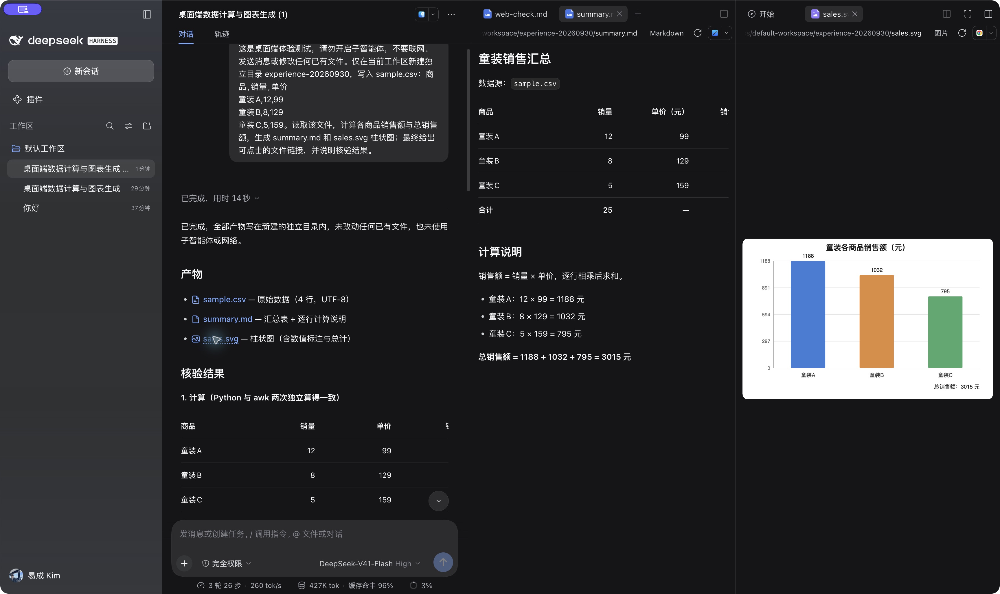
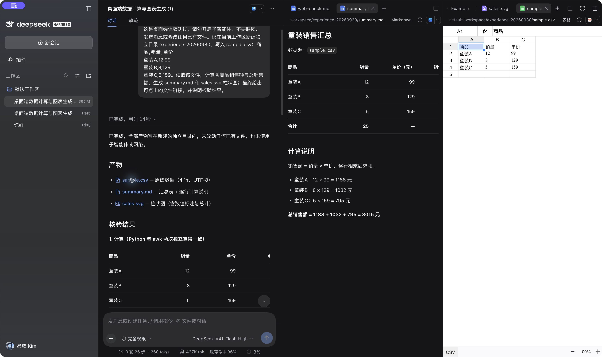
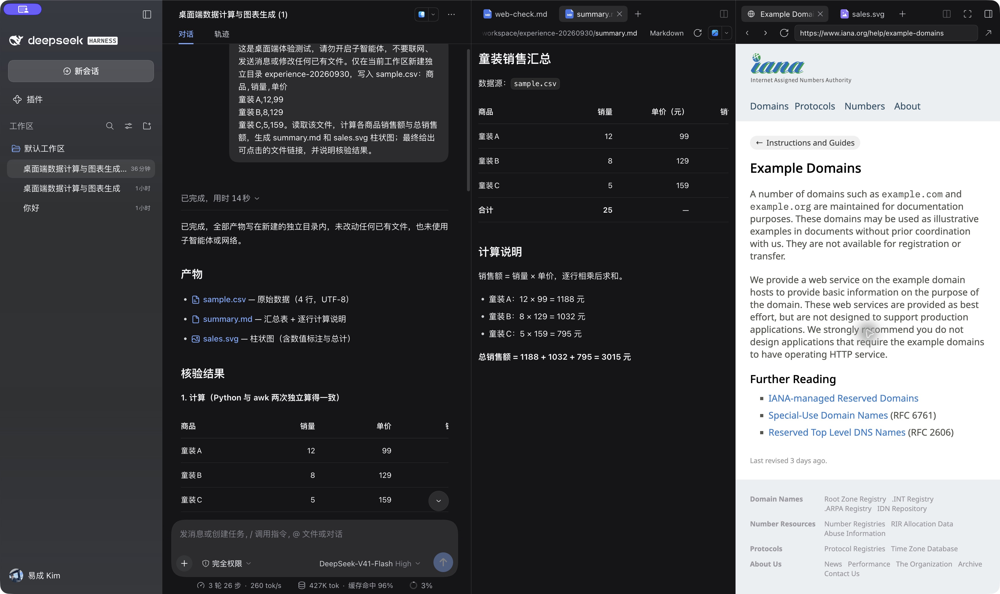

# DeepSeek Harness 桌面体验与抓虾选择性跟进报告

日期：2026-09-30。性质：第一轮实际体验与源码探查；没有修改抓虾业务代码、升级依赖、同步上游、提交或发布。

## 结论

最值得跟进的是 **会话内统一的多标签文件工作面板**：对话、报告、表格、图片和网页可同时留在一个任务上下文里，支持两栏比较与会话级恢复。建议先在抓虾现有 Vue 产品层实现这一交互，再补交付卡与诊断信息；不要为获得这套交互直接升级整个 DSH 运行时。

网页方面，必须分开评价：DSH 内嵌浏览器的人工导航与点击已经实测通过；本次智能体没有使用该内嵌浏览器，而是临时编写 CDP 脚本操作另一份无头 Chromium。它完成了简单任务，但还不是稳定、可观察、开箱即用的浏览器智能体产品链路。

## 基线与证据口径

- 实际操作：`/Applications/DeepSeek Harness.app`，Info.plist 版本 **0.2.0-rc.2**；界面模型选择显示 DeepSeek-V41-Flash / High。没有核验实际服务端模型身份或计费账单。
- 上游源码：官方仓库，独立浅克隆至 `/tmp/deepseek-harness-review-20260930`；探查时 HEAD **639ed015397290b3745d163aafe02ffee4aa3f84**，package.json 同为 0.2.0-rc.2。版本相同不证明已安装包与该提交逐字节一致。
- 抓虾源码：HEAD **6a70ec396ec47f847a8bd928ef18102bab2b4758**，main 比 origin/main 领先 2 个提交，存在原有未跟踪文件，均保留。
- 抓虾锁版：DSH **0.1.2-rc.1**、dsh-im **4.11.0**；已有 `compat/manifest.json` 选择性兼容机制，其参考点为 0.1.5-rc.1。
- 证据分为实际 UI/截图、文件独立回读、源码支持、尚未执行四类。模型自己说“完成”不单独算通过。
- 当前安装环境带用户配置与本机技能/浏览器缓存，因此不是干净机器的开箱测试。

## 实际体验记录

| 场景 | 操作与观察 | 判定 |
|---|---|---|
| 新建会话 | 创建独立测试会话，原“你好”会话保留；测试会话自动命名为“桌面端数据计算与图表生成” | 通过 |
| 文件与计算 | 要求创建 3 行童装 CSV，生成 Markdown 与 SVG；实际落盘，独立读取 CSV 计算 1188+1032+795=3015 | 通过 |
| 执行轨迹 | 看到模型请求、bash/write/read/read_image 参数及返回；能与实际文件对应 | 通过 |
| SVG 预览 | 点击回答中的 sales.svg，在右侧显示中文图表、三根柱与 3015 元总计 | 通过 |
| Markdown 预览 | web-check.md 与 summary.md 渲染标题、表格、代码块；对话留在左边 | 通过 |
| 多标签 | 同一侧栏保留多个 Markdown 文件，另一栏保留网页、SVG、CSV | 通过 |
| 双栏比较 | 点击分栏，左侧摘要、右侧图表；不离开会话 | 通过 |
| 会话隔离与恢复 | 切回原测试会话只显示其 SVG，再切回分支恢复 Markdown+SVG 双栏 | 通过；未测退出 APP 后恢复 |
| CSV 表格与源文本 | CSV 显示单元格网格；“打开方式”提供表格/代码/纯文本，切到纯文本后原始中文数据正确 | 通过；未验证编辑回写 |
| 用量明细 | 首轮显示 84,397 tok：未缓存输入 10,964、缓存读取 70,912、输出 2,521，缓存命中 87% | UI 通过；不等同费用 |
| 对话分支 | 从完成回答分支，再要求不调用工具回答历史结果，正确回答 3015 元、童装A 12 件 | 通过 |
| 插件入口 | 看到 8 项官方入口，包括团队、自动授权审查、自动化任务、语音、终端等；实验项有明确标识 | 仅入口核查，未启用 |
| 网页智能体 | 要求打开 example.com、点 Learn more、回读 URL/标题并交付报告；实际执行 bash+自写 CDP 脚本 | 有条件通过，详见下文 |
| 内嵌浏览器 | 侧栏新标签→浏览器→输入网址→点击 Learn more，地址栏和页面跳转到 IANA Example Domains | 人工交互通过 |
| 文件刷新/全屏/缩放 | 已看到入口；本轮没有形成完整操作前后证据 | 不宣称通过 |

第一轮文件任务 UI 显示 14 秒、8 步；分支追问显示 1 秒。网页任务显示 1 分 12 秒、本轮约 330K tok。以上是单次界面记录，没有同模型、同提示词、同环境的抓虾对照，不能用于性能排名。

## 文件预览：具体值得借鉴的地方

1. **点击文件即进入任务旁的工作区。** 用户可边看数据、边追问，不必在聊天、资源列表、系统应用间往返。
2. **文件成为持久标签。** 多个文件不会相互替换；同一个文件可以选择不同查看方式。抓虾目前已有侧栏与文件查看，但主体仍是单个 `selection`。
3. **两栏用于核对。** 摘要与图表、原表与报告、参考图与生成图可以并排。对电商核款、核图、Office 交付，这比继续堆格式支持更直接。
4. **布局跟着会话走。** 返回任务能接着看原来的材料。抓虾已经保存单个 selection 与宽度，应扩展现有机制，而非另造一份会话状态。
5. **统一标题栏。** 路径、查看方式、重新读取、系统打开位于固定位置，用户无需为每种文件重新找操作。
6. **浏览器和文件共享面板。** 研究来源与结果能并排，但网页交互必须继续绑定抓虾已有浏览器身份和权限链。

实测也有不足：双栏时 Markdown 宽表右侧内容超出可见区，不能因为有分栏就认为所有内容都易读；CSV 网格在深色整体界面中仍呈白底。抓虾实现时应给宽表横向滚动提示和最小有效栏宽。

## 网页自动化实测与边界

测试只使用公开的 example.com 与其 Learn more 链接目标，无登录、表单提交、业务写入。

**智能体路径：** DSH 在轨迹中检查了本机浏览器与工具，调用本机 Playwright 缓存的 chrome-headless-shell，使用 Node WebSocket/CDP 驱动。留存的 `cdp-out.json` 包含导航前 Example Domain、点击目标坐标、三次 Input.dispatchMouseEvent，以及跳转后 `https://www.iana.org/help/example-domains` / Example Domains。驱动源码与执行轨迹相互对应，文件报告通过 present 生成了单独交付卡。

这不是仅 curl 抓取后宣称点击；但也不是模型使用了 DSH 侧栏里用户可见的浏览器。浏览器依赖来自本机已有缓存，换一台干净机器可能不成立。首份 JSON 的鼠标事件捕获列表为空，模型后来追加对照脚本；本报告以已留存的原始 JSON、执行记录和独立 UI 点击为证，不把“有 referrer”或模型的“三重证据”话术当作不可伪造证明。

**人工路径：** 我通过桌面控制直接打开 DSH 侧栏浏览器，实际点击 Learn more；页面标题和地址栏均变为 IANA 目标页面，截图已保存。这证明桌面内嵌浏览器可用，不能证明 Agent 自动控制已接通。

上游 `packages/browser-use/browser-use` 本身只是单 provider 注册服务，不提供模型工具；实际浏览器工具另由 experimental 下 Playwright MCP、Chrome DevTools MCP、Stagehand 等 provider 提供。因此“当前会话未注册”不能扩大成“DSH 仓库没有浏览器自动化”。

抓虾应保留已有 CDP、页面绑定和会话资源路径，优先做到：模型操作哪个 tab，用户面板就显示哪个 tab；页面截图、动作结果、URL 与 task/run 关联。不要仿照本次临时安装探测、自写驱动来代替稳定产品能力。

## 源码对应与选择性更新建议

以下上游路径均相对于固定提交 639ed015；抓虾路径相对于本地仓库。

| 优先级 | 建议更新 | 上游参考 | 抓虾落点与已有能力 | 验收重点 |
|---|---|---|---|---|
| P1 首批 | 多标签文件面板与最多两栏 | `packages/client/ui-sidebar-right/src/client/{service,stores,persistence,tab-registry}.ts`；`ui-dockkit` | `app/src/renderer/components/agent/SessionResources.vue` 当前是 selection+width；已有会话级保存 | 同会话开 MD/图/表，切会话恢复；关闭一页不影响其他页；窄窗可用 |
| P1 首批 | 预览器统一接口与查看方式 | `ui-sidebar-documentpreview/src/client/{definition,store}.ts` 及 markdown/excel/office 子目录 | 保留 `DocumentPreview.vue`、`PdfPreview.vue`、`OfficePreview.vue`，外加图片缩放与 CSV 网格 | 中文路径、大文件、缺失文件、刷新旧请求失效；原 Office 验收标记保留 |
| P1 首批（9月30日追加：取消浮动交付卡，保留会话文件与来源投影） | 文件交付与来源 | `ui-deliverables/src/client/turn-deliverables.ts`、`PresentedFileCard.tsx`，`deliverables/tool-present` | `AgentProductLayer.vue`、`core/agent/service.py:_collect_run_artifacts` 与现有 artifact.created | shell、Office、适配器三种来源都能交付；路径回读存在；点击进入同一面板 |
| P1 | 用户可见页面与 Agent 页面一致 | `ui-sidebar-browser/src/client/electron/*`、browser-use provider 分离设计 | `AgentBrowserPanel.vue`、`SessionResources.vue`、现有 CDP/API | Agent 导航/点击与面板 URL 对得上；断连后不重放业务提交 |
| P2 | 可按需打开的执行诊断 | `ui-trajectory/src/client/TrajectoryTimeline.tsx` 等 | `scripts/compact-chat.mjs:107` 明确过滤非 chat 视图，当前隐藏轨迹是产品选择 | 默认维持简洁，详情包含工具结果、错误、耗时与 run 标识；不暴露凭据 |
| P2 | Token/缓存/耗时的清晰口径 | `ui-chat/src/client/contract/turn-metrics.ts`、`performance-usage.ts` | `worker/context-metrics.mjs` 已记录字节诊断，service 已有 performance 字段 | 不把 bytes 当 tokens；区分单轮、累计、继承分支；费用只有真实价格来源才展示 |
| P2 待核查旧版覆盖 | 完成轮次分支与父会话定位 | `ui-chat/src/client/apply.ts:248`、`conversation-nodes/turn-tail.ts` | 抓虾运行时已有 DSH 会话机制，需先确认旧版分支入口和产品投影行为 | 子会话继承截止点正确，父会话不变，文件共享关系明确 |
| P3 | 计划审阅、插件能力面板 | `ui-plan`、`ui-user-questions` 等 | 与已有任务、审批、技能配置结合 | 本轮未实测，不排进首批；先明确业务场景 |

抓虾已经有文件侧栏、Office 预览/交付状态、系统打开/定位、会话保存、浏览器标签、资源搜索。此次差距主要是多资源并行操作与统一状态管理，不是从零开发预览系统。

## 推荐实施切分

**第一步：仅改抓虾产品层。** 将 SessionResources 的单个 selection 升为每会话的 panes/tabs/activeTab；保留资源列表作新标签入口。先支持文件多标签、关闭、两个面板、宽度与会话恢复。抽出独立状态模块，所有文件入口统一调用 openResource。无需 DSH 升级。

**第二步：接现有渲染器。** 用同一标题栏包住 Markdown/PDF/Office/图片/CSV，保留各自加载、取消和错误语义。数据标识使用 sessionId+规范资源身份，预览请求按标签和代次隔离；同名文件不可误合并。图片放大、CSV 网格等按格式逐项补。

**第三步：交付与浏览器衔接。** 把消息文件链接、交付卡、资源列表都接到同一 openResource。浏览器面板沿用现有 tab_id 与会话绑定，不重新创建一套不共享登录态的浏览器。任务完成时显示可验证交付物，而不是从模型文字猜文件。

**第四步：诊断与可观测性。** 在保持简洁对话的前提下增加“执行详情”，以及可选用量明细。源码上已有 compact-chat 的定制选择，不应直接删除补丁恢复整套上游 UI。

若确需回移植 DSH 层逻辑，继续使用已有 compat 登记：固定来源提交、适用版本、唯一锚点、幂等性、失败即停止、移除条件与回归用例。上游 React/Cordis slots 和抓虾 Vue 外层不同，照搬组件文件不能解决接口兼容问题。

## 不宜直接照搬及尚未覆盖

- 不整仓同步 0.2.0-rc.2：会牵涉预稳定接口、Session 事件格式、slot 注册和大量产品补丁。
- 不把上游 HTML 脚本预览开关直接带入：抓虾已有 DOMPurify/CSP/资源路径控制；先保持静态预览边界。
- 不用模型自动授权替代现有后端授权与审批；团队/语音等实验插件本轮仅看入口。
- 不把“已编辑文件”当作“完整交付物”：首个任务有 3 个落盘文件，但卡片只列 CSV；后续网页任务使用 present 才有独立交付卡。上游当前源码另有 git changes 和显式 present，两者语义不同，安装包现象不能概括为所有路径的缺陷。
- 尚未执行：真实登录站点、复杂表单、上传下载、批量任务、自动化定时触发、权限拒绝/审批、停止与排队、断网恢复、APP 重启恢复、完整 XLSX/DOCX/PPTX/PDF 渲染、长期稳定性。它们不在本报告的“通过”范围。
- 多次桌面控制遇到“用户已改变应用”及剪贴板读取超时；输入实际有时已成功，均先读回再继续。这属于测试控制限制，未据此认定 DSH 产品缺陷。

## 证据索引

证据目录：`qa-2026-09-30-deepseek/`。

- `01-plugins.png`：插件页入口。
- `02-trajectory-svg.png`：轨迹与真实 SVG 预览。
- `03-token-usage.png`：Token/缓存拆分。
- `04-branch-result.png`：分支继承结果。
- `05-web-report-preview.png`：网页任务报告预览。
- `06-split-markdown-svg.png`：Markdown/SVG 双栏。
- `07-embedded-browser-click.png`：内嵌浏览器点击后目标页面。
- `08-web-trajectory.txt`：网页任务工具执行记录。
- `09-csv-grid.png`：CSV 网格。
- `artifacts/`：原始 CSV、MD、SVG、网页报告、CDP 驱动与 JSON；`artifact-manifest.json` 记录哈希。

[上游固定版本源码](https://github.com/deepseek-ai/deepseek-harness/tree/639ed015397290b3745d163aafe02ffee4aa3f84)。本报告中的 DSH 生成网页报告作为待核对的测试产物保留，不作为其全部自述均已独立验证的背书。
