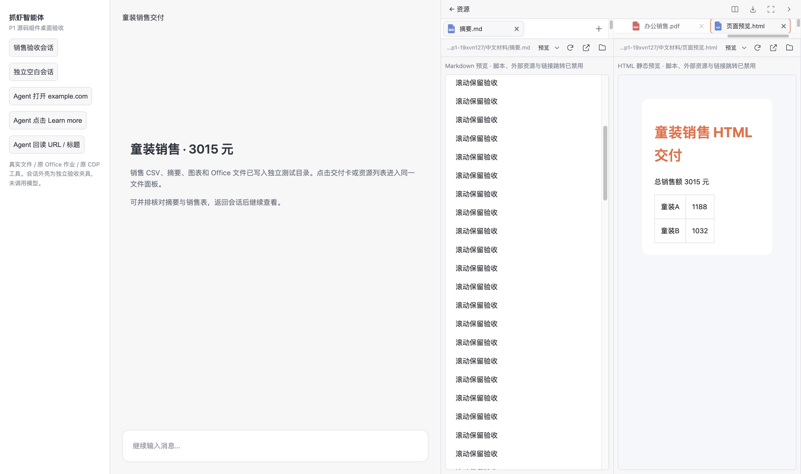

# P1 后续修复：按钮、连续阅读、HTML 与交互

2026-09-30，分支 `codex/dsh-file-preview-p1`。本轮接管复审交接改动，并完成用户追加的按钮统一、整份文件连续滚动、Harness 生成 HTML 的侧栏预览场景。未提交、推送、发布或替换安装包；未修改独立复审的 checkpoint。

> 后续真实开发客户端走查及最新界面调整见 [真实客户端报告](2026-09-30-deepseek-real-dev-preview-walkthrough.md)。已取消重复交付卡、移除 Office 重复打开按钮条及 HTML/Markdown 固定说明行。下文保留此前独立组件验收的记录。

## 最终变化与证据

| 场景 | 实现 | 实际验收 |
|---|---|---|
| 按钮大小及说明 | 面板与文件工具栏图标按钮统一 28×28 px、16px 图标；关闭/添加/导出/双栏/最大化/收起/刷新/系统打开/定位均有 title、可访问名称与悬停提示；预览方式选择器也有说明 | 全部可见图标按钮尺寸和说明断言通过；真实悬停展示“系统打开”提示 |
| 整份文件上下滚动 | PDF 的全部页面依次排列，Office 的所有预览页依次排列；删除上一页/下一页及单页切换状态；PDF 保留缩放和适宽 | 原 Office jobs 生成两页 DOCX、两页 PPTX、两个 sheet 的 XLSX；原 PDF 输出两页。鼠标 wheel 实测后续页，所有页容器存在，翻页按钮不存在 |
| 长文档开销 | PDF 附近页面按需渲染，离开阅读范围/隐藏标签时释放 canvas 和文字层；Office 页面按需加载图片，保留页占位。用户可从第一页连续滚动到最后一页 | PDF 单元测试验证隐藏时释放 raster、晚到的页读取不能重绘已取消页面；单页 raster 上限 800 万像素 |
| Harness 生成 HTML | 真正 shell 写入中文路径 HTML，再由原 artifact_present 投影；资源侧栏使用现有 DocumentPreview 静态 HTML 渲染和原文查看 | HTML 标题/金额/表格/内联 CSS 实际显示，原文包含 doctype，iframe 保持原 sandbox 隔离 |
| 标签拖放/空栏/比例/焦点 | 插入位置左右边缘标记、空栏落点反馈；同栏排序、跨栏拖动、Alt+方向键；分隔器键盘/拖动、比例持久化、取消清理；关闭页恢复邻近焦点；多标签保持宽度横向滚动 | 原 MD iframe 在跨栏与返回后 DOM 和 500px 滚动保留；同栏排序、空栏、关闭后焦点、48% 比例重新挂载恢复、窄窗均通过 |
| 浏览器浮窗 | “脱离为浮窗”接真实已有 floating 组件，而非仅 back；固定回栏与 session layout 保存；浮窗 target 不重复显示 mini | 真实浮窗/固定切换和 CDP 流重连通过，target 不变、后端动作 trace 不变 |

## 浏览器旧画面诊断的处理

独立复审观察到的旧地址现象，仍不能确定为产品缺陷：后台暂停或旧控制状态也是可能原因。本轮没有据此自动重放动作。保留“画面已暂停”、新帧恢复 connected 的状态说明，补齐异步启动失败只更新仍可见消费者的条件。

连续三次截图失败显示一次错误，恢复后清除错误。新增可执行测试验证这个阈值、失败后恢复，以及旧 capture/旧 websocket 的迟到失败或关闭不能覆盖替换流的状态。源文件为 `app/src/agentBrowser.js`、`AgentBrowserPanel.vue`；动作工具与审批边界没有新增旁路。

## 原生消息文件链接链路

`app/src/nativeResourceOpenBridge.test.js` 直接读取本地锁版依赖的真实已补丁 native chat openFile 和原 resolveWorkspacePath，执行原 slots 的 callback/postMessage 与 AgentWebView 的原 onWindowMessage 代码。中文相对路径进入资源面板；错误 origin、其他 frame、其他 session 被拒绝；dispose、`.` 目录和 standalone fallback 通过。本次实际执行该测试，没有 skip。

这是生产源码/本地编译 bundle 的可执行链路验证，运行环境中的 window/context 是隔离替身；尚未完成完整原生 DSH 聊天 DOM 中的人手点击及已安装包验收，不把它写成安装包 E2E。

## 验证

- [Node 测试](qa-2026-09-30-deepseek/harness-p1-followup/node-tests.txt)：**113 passed、0 failed、0 skipped**。
- [Vite 构建](qa-2026-09-30-deepseek/harness-p1-followup/vite-build.txt)：通过，仅原有大 chunk 提示。
- [实际 Electron 桌面结果](qa-2026-09-30-deepseek/harness-p1-followup/desktop-results.json)：全部断言通过，0 个捕获到的 renderer exception。
- [diff check](qa-2026-09-30-deepseek/harness-p1-followup/diff-check.txt)：通过。
- 本轮没有改生产 Python 服务逻辑；原轮 289 项 Python 检查记录仍在[首轮报告](2026-09-30-deepseek-p1-implementation-and-acceptance.md)，没有将其算作本轮重新执行。

[准确命令](qa-2026-09-30-deepseek/harness-p1-followup/validation-commands.json)。本轮自建后端使用 5190 与独立数据目录，创建自己的 browser target；复审的 5189/5173 与其窗口未被关闭。

## 截图

- [统一按钮与悬停说明](qa-2026-09-30-deepseek/harness-p1-followup/17-uniform-buttons-tooltips.png)
- [连续滚动 PDF](qa-2026-09-30-deepseek/harness-p1-followup/07-pdf.png)
- [Word 第二页](qa-2026-09-30-deepseek/harness-p1-followup/06-office-docx.png)、[PPT 第二页](qa-2026-09-30-deepseek/harness-p1-followup/06-office-pptx.png)、[Excel 第二页](qa-2026-09-30-deepseek/harness-p1-followup/06-office-xlsx.png)
- [生成的 HTML 预览](qa-2026-09-30-deepseek/harness-p1-followup/18-generated-html-preview.png)
- [跨栏后的空栏](qa-2026-09-30-deepseek/harness-p1-followup/15-cross-pane-empty.png)、[真实浮窗](qa-2026-09-30-deepseek/harness-p1-followup/16-browser-floating.png)

边界：本轮仍为生产组件的独立 Electron 验收，没有调用模型或构建安装包。HTML 采用静态预览，脚本、外部资源和链接跳转沿用现有限制。Office 视觉检查/最终交付门禁保留；渲染成功不等于最终交付已认证。超长文档性能未做大规模压力测试。为内存释放，离开可见范围的页面会按需重新渲染，但整份文件的顺序与滚动结构始终保留。
