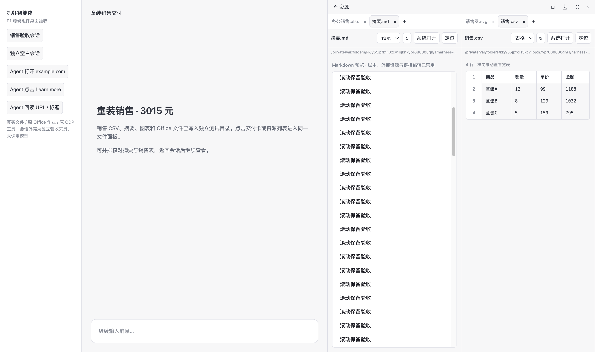
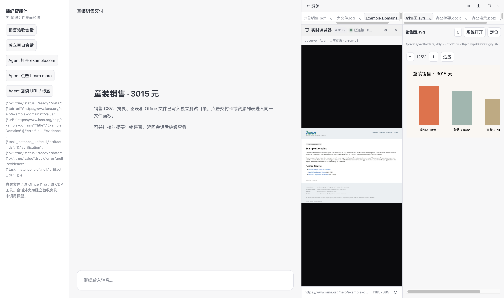

# DeepSeek 桌面体验 P1：实现与源码组件验收

后续追加要求与最新交互验收见 [P1 后续修复报告](2026-09-30-deepseek-p1-followup-ui-acceptance.md)。下文保留首轮实现记录。

日期：2026-09-30。分支：`codex/dsh-file-preview-p1`。对应 [原体验报告的 P1 清单](2026-09-30-deepseek-desktop-experience-and-followup.md)。

四项 P1 均已实现，并通过相关单元/契约测试与独立 Electron 桌面组件验收。改动留在本地工作区，未 commit、push、发布或替换已安装应用；无关工作区文件保留。DSH 仍为 `0.1.2-rc.1`，交互参考固定上游提交 `639ed015397290b3745d163aafe02ffee4aa3f84`。

## 实现及验收对应

| P1 | 最终行为 | 证据与边界 |
|---|---|---|
| 多标签、最多两栏 | 文件以完整路径识别；每会话独立标签、当前页、栏位、最大化、宽度、查看方式和图片缩放；方向键切换；单页关闭；窄窗切换栏 | MD/图片/CSV 双栏截图；切会话恢复；关闭 CSV 后另一栏 MD 的 DOM 与 500px 滚动位置保留；Vue 重新挂载后恢复 7 个标签；920px 窗口可操作 |
| 统一预览接口 | `ResourcePreview` 统一标题栏、刷新、系统打开与定位，复用 Markdown/HTML/PDF/Office；图片 25–400% 缩放；CSV/TSV 网格与原文 | 中文路径、256 KB 截断、删除图片/恢复、删除 PDF/刷新/恢复、延迟旧响应不能覆盖新内容均实测；DOCX/PPTX/XLSX 使用原 Office 作业生成并渲染 |
| 交付卡与来源 | shell 显式结构化输出、`artifact_present(paths)`、Office 和适配器投影已有文件；记录 run/tool/source；交付卡进入同一面板 | 原交付收集器回读真实文件；缺失路径跳过；shell/Office/adapter 的事件见 backend-trace；模型文字中的路径不会被猜为交付物 |
| Agent 页面与可见页面一致 | 浏览器事件包含 operation/phase/session/run/tool；实际动作后读回页面元数据；绑定原 CDP target；小窗/完整面板共享截图流 | 原 MCP 工具导航 example.com、点击 Learn more、读回 IANA URL/title，并由原 Electron 截图流显示；停止流后刷新画面保留 target，后端动作 trace 不变 |

消息文件链接通过产品回调接入同一 `openResource`。C03 compat 固定版本和唯一锚点，重复应用幂等，缺失/重复/不完整补丁会失败；可执行回归验证中文相对路径解析、会话参数传递，以及 `.` 目录入口和独立 DSH 的原打开路径。原生聊天 iframe 的完整点击链没有在已安装包中验收。

`SessionResources` 使用扁平 keyed DOM 保持活动标签；隐藏标签采用 visibility 与 inert，避免 `display:none` 让 iframe 滚动归零。当前会话打开的标签保留，其他会话最多缓存 12 个预览。旧会话布局元数据继续保存在原 `crawshrimp.sessionPanel.v2` 键中。

## 最终验证

| 检查 | 结果 | 保存日志 |
|---|---|---|
| Python：交付、服务/权限硬化、资源、Office、浏览器、自动化 API/MCP | **289 passed**；6 条现有依赖弃用警告 | [python-tests.txt](qa-2026-09-30-deepseek/harness-p1/python-tests.txt) |
| Node：资源工作区、预览、时间口径、产品契约、流交接、compat、context tools | **101 passed，0 failed** | [node-tests.txt](qa-2026-09-30-deepseek/harness-p1/node-tests.txt) |
| Vite 前端构建 | 通过；现有大于 500 KB chunk 提示 | [vite-build.txt](qa-2026-09-30-deepseek/harness-p1/vite-build.txt) |
| 可见 Electron 桌面组件验收 | 全部断言通过，0 个捕获到的 renderer exception | [desktop-results.json](qa-2026-09-30-deepseek/harness-p1/desktop-results.json)、[desktop-run.txt](qa-2026-09-30-deepseek/harness-p1/desktop-run.txt) |
| 本地运行时依赖补丁 | C03 已应用到本地依赖树 | [runtime-patch.txt](qa-2026-09-30-deepseek/harness-p1/runtime-patch.txt) |
| `git diff --check` | 通过 | [diff-check.txt](qa-2026-09-30-deepseek/harness-p1/diff-check.txt) |

准确命令见 [validation-commands.json](qa-2026-09-30-deepseek/harness-p1/validation-commands.json)。以上统计为最终选定测试的一次结果；未把不同轮次重复通过数相加。

## 桌面证据

验收夹具直接加载生产 Vue 组件，使用独立临时数据目录、真实文件、原 Office jobs/随包 LibreOffice、原 Python MCP 浏览器工具和原 Electron CDP 流。会话外壳是开发夹具，没有请求模型。测试审批回调用于隔离 QA 作业，不能证明真实审批卡交互。刷新旧响应、文件删除及截图流停止均为实际故障注入。

- [交付卡](qa-2026-09-30-deepseek/harness-p1/01-delivery-card.png)
- [Markdown/图片双栏](qa-2026-09-30-deepseek/harness-p1/02-markdown-image-split.png)、[CSV 网格](qa-2026-09-30-deepseek/harness-p1/03-csv-grid.png)、[CSV 原文](qa-2026-09-30-deepseek/harness-p1/04-csv-source.png)
- [会话恢复](qa-2026-09-30-deepseek/harness-p1/05-session-restored.png)、[窄窗口](qa-2026-09-30-deepseek/harness-p1/09-narrow-window.png)
- [DOCX](qa-2026-09-30-deepseek/harness-p1/06-office-docx.png)、[PPTX](qa-2026-09-30-deepseek/harness-p1/06-office-pptx.png)、[XLSX](qa-2026-09-30-deepseek/harness-p1/06-office-xlsx.png)、[PDF](qa-2026-09-30-deepseek/harness-p1/07-pdf.png)
- [大文件截断](qa-2026-09-30-deepseek/harness-p1/08-large-file.png)、[缺失文件](qa-2026-09-30-deepseek/harness-p1/13-missing-file.png)、[刷新与过期响应隔离](qa-2026-09-30-deepseek/harness-p1/14-refresh-stale-isolation.png)
- [example.com 导航](qa-2026-09-30-deepseek/harness-p1/10-agent-example.png)、[实际 IANA 页面](qa-2026-09-30-deepseek/harness-p1/11-agent-visible-iana.png)、[流交接与重连](qa-2026-09-30-deepseek/harness-p1/12-browser-stream-handoff.png)
- [文件与 Office 后端 trace](qa-2026-09-30-deepseek/harness-p1/backend-trace.json)、[浏览器动作/读回 trace](qa-2026-09-30-deepseek/harness-p1/browser-trace.json)





## 复现

需要已有 app dependencies、Python venv、随包 Python/Office runtime，以及现有浏览器 CDP 服务。开发端口为 5173/5189。后端脚本启动后会输出 `QA_READY`，等待它完成 Office 生成再运行桌面驱动。

```sh
venv/bin/python scripts/file-workspace-qa-server.py
```

在另一终端运行 `cd app && npm exec vite -- --host 127.0.0.1`，然后从仓库根目录运行 validation-commands.json 的 desktop 命令。桌面驱动打开独立 Electron 窗口并保存截图与结果；后端退出时只关闭自己创建的浏览器 target，测试文件和证据保留。

## 仍有边界

- 这是源码组件桌面验收，未完成安装包构建/分发、整套 DSH 原生聊天集成、完整模型调用、真实登录站点或业务提交验收。
- Office 预览保留“视觉检查尚未完成”与原交付门禁；本次渲染与人工查看截图不等同于完成 Office 最终交付认证。
- 标签布局、原文方式和图片缩放可恢复；iframe 滚动依赖仍缓存的运行中 DOM，不保证重启、收起隐藏或缓存淘汰后的滚动恢复。PDF/Office 阅读器内部页码与缩放未写入工作区持久化。
- 文本最多 256 KB，CSV 最多 1000 行/100 列，图片最多 32 MB；完整内容仍用系统打开。HTML/Markdown 继续采用原静态隔离边界。
- 文件身份使用完整路径，跨平台分隔符统一；未新增文件移动追踪、大小写/符号链接合并。任意目录链接可能进入不支持预览提示；原生 `.` 目录入口保留原打开行为。
- 双栏中浏览器显示完整目标 viewport 缩略图，细节较小；最大化/合并可扩大。重连只重启截图流，动作失败仍明确标记待核实且不自动重放。

验收辅助进程结束后，文件哈希清单保存在 [evidence-sha256.json](qa-2026-09-30-deepseek/harness-p1/evidence-sha256.json)。
