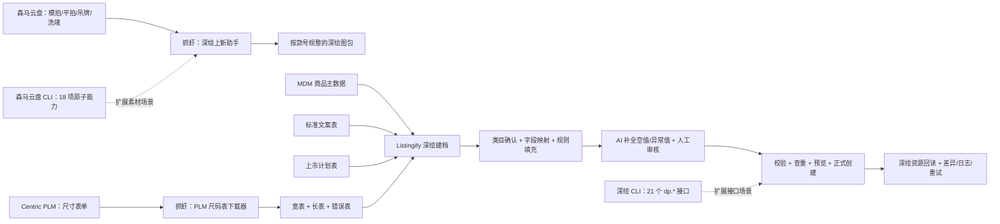

# 深绘上新业务价值与效率总结汇报

> 汇报日期：2026-07-20  
> 汇报范围：抓虾「深绘上新助手」、抓虾「PLM 运营助手—尺码表下载器」、Listingify 深绘建档、深绘 CLI、森马云盘 CLI  
> 核心主题：把跨系统、靠经验、重复手工处理的深绘上新，逐步建设成可批量、可审核、可追溯、可扩展的数据生产线。

## 一、汇报结论

围绕“深绘上新”，目前已经形成了一条从上游资料准备到深绘建档回读的完整解题链路：

1. **抓虾先解决最直接的业务堵点**：把森马云盘中的模特图、静物图、吊牌、洗唛等素材按深绘 SOP 自动整理成款号图包，减少找图、筛图、改名、合包的重复劳动。
2. **PLM 运营助手补上尺码数据断点**：在 PLM 不提供正式对接接口的情况下，复用已登录页面内的数据链路，按款号批量提取尺码表，并同时输出适合人工查看的宽表和适合系统处理的长表。
3. **Listingify 将零散自动化升级为建档编排能力**：先确定深绘类目和字段模板，再统一接入 MDM、PLM 尺码表、标准文案表、上市计划表，通过字段映射、规则填充、AI 补全、人工审核、提交校验和创建后回读形成闭环。
4. **深绘 CLI 和森马云盘 CLI 将能力开放为“积木”**：把签名、鉴权、接口调用、云盘搜索、规则选图、下载计划等底层能力标准化，让开发者和 AI agent 可以快速组合更多个性化场景，而不必每次重新开发一套固定页面。
5. **业务价值不只是“操作更快”**：更重要的是将个人经验变成组织规则，将一次性脚本变成可复用能力，将提交结果变成可审计记录，让人员从重复搬运转向异常判断和业务确认。

一句话总结：

> 这项工作的本质，是把“运营人员跨系统手工凑齐一份深绘档案”，升级为“系统批量准备标准数据，人员只审核例外并确认发布”。

## 二、原始业务痛点

深绘上新并不是单一系统内的录入动作，而是一条跨森马云盘、PLM、Excel、MDM、深绘后台的多系统链路。原来的主要问题集中在以下几个方面。

### 1. 图包整理高度依赖人工经验

- 运营需要按款号在不同云盘路径中寻找模拍、平拍、吊牌、洗唛等素材。
- 同一款号可能存在多层目录、状态后缀、重复文件、白底图、包装图及其他不符合 SOP 的素材。
- 文件找到后仍需筛选、改名、合并、压缩，最后才能交给深绘上传。
- 批量处理时，一个错误往往在尾段才暴露，容易造成整批返工。

### 2. PLM 尺码表缺少正式接口出口

- 尺码表存在于 PLM 页面和内部数据对象中，但没有可直接用于系统集成的正式业务接口。
- 人工逐款查看、截图、复制或导出，效率低且容易抄错。
- 即使拿到 Excel，也要再次整理才能用于深绘字段映射。
- 不同款号、阶段、修订版和测量点如果没有来源信息，后续很难追溯。

### 3. 多张业务表格彼此不对齐

- MDM、PLM 尺码表、标准文案表、上市计划表分别保存商品事实的一部分。
- 同一含义可能有多种表头写法，同一字段也可能在不同表格中重复或缺失。
- 深绘不同类目的字段模板、必填要求和枚举值不同，不能靠一套固定列直接覆盖。
- 运营需要在多张表与深绘后台之间反复复制、判断和补空字段。

### 4. 提交成功不等于业务闭环

- 接口或页面提示成功，并不一定意味着深绘档案字段、SKU、尺码表和素材已经正确落地。
- 失败时如果没有请求、来源、字段、回读差异和重试记录，排查成本很高。
- 个性化需求一多，固定页面和一次性脚本会迅速膨胀，难以维护。

## 三、整体解题架构

这条链路可以概括为四层：

| 层级 | 能力载体 | 主要解决的问题 | 标准交付物 |
| --- | --- | --- | --- |
| 素材标准化 | 抓虾「深绘上新助手」 | 图包靠人工查找、筛选、改名、合包 | 按款号规整的待上传图包、处理结果表 |
| 尺码数据化 | 抓虾「PLM 运营助手—尺码表下载器」 | PLM 没有正式接口，尺码数据难批量复用 | 宽表、长表、错误表及来源信息 |
| 建档编排化 | Listingify「深绘建档」 | 多源表格与深绘模板无法稳定对齐 | 有来源、有规则、有审核状态的建档草稿 |
| 能力积木化 | 深绘 CLI、森马云盘 CLI | 固定流程难覆盖个性化和临时需求 | 可 dry-run、可组合、可审计的原子能力 |

## 四、建设演进过程

### 业务主线

| 时间 | 建设阶段 | 关键结果 | 业务意义 |
| --- | --- | --- | --- |
| 2026-04-27 | 抓虾上线深绘上新助手 | 首次把云盘素材按深绘上新 SOP 自动整理 | 先解决最耗人工的图包准备问题 |
| 2026-05 至 2026-06 | 图包能力持续稳定 | 加入 PDF 截图、素材源选择、鞋类标签识别、失败重试、特殊目录后缀识别 | 从“能跑”升级为“能处理真实复杂目录” |
| 2026-06-24 至 2026-06-25 | 深绘 CLI 建设 | 建立接口注册表、签名、配置、授权计划、Java SDK bridge、商品内容抽取 | 把深绘底层调用沉淀为安全复用能力 |
| 2026-06-25 | 森马云盘 CLI 建设 | 建立搜款、搜图、目录探查、规则选图、下载计划与 agent 协议 | 把抓虾中的云盘经验开放给更多场景 |
| 2026-06-25 起 | Listingify 深绘建档闭环 | 建立草稿、字段、SKU、校验、查重、创建、回读和日志 | 从“准备资料”走向“可治理的商品建档” |
| 2026-06-27 至 2026-07-03 | 多源表格与字段规则接入 | 上市计划、标准文案、字段映射、异步导入和校验逐步落地 | 将分散 Excel 变成可复用业务数据 |
| 2026-07-03 | 抓虾上线 PLM 尺码表下载器 | 批量提取指定阶段尺码表，输出宽表和长表 | 补上 PLM 没有正式接口的关键断点 |
| 2026-07-06 起 | Listingify 接入 PLM 尺码表与 AI 映射 | 尺码测量点映射、预览、人工审核、AI 推荐与草稿回填 | 将尺码表纳入深绘建档主流程，而非独立附件 |
| 2026-07-15 至 2026-07-16 | 类目决策与回读继续收紧 | 深绘类目推荐、业务优先级、发布可靠性和表单资源回读继续完善 | 降低错类目和“假成功”风险 |

### 演进逻辑

整个建设过程不是一次性规划出“大而全平台”，而是沿着真实业务断点逐步推进：

1. 先解决“资料拿不到、图包理不清”。
2. 再解决“表格之间对不上、字段填不全”。
3. 再解决“如何安全创建、如何确认真的创建成功”。
4. 最后把成熟规则拆成 CLI 原子能力，支持更多临时和个性化需求。

## 五、抓虾：深绘上新助手

### 1. 产品定位

深绘上新助手解决的是上新前最重的素材准备工作：根据款号从森马云盘定位静物图与模特图，按深绘 SOP 过滤、命名、合并和打包，并提供可追踪的结果清单。

当前包含三个连续能力：

1. **PDF 批量截图**：将吊牌、合格证、洗唛 PDF 批量截图和裁切为深绘可用的 `yq` 图片。
2. **整理深绘上新图包**：从静物图和模特图路径按款号定位素材，过滤不可用文件，按款号整理或压缩。
3. **上传深绘图片包**：在深绘图片包上传页按款号匹配产品，先 dry-run 校验，明确切换后才执行真实上传。

### 2. 解决的关键问题

- 支持款号和款色编码批量输入，不再逐款手工搜索。
- 支持静物图、模特图单独选择或合并处理。
- 识别多层目录以及“款号 + 状态后缀”等真实目录命名。
- 按 SOP 过滤白底图、包装图、`m/M` 开头图等不应进入模特图包的素材。
- 识别吊牌、洗唛和 PDF，按 `yq` 规则整理。
- 按云盘路径去重，降低重复素材进入图包的风险。
- 输出逐文件处理结果，失败项可按原路径精确重跑。
- 下载支持并发处理，当前图包任务默认并发数为 8。
- 真实上传前保留 dry-run 安全闸门。

### 3. 业务价值

- **效率价值**：把“逐文件夹查找 + 人工筛选 + 改名 + 合包”变成“批量输入款号 + 系统处理 + 人员看结果”。
- **质量价值**：统一执行同一套 SOP，减少不同人员因经验差异造成的错图、漏图、错命名。
- **返工价值**：失败记录能够精确重跑，不必整批重新开始。
- **交接价值**：输出的是标准图包和明细表，新人不需要先掌握全部云盘目录经验才能参与。
- **安全价值**：整理、校验与真实上传分开，降低误传生产数据的风险。

## 六、抓虾：PLM 运营助手—尺码表下载器

### 1. 产品定位

尺码表下载器解决的是“PLM 页面里有数据，但没有正式对接接口”的问题。它复用运营人员已经登录的 PLM 页面，通过 PLM 自身页面使用的 `/csi-requesthandler/RequestHandler` 数据链路，从款式 `DataSheets` 定位 `SizeChart`，再解析修订版、测量点、尺码和尺码值。

这不是要求 PLM 先做系统改造，而是在现有权限和现有页面基础上，为业务建立一个可批量使用的数据出口。

### 2. 输出设计

| 输出 | 主要用途 | 特点 |
| --- | --- | --- |
| 宽表 | 运营查看、人工校对 | 每个测量点一行，尺码展开为动态列，更接近传统尺码表阅读习惯 |
| 长表 | 系统解析、字段映射、统计 | 每条记录对应“款号 + 测量点 + 尺码 + 尺码值”，适合程序处理 |
| 错误表 | 异常定位和重跑 | 保留款号、阶段、链接、状态、抓取结果和备注 |

下载器支持：

- 多款号批量输入与自动去重。
- 默认获取“大货”阶段，也可指定初版、内评、订货等阶段。
- 保留款号、款式、尺码表阶段、修订版、测量点、公差、尺码值和抓取时间。
- 输出到用户指定目录，或使用抓虾默认任务输出目录。
- 对多款、多阶段、多修订版进行明确区分，避免数据混淆。

### 3. 已验证的数据规模

Listingify 的尺码表映射验证材料中，真实 PLM 文件去重后包含 **604 条尺码明细**，原始文件另有 **6 条重复记录**。这说明该能力已经用于真实的多款、多测量点数据，而不是单款演示。

需要说明：604 条是当前留存样本的明细规模，不等同于日常或年度总吞吐量。

### 4. 业务价值

- **绕开等待成本**：无需等待 PLM 提供新的正式接口，即可先形成稳定数据出口。
- **减少抄录错误**：由系统读取页面数据对象，替代人工逐单元格复制。
- **一次采集、多处复用**：同一份长表既能用于 Listingify 尺码映射，也能用于检查、统计和后续其他系统。
- **保留数据血缘**：阶段、修订版、链接和抓取时间都可追溯。
- **异常可管理**：抓取失败不再依赖口头反馈，而是进入错误表并可重新处理。

## 七、Listingify：从“多张表”到“深绘建档闭环”

Listingify 的解题重点不是再做一个表单录入页面，而是建立一套可长期维护的建档编排模型。

### 1. 第一步：先确定类目，再加载目标字段模板

深绘不同类目的必填字段、枚举值和尺码表要求不同，因此不能先填字段、最后再选类目。Listingify 的处理顺序是：

1. 同步深绘类目树与 `dp.trade.fields` 字段模板。
2. 从上市计划表中的官方、唯品、抖音类目信息提取业务线索。
3. 结合平台覆盖、语义匹配和业务优先级推荐深绘类目。
4. 高置信且无冲突时可进入自动应用路径；中低置信、来源冲突或没有匹配时要求人工选择或确认。
5. 类目确定后，再按该类目的真实模板生成字段和校验要求。

这一步的价值是避免“字段已经填了一半，最后发现类目错了而全部返工”。

### 2. 第二步：把字段来源变成明确规则

Listingify 建立了字段映射规则，明确每个深绘字段的来源类型、来源表、来源字段、默认值、阻断属性和备注。当前主要来源包括：

| 来源 | 典型数据 | 在建档中的作用 |
| --- | --- | --- |
| MDM 商品主数据 | 款号、SKC、SKU、颜色、尺码、价格等 | 提供商品与变体的基础事实 |
| 上市计划表 | 上市时间、发布类目、渠道、季节、吊牌价等 | 提供类目决策和运营节奏数据 |
| 标准文案表 | 搜索标题、唯品标题、内容平台标题、推荐理由、FAB、面料/材质、细节文案等 | 提供商品文案和内容表达 |
| PLM 尺码表 | 测量点、尺码、尺码值、公差、阶段和修订版 | 生成深绘尺码表类结构字段 |
| 固定值/业务规则 | 配送、发货、通用枚举等 | 处理稳定且可规则化的字段 |
| 人工判断 | 冲突类目、特殊商品和高风险字段 | 保留业务决策权 |

字段映射的核心价值，是把“这个字段应该从哪里抄”从个人记忆转成系统规则。

### 3. 第三步：规整多种 Excel，而不是要求业务先改模板

Listingify 对来源表做兼容和规整：

- 兼容不同表头别名，例如“标准文案”“标准文案表”“文案表”统一识别为文案来源。
- 支持错位表头、跨页签解析和多批次导入。
- 将上市时间、官方/唯品/抖音发布类目等字段转成结构化数据。
- 将 PLM 宽表/长表聚合到款号维度，再生成深绘需要的对象结构。
- 将导入批次、来源行和草稿关联，避免后续读取到同款号的历史脏数据。
- 对缺失 MDM 的款号自动排队同步，再生成建档草稿。
- 导入和同步进入全局异步任务中心，关闭弹窗后仍能查看完成数、失败数和结果。

这意味着业务可以继续使用熟悉的工作表，系统负责吸收模板差异，而不是把数据清洗压力重新推回运营人员。

### 4. 第四步：规则优先，AI 处理空值和异常值

Listingify 的 AI 不是无条件生成整份商品档案，而是放在规则处理之后，主要处理以下候选：

- 当前值为空的字段。
- 当前值不符合深绘枚举模板的字段。
- SKU 颜色需要映射为深绘颜色别名的字段。
- 规则无法稳定匹配的尺码表目标字段。

AI 补全具备以下约束：

- 字段模板和候选枚举会进入上下文，AI 不能随意输出不受支持的值。
- 补全结果记录来源和置信度，区分 `AI_SUGGESTED` 与规则兜底。
- 已有有效值、JSON 结构字段和不适合 AI 处理的结构性字段会被跳过。
- 尺码表 AI 映射必须从真实 PLM 测量点中选择，不能编造测量点或尺码值。
- 中低置信和未匹配项保留人工审核入口，人工确认后的映射才用于重新生成草稿。

因此，AI 的定位是“减少低价值查找和初稿填写”，而不是替代业务对类目、尺码和关键字段的判断。

### 5. 第五步：建立创建与回读闭环

Listingify 将正式建档拆成清晰的控制阶梯：

1. 生成建档草稿。
2. 执行必填、枚举、SKU、价格和字段模板校验。
3. 调用深绘查询能力进行重复档案检查。
4. 生成提交预览，让业务看到即将提交的内容。
5. 明确确认后，通过 Java SDK bridge 执行正式创建。
6. 创建后调用 `dp.product.resource` 回读表单资源。
7. 保存请求标识、提交日志、状态、回读结果、差异和重试记录。

这一步把“接口返回成功”升级为“深绘侧已经可回读且内容一致”，显著提高结果可信度。

### 6. Listingify 的核心业务价值

- **统一事实入口**：多个系统和 Excel 不再各自为政，而是进入同一建档草稿。
- **减少重复搬运**：字段按来源与规则自动填充，人员主要处理缺失和冲突。
- **提前发现问题**：错类目、缺模板、缺必填、枚举不匹配等问题在提交前暴露。
- **降低发布风险**：查重、预览、显式确认和创建后回读形成多重安全闸门。
- **可持续优化**：人工审核结果可以反向沉淀为更稳定的映射规则。
- **可审计**：来源批次、字段来源、AI 来源、人工覆盖、提交和回读均有记录。

## 八、附加 CLI 能力：把成熟能力开放给更多个性化场景

### 1. 深绘 CLI

深绘 CLI 面向开发者和 AI agent，统一封装深绘开放平台的配置、签名、调用、风险授权、结果归一化和敏感字段脱敏。

当前代码注册表覆盖 **21 个 `dp.*` 接口**，涉及：

- 商户与平台信息。
- 深绘类目和类目字段模板。
- 商品创建、更新、增量更新、查重和资源回读。
- 商品图片、详情页、分发、颜色等能力。

其关键设计包括：

- 默认 dry-run，先显示将要执行的参数和动作。
- 只读接口与写入、付费、慎用接口采用不同风险等级。
- 高风险调用必须先生成计划，得到明确授权后再使用 `--yes` 执行。
- 商品创建、更新和资源回读使用 Java SDK bridge，降低手写 JSON 与 SDK 实体映射不一致的风险。
- 大体量商品资源响应可提炼为摘要、SKU、图片和详情页等适合业务和 agent 消费的结构。
- 凭证与配置分离，计划和输出中的敏感字段会脱敏。

**业务赋能场景：**

- 批量查询某批款号是否已在深绘建档。
- 拉取指定商品的图片、表单或详情页资源做质量检查。
- 为一次性迁移、补数或专项审计生成可审核执行计划。
- 让 AI agent 在受控授权下组合深绘能力，而不直接接触复杂签名和原始 SDK。

### 2. 森马云盘 CLI

森马云盘 CLI 复用已登录 Chrome 会话，在页面上下文中调用云盘已有的读取能力，不读取或持久化 cookie、token 等敏感信息。

当前注册 **18 项原子能力**，包括：

- 登录会话探测、路径解析、款号规范化和挂载点解析。
- 文件列表、搜索、详情、预览 URL 和下载 URL。
- 图片目录探查、规则筛选和素材分类。
- 图片下载计划、规则下载计划、清单下载计划与显式执行。
- 深绘素材 SOP 分类和深绘图包计划。

CLI 同时支持 `table`、`json`、`ndjson`、`csv`、`md` 输出，便于人员查看、脚本衔接和 AI agent 组合。

其安全边界是：

- 默认只读。
- 先探查、先生成计划，再显式下载。
- 不执行上传、删除、移动、重命名、分享等外部可见修改。
- 临时签名 URL 不进入代码仓库或固定文档。

**业务赋能场景：**

- 新季度目录结构变化时，快速探查并验证新的选图规则。
- 按款号批量查找尺码表、包装图、平拍、模拍和设计源文件。
- 按“全身图、静物图、指定文件名”等临时业务规则下载图片。
- 将云盘搜索和下载计划交给 AI agent，与 Excel、深绘 CLI 或其他处理工具组合。

### 3. 为什么 CLI 是产品能力的一部分

固定助手适合高频、稳定 SOP；CLI 适合长尾、临时和跨系统组合需求。两者结合后形成：

- 高频流程由产品页面承载，降低业务使用门槛。
- 新场景先用 CLI 快速验证，不必等待完整页面开发。
- 验证稳定的 CLI 组合可以再沉淀为抓虾或 Listingify 的正式功能。
- 同一套规则和安全边界可以在人员、脚本和 AI agent 之间复用。

## 九、业务价值与效率提升总结

| 价值维度 | 原来 | 现在 | 直接收益 |
| --- | --- | --- | --- |
| 素材准备 | 人工逐目录找图、筛图、改名、合包 | 按款号批量定位、SOP 过滤、并发下载、标准打包 | 缩短准备链路，减少错图漏图 |
| 尺码获取 | 人工逐款查看或复制 PLM 页面 | 批量读取并输出宽表、长表、错误表 | 减少抄录与二次清洗 |
| 表格处理 | 多份 Excel 反复复制粘贴 | 表头兼容、跨页签解析、批次导入和结构化存储 | 减少重复搬运，保留来源 |
| 类目决策 | 依赖个人经验，错了后面整体返工 | 来源类目 + 平台覆盖 + 语义推荐 + 人工确认 | 更早发现错类目和冲突 |
| 字段填写 | 人工逐字段查资料、补空值 | 来源映射、规则填充、AI 补全、人工审核 | 标准字段自动完成，人员处理例外 |
| 尺码映射 | 人工把 PLM 测量点对应到深绘字段 | 规则匹配 + AI 候选 + 人工确认 + 预览 | 降低错配与编造风险 |
| 提交发布 | 页面操作或接口返回后人工猜测结果 | 查重、校验、预览、授权、创建、资源回读 | 降低重复建档和假成功 |
| 异常处理 | 依赖口头反馈或整批重跑 | 错误表、失败项重跑、日志、回读差异 | 缩小排查范围，降低返工成本 |
| 个性化需求 | 每个需求单独开发脚本或页面 | 21 个深绘接口 + 18 项云盘原子能力 | 更快响应长尾业务需求 |
| 组织能力 | 经验集中在少数熟练人员 | SOP、映射、审计和工具化能力沉淀 | 降低人员依赖，提高可复制性 |

### 可验证的效率事实

目前可以直接由代码、配置和样本证明的效率事实包括：

- 图包整理支持多款号批量输入，并默认使用 8 路下载并发。
- PLM 尺码表一次任务可处理多款号，并同时生成宽表、长表和错误表。
- 真实 PLM 样本去重后为 604 条明细，发现并隔离了 6 条重复记录。
- Listingify 的来源表导入、MDM 同步和草稿生成可进入异步任务中心，操作页面关闭后仍可追踪进度。
- 深绘创建前有查重、校验、预览和授权，创建后有资源回读。
- 深绘 CLI 当前覆盖 21 个 `dp.*` 接口；森马云盘 CLI 当前提供 18 项原子能力。

### 暂不虚构的数字

目前没有统一留存“人工处理一款耗时、自动化处理一款耗时、一次通过率、返工率”等完整前后对照样本，因此本报告不直接宣称“节省 X% 人时”或“效率提升 X 倍”。

从流程结构上，重复查找、复制、筛选和格式转换已经被显著压缩；下一步只要持续采集实际任务数据，就可以把业务价值从定性判断升级为财务和产能口径。

## 十、建议纳入经营看板的效率指标

| 指标 | 建议公式 | 说明 |
| --- | --- | --- |
| 单款人工触达时长 | 人工实际操作分钟数 / 完成款数 | 衡量运营真正花在鼠标和表格上的时间 |
| 自动化覆盖率 | 无需人工逐字段处理的款数 / 总款数 | 衡量标准场景被系统接管的比例 |
| 首次建档成功率 | 首次创建且回读通过款数 / 首次提交款数 | 比单看接口成功更可信 |
| 字段自动填充率 | 规则或 AI 完成字段数 / 应填字段数 | 可拆为规则、AI、人工三类 |
| 人工复核率 | 需要人工确认的字段或款数 / 总字段或总款数 | 用于发现规则不足和高风险品类 |
| 图包重跑率 | 发生失败重跑的款数 / 图包处理款数 | 衡量云盘路径、素材质量和规则稳定性 |
| 尺码映射命中率 | 高置信规则命中字段数 / 尺码表目标字段数 | 衡量尺码映射成熟度 |
| 建档周期 | 从资料齐套到回读通过的时间 | 衡量整条链路，而不是单个脚本速度 |
| 异常闭环时长 | 异常产生到修复并回读通过的时间 | 衡量错误表、日志和重试能力的价值 |

建议以 20 至 50 个真实款号做一轮基线采样，分别记录人工旧流程与当前流程，之后再对外发布明确的节省比例。

## 十一、下一步建议

### P0：先建立业务效果基线

- 在抓虾和 Listingify 统一记录任务款数、成功数、失败数、重跑数、人工确认数和总耗时。
- 选取服装、鞋、套装等不同复杂度品类，形成分品类效率基线。
- 将“创建成功”统一定义为“深绘资源回读通过”，避免口径不一致。

### P1：继续提高标准场景自动化覆盖率

- 将高频人工确认结果沉淀为类目映射和字段映射规则。
- 按类目统计尺码表字段命中率，逐步将稳定的中低置信映射升级为高置信规则。
- 建立来源表字段字典和版本管理，提前识别表头变化。
- 将图包、尺码、文案、上市计划的“资料齐套状态”统一展示在款号维度。

### P1：强化端到端质量看板

- 展示每个款号当前处于资料缺失、待映射、待审核、待创建、已创建、回读异常中的哪个阶段。
- 把失败原因按云盘、PLM、来源表、类目、字段模板、深绘接口分类统计。
- 对重复失败和高返工品类形成规则优化清单。

### P2：形成“CLI 验证—产品化”的创新通道

- 个性化场景先用 CLI 组合验证价值和稳定性。
- 达到固定使用频率后，再升级为抓虾助手或 Listingify 正式工作流。
- 保持 dry-run、显式授权、脱敏、串行限流和回读验证等统一安全边界。

## 十二、最终总结

深绘上新这条线已经从“做几个自动化脚本”演进为一套分层产品能力：

- 抓虾解决素材和 PLM 数据获取问题。
- Listingify 解决多源数据治理、类目字段映射、AI 补全、审核发布和结果回读问题。
- 深绘 CLI 与森马云盘 CLI 解决能力复用和个性化扩展问题。

这套方案最重要的业务价值，是把人员从“找资料、搬数据、试字段、反复重做”中释放出来，让系统处理可规则化的标准工作，让业务人员专注于类目判断、异常处理和发布确认。

最终形成的不是一条只能处理当前季度、当前目录或当前表格的脚本，而是一套可以持续吸收新规则、新品类和新业务场景的深绘上新能力底座。

## 附录：证据基线

本报告依据 2026-07-20 本机仓库现状和 Git 历史梳理，主要证据路径如下：

- 抓虾：`/Users/xingyicheng/Documents/crawshrimp`
  - `adapters/shenhui-new-arrival/manifest.yaml`
  - `adapters/plm-ops-assistant/manifest.yaml`
  - `release-notes/v1.4.32.md`
  - `release-notes/v1.4.38.md`
  - 关键提交：`cb5663ed`、`9b242438`、`bf77ef93`、`8d13cfb5`、`23d586f0`、`db42eaa1`、`434890c4`、`de269876`
- Listingify：`/Users/xingyicheng/Documents/Listingify`
  - `README.md`
  - `web/server/services/product-archive-drafts.ts`
  - `scripts/lib/product_archive_source_importer.mjs`
  - `scripts/lib/deepdraw_field_mapping_importer.mjs`
  - `scripts/lib/listing_launch_plan_importer.mjs`
  - `scripts/lib/product_archive_size_chart.mjs`
  - `docs/deepdraw-plm-size-chart-mapping-notes-2026-07-06.md`
  - 关键提交：`6a1faae`、`fadc3ff`、`d13c1d1`、`92395c7`、`bb64673`、`eb409b7`、`fbe8f75`、`5b9220f`
- 深绘 CLI：`/Users/xingyicheng/Documents/深绘 CLI`
  - `README.md`
  - `src/core/api-registry.ts`
  - `src/core/approval.ts`
  - `src/sdk/java-adapter.ts`
- 森马云盘 CLI：`/Users/xingyicheng/Documents/semir-yunpan-cli`
  - `README.md`
  - `src/capabilities.ts`
  - `src/shenhui.ts`
  - `src/shenhui-plan.ts`

口径说明：本报告中的 21 个深绘接口和 18 项云盘原子能力均按当前代码注册表重新统计；604 条尺码明细与 6 条重复记录来自 Listingify 留存的真实 PLM 映射验证材料。
