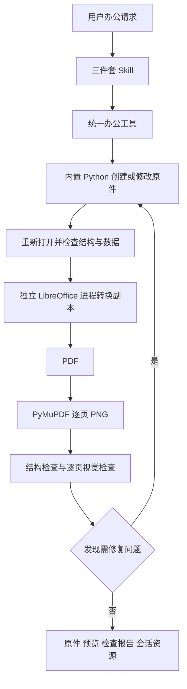

# Harness 办公三件套运行环境与逐页检查方案

日期：2026-09-09

状态：核心实现与分支回归已完成；按用户后续授权合并本地 main 后执行最终客户端与打包验收。跨平台原生验证未全部完成。

工作分支：`codex/office-suite-runtime`

独立工作区：`/Users/xingyicheng/Documents/crawshrimp-harness-office-suite`

基线：`b11b7f9c`，从当前 main 已提交状态创建，不包含原工作区未提交改动。

## 1. 目标与交付边界

用户安装 Harness 后，无需另装 Python、Microsoft Office、LibreOffice 或中文字体，即可在 Agent 对话中生成和修改 Word、PPT、Excel；生成后得到可编辑原件、逐页预览及检查结果。正常办公任务不执行在线 pip 安装。

本期明确新增 `python-docx`、`python-pptx`、`pandas`、`matplotlib`，复用已有 `openpyxl`、`xlrd`、`Pillow`、`PyMuPDF`。随包增加 LibreOffice 和中文字体，补齐统一执行工具与三件套 Skill。

本期主格式是 `.docx`、`.pptx`、`.xlsx`；已有 `.xls` 读取继续保留。提供常规文本、表格、图片、图表及公式处理。旧 `.doc/.ppt` 转换可作为尽力支持能力，不能据此承诺复杂格式无损往返。

不把 VBA、ActiveX、外部数据连接刷新、正在打开的 Office 桌面控制纳入首期。模板中的复杂对象、批注/修订、SmartArt、嵌入对象等需识别并报告兼容性风险；默认另存新文件，保留源文件。

下文保留设计契约；实现说明见 runtime-locks/README.md，实测状态见文末。设计项不能作为已验证能力。

## 2. 当前项目事实

| 位置 | 已有行为 | 本次需补齐 |
| --- | --- | --- |
| `core/requirements.txt` | 声明 openpyxl、xlrd、Pillow、PyMuPDF 等，多数使用版本下限 | 四个新库；最终运行环境的精确依赖锁 |
| `app/scripts/download-python.sh` | Python 3.12.13；支持 mac-arm64、mac-x64、win-x64；支持跨目标安装 | 基于目标锁文件安装、完整缓存指纹、四个库的检查 |
| `app/scripts/after-pack.js` | 拷贝 `Resources/python`，检查已有依赖路径 | 原生可执行检查、Office/字体资源、真实样例验证 |
| `app/src/main.js` | 给后端传入 `CRAWSHRIMP_PYTHON_EXECUTABLE` | 把内置解释器身份贯穿办公工具、渲染子进程和诊断 |
| `core/agent/service.py`、`worker.py` | 按 runtime generation 构建并传递环境 | 独立办公配置与能力状态，避免依赖继承 PATH 的偶然结果 |
| `core/agent/mcp_gateway.py` | Skill 发现/读取、文件与附件工具 | 统一办公工具；附件图片元数据不等于图像已进入模型 |
| `integrations/deepseek-harness/scripts/stage-runtime.mjs` | 复制 skills 并检查 DSH 依赖 | 三件套及公共辅助脚本的必需文件检查、指纹更新 |
| `SessionResources.vue` | 会话资源入口，已有图片预览 | 文档与 PDF、逐页图片的关联、页码和检查状态 |

上轮本机检查确认 mac-arm64 随包 Python 可以导入 openpyxl 3.1.5。这个结果不证明实际用户任务使用了同一解释器，也不证明 Windows/Intel 包可运行。

旧分支 `codex/office-runtime-skills` 已做源码参考：吸收能力发现、Skill 打包检查、生成与渲染验收思路。本次由 Harness 自己维护所需依赖，不整体复制旧方案的 Codex runtime，不增加第二套办公 Python，不以开发机 Codex 缓存作为正式构建来源。

## 3. 推荐架构



由后端协调子进程，文档生成、LibreOffice 转换和高分辨率渲染不阻塞 API 事件循环。现有 DSH/MCP 承担调用与消息传递，现有会话资源机制承担交付。无需为首期再引入独立服务或第二种调度基础设施。

一个 App 对应一套内置 Python；每次任务使用独立的工作目录、LibreOffice profile、缓存和日志。应用资源目录只读，所有临时数据写到 Harness 用户数据目录或当前会话工作目录。

## 4. 依赖与版本管理

### 4.1 运行组件

| 组件 | 决策 | 主要用途 |
| --- | --- | --- |
| Python | 保持现有 3.12.13 基线，兼容性检查后再决定是否调整 | 后端和办公脚本共用 |
| python-docx | 新增 | Word 段落、样式、表格、图片、页眉页脚 |
| python-pptx | 新增 | PPT 页面、形状、文本框、表格、图片、原生图表 |
| pandas | 新增 | 数据清洗、聚合、透视；Excel 引擎显式指定 openpyxl |
| matplotlib | 新增 | 使用 Agg 后端生成静态图表 |
| openpyxl / xlrd | 复用 | XLSX 读写、XLS 读取 |
| Pillow / PyMuPDF | 复用 | 图片加工、PDF 解析和逐页栅格化 |
| LibreOffice | 新增，每目标平台独立二进制包 | DOCX/PPTX/XLSX 转 PDF、支持范围内的公式重算 |
| 思源黑体与思源宋体 SC | 新增，优先静态 OTF/TTF 的 Regular/Bold | 统一中文排版和图表字体 |

不新增独立的 XlsxWriter、pptxgenjs、docxtpl、Poppler 或 artifact-tool 工作流；XlsxWriter 作为 python-pptx 的上游传递依赖随锁交付。传递依赖如 numpy、lxml、fonttools 必须随锁文件完整交付，不能只锁四个顶层库。

### 4.2 精确锁定方法

保留 `core/requirements.txt` 作为后端直接依赖声明；新增 `core/requirements-office.in` 声明办公直接依赖。构建时将两者以及对应 Windows 依赖联合求解，生成每平台一份完整锁，安装到现有 Python。不能分别安装两组依赖导致最后一次安装破坏前一组版本。

建议文件：

```text
runtime-locks/python/mac-arm64-py312.txt
runtime-locks/python/mac-x64-py312.txt
runtime-locks/python/win-x64-py312.txt
runtime-locks/office-assets.json
```

Python 锁包含全部精确版本和允许 wheel 的 SHA-256；安装使用 `--require-hashes`，发布构建从已准备好的 wheelhouse 离线安装，优先只接受目标 wheel。若缺少 wheel，先解决构建产物，不在用户机器编译。

`office-assets.json` 记录 schemaVersion、平台/架构、最低系统版本、Python ABI、LibreOffice 精确构建版本、下载来源、归档哈希、解包布局、可执行文件相对路径、字体版本/哈希、许可证及 runtime 指纹。字体包可以三平台共用；LibreOffice 二进制不能混用。

版本落定是 P0 的明确输出：先选有 Python 3.12 三平台 wheel 的稳定发行版本，在完整后端与办公环境联合验证后写入锁。方案阶段不虚构“已经验证”的四库版本或 LibreOffice 版本；在精确锁与原生验证完成前，不允许发布构建通过。禁止使用 `latest`、动态下载页和不含哈希的运行时下载地址。

缓存指纹包含：Python 构建、全部锁、Office manifest、字体、平台架构、构建脚本版本。任一变化都重建对应目标，防止旧 site-packages 目录存在就被当作已更新。

## 5. 随包目录与构建流程

```text
Resources/
  python/                         # 沿用现有 Python，含四个新库
  python-scripts/core/office/      # 工具实现、校验与子进程入口
  deepseek-harness/skills/
    office-word/
    office-ppt/
    office-excel/
    office-common/                # 共享规则、辅助脚本，不增加第四个用户入口
  office/
    runtime.json
    libreoffice/                  # 目标平台完整依赖布局
    fonts/
    licenses/
```

构建流程：校验锁与资源哈希 → 准备目标 Python/wheelhouse → 构建 Office 资源目录 → staging skills → after-pack 拷贝并校验 → 目标系统功能验收 → 应用签名/公证及最终安装包验收。

新增 `stage-office-runtime.mjs` 管理 Office 原生资源，与现有 Python 下载脚本、DSH staging 协作；Python 仍然只有现有一份。目录名称 `mac-*` 与 DSH 的 `darwin-*` 使用显式映射，避免平台标识误匹配。

复用 LibreOffice 官方可验证发行物或项目维护的可复现分发产物。保留所需 dylib/DLL、配置、过滤器与资源布局，先完成完整包运行，再依据测试精简；不要只复制 `soffice` 可执行文件。

macOS 上处理嵌套 app/framework/dylib 签名和公证，签名完成后不得再改 bundle；Windows 校验 DLL 和加载路径并从安装后的实际目录执行。可跨平台准备文件，但每个平台的执行验收必须在原生环境完成。无法执行的检查标为 `not_run`，不能转成成功。

LibreOffice 与字体显著增加安装体积；P0 输出压缩前后体积和各组件占比，P5 输出安装/升级耗时。未测量前不承诺具体 MB 数。纳入现有安装与升级包，不依赖首次使用下载。

许可证随包保存，并核对各组件的再分发及字体嵌入条件；复用的 PyMuPDF 同样沿用并核实项目的分发许可安排。开发机缓存可以加速下载，不能成为唯一资源来源。

## 6. 统一执行入口

### 6.1 解释器所有权

`CRAWSHRIMP_PYTHON_EXECUTABLE` 是办公 Python 的唯一权威入口。发布态必须解析到当前 App 的 `Resources/python`，校验真实路径、可执行性及 runtime 指纹；缺失时返回办公环境错误，不静默使用系统 Python。

开发态允许显式选择已按同一锁同步的项目 venv，并在诊断中标记 `development`；开发环境通过不代表发布包通过。普通办公任务不创建 venv，不向用户 site-packages 或应用资源目录安装库。

办公工具在后端使用参数数组启动绝对路径解释器，`shell=False`，不拼接 shell 字符串。通过绝对入口脚本及其受控导入路径加载实现；新进程设置 `PYTHONNOUSERSITE=1`、UTF-8、`MPLBACKEND=Agg` 和任务级 `MPLCONFIGDIR`。办公子进程清除外来 `PYTHONHOME/PYTHONPATH/VIRTUAL_ENV` 污染，再设置所需模块路径；不在全局后端环境删除项目运行所需配置。

解释器必须贯穿桌面 → 后端 → runtime → 工具 → 子脚本。Python 子脚本再开 Python 时使用 `sys.executable`，不使用 `python`、`python3`、`py`、`pip` 或 `pip3` 名称查找。

### 6.2 工具契约

| 拟新增工具 | 输入 | 输出 |
| --- | --- | --- |
| `office_runtime_info` | 无或检查级别 | 可用能力、版本、平台、解释器身份、缺失项 |
| `office_run` | 会话脚本路径、参数、工作目录、超时 | 作业 ID、退出码、有限日志、产物引用 |
| `office_render` | 文档产物 ID、页范围/打印范围 | PDF、页面清单、逐页图片、渲染诊断 |
| `office_validate` | 文档与预期数据契约 | 结构/数据/公式检查、问题清单 |
| `office_preview_read` | 作业 ID、文档 revision、页码 | 真实图像内容、页码、图像哈希与尺寸 |

`office_run` 允许执行当前授权会话中的办公脚本，不是任意 shell 转发。复用现有本地代码执行授权及路径规则；工作目录限制不是 Python 安全沙箱，不得把本工具视为新的权限隔离机制。耗时调用返回作业引用，查询/取消优先复用现有任务通道，只有缺少合适契约时才补最小作业接口。

Skill 优先调用这些工具。确需终端入口时提供同一实现的 CLI 适配层，明确平台调用语法：

```sh
# macOS，两个变量由 Harness 注入，CLI 路径为受控绝对路径
"$CRAWSHRIMP_PYTHON_EXECUTABLE" "$CRAWSHRIMP_OFFICE_CLI" doctor
```

```powershell
# Windows PowerShell
& $env:CRAWSHRIMP_PYTHON_EXECUTABLE $env:CRAWSHRIMP_OFFICE_CLI doctor
```

Persona、三件套 Skill、公共脚本同时规定：办公任务必须使用统一入口；出现 ImportError 先读取 runtime_info，正常任务不能通过裸 pip 修复。运行时缺失返回 `OFFICE_RUNTIME_INCOMPLETE`，由安装包修复流程处理。

无需为此拦截所有普通 shell 命令，也不声称字符串过滤能阻止任意 Python 安装库。保障来自工具执行路径、Skill 规则、只读 bundle 和真实 Agent 回放验收；打包依赖安装只在构建阶段发生。

## 7. LibreOffice 渲染与进程管理

每个转换作业创建独立临时目录和 profile，通过 `-env:UserInstallation=<正确编码的 file URI>` 启动 `--headless` 转换。输出写入临时目录，检查文件、页数及可解析性后再原子发布到产物目录。不能只看 exit code 或 stdout 的 “convert” 文本判成功。

默认最多两个 Office 重作业并行；低内存配置可设为一个。每个作业拥有自己的进程树、取消标识和日志，不共享 profile，不通过杀死所有 soffice 处理超时。初始默认转换超时 120 秒，可按文件大小与调用参数在上限内调整；页图分批渲染，PDF 必须先正确生成。

新上传文档和生成文件以副本打开，默认禁止宏执行及外部链接自动更新。明确选择输出过滤器，不使用用户机器的默认 Office 配置。打开外部文件仍受现有文件权限与任务授权约束。

服务退出/任务取消后清理自己启动的子进程；应用重启将遗留运行作业标记为中断，保留已生成原件，不能把旧 PDF 或旧图误认成新版本结果。重试新建 attempt 目录，先对照 revision 和哈希，不覆盖用户输入。

## 8. 中文字体与排版一致性

默认正文/表格/PPT 使用思源黑体 SC，Word 长篇正文可用思源宋体 SC；各使用 Regular/Bold 最小集合，按实际字体元数据名称引用。字体文件、字体映射和模板版本进入 runtime 指纹。

Word 同时设置 Latin 与 East Asian 字体槽位；PPT 显式设置主题/文本字体，必要时补充 OOXML 东亚字体属性；Matplotlib 直接注册随包字体文件并指定字体 family，避免只设置一个系统字体名称。测试包含中文、英文、粗体、货币符号、负号及日期。

LibreOffice 字体发现必须逐平台做实证：由平台适配器使用该版本支持的应用字体目录/字体配置加载随包字体。不能假设设置 FONTCONFIG_PATH 就能覆盖 macOS、Windows 原生字体后端，也不能假设另一个进程注册的 private 字体会自动传给 soffice。

P0 必须在未安装思源字体的干净系统上验证实际渲染与 PDF 字体信息。若某平台无法从应用自带字体目录加载，需先解决该平台字体集成再进入发布阶段；禁止默默退到系统字体、要求用户安装字体或申请管理员权限作为默认方案。

本地 PDF/预览以随包字体为依据。可编辑原件在另一台没有相应字体的电脑打开可能替换字体；字体嵌入要验证格式支持和许可，未实现时以随附 PDF 作为排版参照，不承诺跨 Office 应用像素一致。

## 9. 生成、预览、检查与修复闭环

### 9.1 输出约定

```text
<当前会话工作目录>/outputs/office/<job-id>/
  source/                  # 输入与生成脚本的工作副本
  editable/                # 最终可编辑原件
  preview/
    document.pdf
    pages/page-0001.png
    pages/page-0002.png
    contact-sheet.png
  checks/report.json
  checks/report.md
  manifest.json
```

manifest 记录 session/job/attempt/revision、原件哈希、runtime/template 指纹、类型、页数、页图哈希、打印范围、检查覆盖范围、结果和产物引用。用户主动选择导出位置时复制最终产物过去；源文件、脚本、临时日志无需全部作为用户下载项。

文档修改后递增 revision，旧预览和检查立即失效。没有生成对应 revision 的 PDF/页图和检查结果，不能保留“已检查”标签。预览按页懒加载，并通过已有会话资源鉴权提供，不暴露任意本机路径。

### 9.2 自动检查与图像检查分开

结构检查：使用对应 Python 库重新打开；验证文件结构、内容、数值、页数预期、表格规模、公式和媒体引用。结合 PDF 文本/坐标启发式标记页外对象、空白页、异常分页和缺字；这些检查不能完全证明无溢出或视觉问题。

视觉检查：将真实页面图传入支持图像的模型链路，逐页检查截断、重叠、对齐、字号、留白、对比度、图表标签与中文显示。拼图仅用于导航，不能代替单页检查。必须包含修复前后对照；自动布局修复默认最多两轮，仍有问题则列出未解决页码并交付可用原件，不无限循环。

默认检查所有 Word/PPT 页面和 Excel 配置打印范围产生的所有页面；长文档按批继续，记录待检查页与已检查页。若资源限制导致中断，则状态是 `partial`，并清楚报告覆盖范围，不能用抽样通过代表全量通过。

首期页图默认约 144 DPI，细小表格/疑似缺陷可局部或整页升级到 200 DPI。批大小、最大像素和并发可配置，避免一次把长文档全部送进上下文。

### 9.3 图像必须真正到达模型

当前附件读取对图片返回元数据，不能直接用它证明模型已看到预览。`office_preview_read` 要复用经验证的原生图像内容通道；如当前 MCP 转发不保留 image block，需补桥接并做端到端回放。

当前模型支持图像时直接检查；文本模型可使用用户已配置的视觉路由执行同一页图检查。若现有视觉桥只处理新用户图片，需要扩展到本次工具产生的页图并绑定 job/revision/page，防止旧图或其他会话图串入。无需创建子代理。

没有可用视觉路由时仍可生成原件、PDF 和页面图，结构检查照常运行，但结果必须标为“已生成预览，视觉检查未完成”，原因可为 `VISION_UNAVAILABLE`。自动逐页检查的产品验收必须在已配置视觉路由的条件下通过；“无需安装依赖”不代表无需模型配置/网络。

报告分别保存：structure、data、render、visual 的 `passed / issues / failed / partial / not_run`，视觉覆盖页码、执行时间、模型路由、图像哈希和问题。工具发送回执只能证明页面被提供；视觉通过还需对应页面的实际检查结果。两者都与原件 revision 绑定。

## 10. 三件套 Skill 规范

三个 Skill 均包含 `SKILL.md`、`references/`、`templates/`、`scripts/` 和样例输入/输出说明。共享运行规则放在 `office-common`，公共脚本可以直接运行或由 office_run 调用；运行代码与模板必须跟随 skills 一起 staging。

共同流程：读取需求与数据 → 选择模板 → runtime_info → office_run → 重新打开与 validate → render → 逐页读取检查 → 必要时修复重跑 → 交付原件与预览。规则默认自行选择合理样式，只有关键业务信息缺失才提问。

| Skill | 默认与模板 | 重点检查 |
| --- | --- | --- |
| office-word | A4；报告/方案/纪要模板；标题层级、统一页边距、页眉页脚、表格样式 | 标题孤行、跨页表头、分页、长表格、图片尺寸、东亚字体、页码 |
| office-ppt | 默认 16:9；封面/目录/图文/数据/总结母版；显式安全边距和字体层级 | 文本框越界、遮挡、图表标签、图片裁切、字号过小、主题一致 |
| office-excel | 数据/汇总/说明工作表；保留业务 ID 文本类型；冻结表头、筛选、数值格式 | 源数据一致、公式、空值、日期、前导零、金额精度、打印区域、重复表头 |

模板必须是可重新打开的真实 DOCX/PPTX/XLSX 文件，保留来源、许可和版本。共享绘图脚本集中设置字体与图表主题，避免各任务临时复制配置。

PPT 优先原生可编辑形状/表格/图表；Matplotlib 图表作为图片插入时明确其编辑能力，不能承诺每个元素都可编辑。Word 默认不承诺自动目录等字段一定能由 python-docx 直接计算，必要时转换后检查其实际更新结果。

### Excel 公式与保真规则

openpyxl 用于公式写入及结构检查，不承担计算。`data_only=True` 返回的是缓存值，缓存为空不能被解释为公式结果为零。

新生成的常规 XLSX：保留原始版本 → 用 LibreOffice 在隔离目录打开/另存重算副本 → 用 openpyxl 分别以公式模式和 data_only 模式验证关键单元格 → 通过后将重算结果作为最终原件，并从此同一版本渲染预览。

针对已有复杂 XLSX：LibreOffice 往返可能改写图表、数据验证、透视表等对象。默认保留源件，在副本上处理；用公式、合并单元格、图表数量、工作表及关键格式对比检查。若发现不支持的 Excel 特有函数、宏、外链或对象，保留缓存/待重算状态并报告，不能强制往返后声称无损。

大表格的数据校验可以全量执行，但视觉检查针对明确的打印区域/汇总页面。默认打印宽度一页、高度自动，不能把几千行强行缩成一页；隐藏工作表和不打印的数据区域要在报告中列明。计算错误检查包括 #REF!、#DIV/0!、#VALUE!、#NAME? 等，并结合任务预期允许明确解释过的错误值。

## 11. 用户看到的结果

继续从 Agent 对话发起，不增加必须填写的办公表单。会话资源中显示一个文档资源，关联“原件”“预览”“检查结果”；支持缩略图、逐页翻页、页码、下载原件和 PDF。实现时优先复用现有图片预览组件。

状态文案表达用户能理解的事实：生成中、生成预览中、检查第 X/Y 页、已检查、部分页面待检查、发现 N 处问题、预览失败。解释器路径、pip、manifest 等放在诊断中，不进入正常用户流程。

渲染失败不能阻止已生成原件的下载；视觉模型不可用不能显示“排版检查通过”。取消任务只取消对应作业，不影响其他会话；对已发布文件更新检查结果时使用 revision 进行竞争校验。

## 12. 代码改动落点

| 文件/目录 | 计划改动 |
| --- | --- |
| `core/requirements-office.in`、`runtime-locks/` | 新库声明、联合锁、原生资源 manifest |
| `app/scripts/download-python.sh` | 锁与 wheelhouse 安装、缓存指纹、依赖核验 |
| `app/scripts/stage-office-runtime.mjs` | Office/字体下载校验、解包、平台资源 staging |
| `app/scripts/after-pack.js`、`app/build.yml` | 资源拷贝、必要文件、签名与包后检查接入 |
| `core/office/runtime.py` | 解释器、资源、版本、能力诊断 |
| `core/office/executor.py`、`cli.py` | 统一子进程执行和 CLI 适配 |
| `core/office/jobs.py`、`render.py`、`fonts.py` | 作业隔离、并发、取消、LibreOffice、字体、PDF 页图 |
| `core/office/validate.py`、`artifacts.py` | 结构/数据校验、revision 和产物清单 |
| `core/agent/mcp_gateway.py` 及工具注册点 | 五个办公工具与现有授权/任务机制接入 |
| `core/agent/service.py`、`cordis_config.py` | 能力注入、统一入口规则、模型能力处理 |
| DSH profile/bridge/patch 脚本 | 仅在需要时补图像内容透传与工具产生页图的视觉链路 |
| `integrations/deepseek-harness/skills/office-*` | 三件套 Skill、共享工具、模板与示例 |
| `integrations/deepseek-harness/scripts/stage-runtime.mjs` | Skill 必需文件、公共脚本和缓存指纹 |
| `SessionResources.vue` 与资源 API | 文档分组、页图浏览、检查状态 |
| `tests/`、`app/scripts/*test.js` | 关键行为回归、原生冒烟、打包门禁 |

此表是职责划分，实施时可顺应已有模块调整文件名，避免重复实现既有任务、资源和权限系统。原工作区正在修改会话资源与 DSH 相关代码；后续合入前应重新比对这部分变化，不能整文件覆盖。

## 13. 验收矩阵与证据

### 13.1 每个平台必须执行

macOS ARM64、macOS Intel、Windows x64 分别在记录的最低支持系统与主流版本环境验证。保持本机未安装额外 Python/Office/思源字体，移除对开发机 PATH、venv、用户包和 Codex 缓存的依赖。安装后可断开包仓库网络运行全部非模型测试。

| 层级 | 验收项目 | 通过证据 |
| --- | --- | --- |
| 环境 | 实际内置解释器导入四库及复用库、pip check | 精确版本、sys.executable、模块真实路径、无用户包来源 |
| 原生资源 | soffice 版本/架构、中文字体加载、PDF 转 PNG | 原生进程结果、PDF 字体信息、中文页图 |
| Word | 生成至少 3 页中文报告，含跨页表格、图片、页码 | python-docx 重新打开、PDF/页图、页面检查记录 |
| PPT | 生成至少 5 页 16:9 演示，含长标题、图表、表格、图片 | python-pptx 重新打开、页数对应、逐页检查 |
| Excel | 数据/汇总/说明表，中文、前导零、金额、日期、SUM/IF 等公式 | 公式与缓存读回、已知计算结果、打印范围页图 |
| 编辑 | 基于既有三格式样例修改内容另存 | 原文件未损坏、关键未修改内容保持、修改内容读回 |
| 并发 | 两会话同时转换同名文件；取消其中一个 | profile/目录隔离，另一任务完成，无误杀 |
| 异常 | 缺库/缺字体/转换超时/损坏文件/只读安装目录 | 明确状态、原件保留、没有临时 pip 或系统 fallback |
| 更新 | 修改文档后重新渲染；检查旧回包 | 新 revision 生效，旧预览/检查不能覆盖 |
| 视觉 | 真实 Agent 获取页图并识别人为放入的截断/重叠 | 工具图像传输与逐页结论、修复后重新检查 |
| 桌面 | 在真实 Electron 对话中生成、翻页、下载、再打开 | 原生点击路径、资源状态、下载文件读回 |
| 交付 | 已签名/公证的安装包安装与升级 | 每平台安装包、校验和、签名与启动结果 |

视觉模型存在波动：自动测试主要检查图像传输、revision、覆盖和状态；布局缺陷识别用固定样例作集成验收，不用单次模型文字回答代替稳定单元测试。跨系统使用结构/数值/字体与人工可见结果验收，不要求 PDF 像素哈希完全一致。

### 13.2 测试范围

新增有行为意义的测试：解释器污染与路径带空格/中文、动态环境传递、超时取消、并发隔离、公式缓存、版本失效、错误状态、页图进入模型。模板做真实文件冒烟，不为文案和可逆样式写镜像实现测试。

运行受影响的 Python/Node 测试和前端构建。DSH profile/依赖 patch 发生变化时，必须做干净 `stage-runtime.mjs --force` 和原生 boot 检查；仅利用既有 node_modules 不足以验证。

每个平台产出 `validation-report.json`，含 commit、runtime 指纹、OS/架构、安装包校验和、命令/退出码、样例路径、检查结果、未执行项。发布门禁要求所有必需项通过，不接受“Mac 上可用，所以 Windows 应该也行”。

## 14. 实施顺序与完成条件

| 阶段 | 工作 | 阶段产物与完成条件 |
| --- | --- | --- |
| P0 依赖与原生验证 | 联合锁四库；选定 LibreOffice 三平台资源；字体无系统安装验证；核查旧代码可复用部分 | 精确锁、资源 manifest、体积报告、三平台最小原生转换；失败则先解决，不进入发布承诺 |
| P1 统一入口 | runtime_info、office_run、CLI、环境传递、缺失处理 | 使用被污染 PATH 仍调用内置 Python；无系统 fallback |
| P2 渲染与数据校验 | 作业隔离、LibreOffice、PDF 页图、重算、revision、结构检查 | 三格式本地真实样例及并发/取消回归通过 |
| P3 Skill 与模板 | Word/PPT/Excel Skill、公共约定、模板、生成示例 | Agent 按需求选择 Skill，通过统一入口生成并重新打开 |
| P4 视觉与交付 | 页图进模型、逐页覆盖、修复循环、资源面板 | 已配置视觉路由时真实 Electron 全链路通过；无视觉路由状态准确 |
| P5 打包与验收 | 三目标构建、原生运行、签名/公证、安装/升级 | 三平台包及完整证据；未执行平台不能标完成 |

预估为一个熟悉项目的工程师约 8–13 个工作日的实施与验证工作量，前提是三平台执行环境和签名条件可用；这是规划量，不是当前承诺的交付日期。字体与 LibreOffice 原生分发是主要不确定项，应在 P0 最先解决。机器排队、证书申请和外部依赖获取时间另计。

后续代码按阶段做窄提交；只暂存本需求路径。用户已补充授权：回归通过后合并到本地 main，并在 main 提交上进行实机和打包验收；不推送或发布。发生安装包失败时修正并重建该 runtime，不在用户运行任务时热装依赖；保留上一可用应用版本用于既有升级回退流程。

## 15. 最终完成定义

只有满足以下全部条件，才能称为“办公三件套开箱即用”：

1. 四个新库及全部依赖已固定、随包交付，三平台实际运行成功。
2. 所有正式办公工具与 Skill 使用内置 Python，受污染系统环境下也不临时安装依赖。
3. Word、PPT、Excel 均能生成、修改、重新打开，关键数据和公式结果正确。
4. LibreOffice 和中文字体随包工作，产生可解析 PDF 与完整逐页图。
5. 已配置视觉能力时，真实页图进入模型，检查覆盖与文档版本对应，发现问题可修复重验。
6. 无视觉能力、部分检查或渲染失败均准确呈现，原件仍可交付。
7. 用户可在真实 Electron 会话中查看页面、查看检查结果、下载并重新打开原件。
8. 三平台安装与升级、签名要求及验收报告齐全，未执行项不冒充通过。
