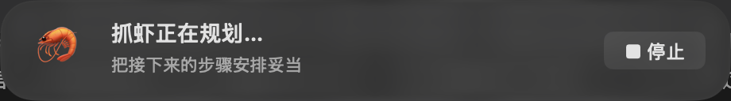
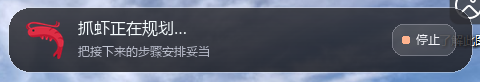

# 抓虾 Computer Use

让智能体通过统一协议操作 **macOS 与 Windows 桌面应用**：观察窗口、识别控件、执行动作，再读回结果。浏览器操作衔接已有 `crawshrimp-skill` 的 DOM/CDP 能力。

GitHub 仓库：[howtimeschange/crawshrimp-computer-use](https://github.com/howtimeschange/crawshrimp-computer-use)（私有仓库，需要访问权限）。

这是独立技能与本地执行器，当前尚未集成到 Harness 安装包。智能体入口是 [SKILL.md](SKILL.md)，安装与开发说明见本文件。





*真实提示层截图。两端均无额外矩形衬板；彩色 🦐 图标随包分发，不依赖运行时联网。*

## 能力与架构

| 层级 | macOS | Windows |
| --- | --- | --- |
| 应用接口 | 优先选择应用 CLI、AppleScript 字典、已验证 CDP | 优先选择应用 CLI、公开 COM/API、已验证 CDP |
| 桌面语义 | Swift helper：AX 观察、AXPress、AXValue | pywinauto UIA 观察/读回、Invoke/Value；已识别的 Win32 Edit/RichEdit/Button 原生消息 |
| 前台键鼠 | CoreGraphics 键鼠与 Unicode 输入 | pywinauto keyboard/mouse |
| 证据 | 窗口截图、AX/应用状态读回 | PrintWindow、UIA/应用状态读回 |
| 操作提示 | 原生透明玻璃、停止按钮、非激活视觉指针 | 中性透明 / 深蓝主题、彩色 🦐、停止按钮、非激活视觉指针 |

Python CLI 负责统一请求、观察记录、去重与多步恢复；平台 helper 执行具体桌面动作。AppleScript/应用 API 适配器由具体任务维护，通用入口不会任意执行脚本。

- **阶段提示**：9 类状态、11 组文案；读取屏幕/核对结果/应用等待随工具执行，思考与规划由智能体真实报告。普通等待每 6 秒轻换一句，减少动态效果时静止；过期阶段回到中性等待。
- **常驻指针**：同一任务的指针停留在上次位置，下一步平滑移动，显示动作光圈后继续停留；任务结束显式关闭。视觉动画不移动系统鼠标。
- **焦点管理**：语义动作尽量后台完成；具体 provider 仍可能激活应用。物理键鼠可显式借用焦点，结束尝试归还；检测接管后中断，不覆盖用户的新焦点。
- **精简观察**：短引用 `eN`、唯一 selector、查询过滤、缩略图和完整证据文件。
- **可靠恢复**：执行前保存收据，同一 `action_id` 不再投递；多步 flow 跳过已完成步骤，未知写入不自动重发。
- **能力与经验**：探测应用身份和自动化能力，显式记录版本化 profile。

Mac 26 默认使用无绿色染色的原生 clear glass，较旧系统/编译器回退为中性毛玻璃。Mac 固定此玻璃样式；Windows 可设置 `CRAWSHRIMP_CU_FEEDBACK_THEME=navy` 使用抓虾深蓝主题，在下次提示进程启动时生效。Windows 使用透明合成样式，尚无系统背景模糊或液态折射。控件读回成功与业务完成分别记录，截图变化本身不能证明业务成功。

## 安装

需要 Python 3.10+。以下命令均在本仓库根目录执行；智能体从其他目录调用时应使用脚本绝对路径。

```bash
git clone https://github.com/howtimeschange/crawshrimp-computer-use.git
cd crawshrimp-computer-use
```

### macOS

推荐 macOS 14+，准备 Xcode Command Line Tools，然后构建本机 helper：

```bash
python3 scripts/setup.py
python3 scripts/computer_use.py doctor
```

AX/键鼠需要辅助功能权限，截图需要屏幕录制权限。显式借焦点还可能需要运行宿主的“自动化 → System Events”权限。`doctor` 只检查，不修改权限；按系统设置提示授予实际运行宿主所需权限。

本机生成的 `scripts/native/mac` 不纳入 Git。迁移 CPU 架构或机器后重新构建。

### Windows

推荐 Windows 10/11 与 x64 Python；在所选虚拟环境安装依赖：

```powershell
py -3 -m venv .venv
.\.venv\Scripts\python.exe scripts\setup.py --install-deps
.\.venv\Scripts\python.exe scripts\computer_use.py doctor
```

执行器必须运行在已登录、解锁的用户交互桌面，目标应用与执行器权限相容。SYSTEM/session0 不能代替用户桌面 UIA 会话。详细说明见 [平台配置与架构边界](references/platforms.md)。

### 接入智能体与浏览器技能

把整个仓库目录交给支持本地脚本调用的智能体，加载 [SKILL.md](SKILL.md)。本项目不包含模型推理服务，也不会自动修改智能体全局配置。

浏览器任务需要另行准备已有的 `crawshrimp-skill`。非默认安装位置可设置 `CRAWSHRIMP_BROWSER_SKILL_DIR`，指向包含 `SKILL.md` 与 `scripts/web_operator.py` 的目录。然后检查桥接：

```bash
python3 scripts/computer_use.py browser -- --help
```

已有 Harness 环境应使用其配置的 `CRAWSHRIMP_PYTHON_EXECUTABLE` 对应解释器。当前没有实现自动安装到 Harness 的集成流程。

## 一次桌面任务

1. 使用 `doctor` 检查依赖和权限。
2. 列出窗口，确认应用、PID、可执行文件与目标窗口。
3. `probe` 探测能力，`observe` 保存新鲜观察。
4. 从观察中选择唯一控件，为动作提供 `expect`。
5. 执行动作并读回收据；任务完成或取消时关闭反馈进程。

```bash
python3 scripts/computer_use.py windows --app TextEdit

# 将 123 替换为刚刚确认的窗口 ID；Windows 可先按 Notepad 等名称查询。
python3 scripts/computer_use.py probe --window 123
python3 scripts/computer_use.py observe --window 123 --run-dir ./work/demo

# 按执行协议创建 work/action.json，使用刚生成的 snapshot 和控件引用。
python3 scripts/computer_use.py act --request ./work/action.json --run-dir ./work/demo
python3 scripts/computer_use.py act --request ./work/action.json --run-dir ./work/demo --execute

python3 scripts/computer_use.py feedback stop --run-dir ./work/demo
```

智能体可在实际分析或规划时更新提示：

```bash
python3 scripts/computer_use.py feedback phase --run-dir ./work/demo --phase thinking
python3 scripts/computer_use.py feedback phase --run-dir ./work/demo --phase planning
```

完整文案及阶段触发规则见 [提示与指针](references/feedback.md)。

`act` 默认预演；`--execute` 是执行开关，用户已授权的范围内无需另建确认流程。同一任务使用固定 run 目录，动作 ID 保持稳定；遇到 unknown，先观察和读回，不通过换 ID 重发。

`type` 接受单行可打印文本，多行优先使用 `set_value`。回车是独立动作，是否发送取决于目标应用和任务授权。物理键鼠默认要求前台；显式 `focus=borrow` 最多借用 8 秒，并要求最近 2 秒没有输入。视觉反馈 15 分钟无新指令会退出，但任务仍应主动 `feedback stop`。

完整请求示例、返回状态和 flow 格式见：

- [执行协议](references/protocol.md)
- [多步流程与应用档案](references/workflows.md)
- [操作提示与常驻指针](references/feedback.md)
- [浏览器与 Electron](references/browser.md)
- [应用适配](references/app-adapters.md)

## 已验证范围

以下为 **2026-09-10 已完成的回归记录**，不是所有平台/应用的兼容性保证。

| 环境 | 结果 |
| --- | --- |
| macOS 26.5.2 / Apple Silicon / Python 3.12.13 | 55 项单测；12 项自建窗口桌面回归；停止按钮与输入中取消实测通过；此前已验证 TextEdit 后台多行中文/emoji 读回 |
| Windows 11 25H2 ARM64 / UTM 4.7.5 / Python 3.12.10 AMD64 模拟运行 | 55 项单测；12 项桌面回归；停止按钮与输入中取消实测通过；此前真实 ARM64 记事本 5 项检查通过 |
| Windows 提示层 | 操作/等待状态的彩色 🦐；保持前台 HWND 和系统鼠标位置；关闭无残留 |
| 浏览器桥接 | 技能发现、`--help` 透传；未做本轮真实网页专项回归 |

Windows 回归使用 x64 Python、pywin32/Pillow，在 ARM 系统中模拟运行。该结果不能替代 Windows x64 实机验收。Mac Intel、Windows 10、原生 ARM64 Python、多 DPI/多显示器、RDP/UAC 矩阵及真人物理输入接管尚未覆盖；没有执行真实微信发送。

两端接管测试分别使用系统事件流模拟和独立进程切换前台；实际借焦点、鼠标点击、Unicode 输入与归还均已执行。详情及修复记录见 [验证记录](references/validation.md)。

当前对 Harness 的只读检查结果：Windows 打包配置只有 NSIS x64，没有原生 Windows ARM64 target；x64 Harness 在 ARM 虚拟机中的完整安装运行尚未验收。

## 开发与回归

当前共 55 项单元/合同测试；阶段提示专项覆盖文案切换、6 秒等待轮换、60 秒过期回退和新旧阶段冲突保护。

不接触桌面的协议/合同测试：

```bash
python3 -m unittest discover -s tests -v
```

真实桌面测试会创建自有窗口、改变焦点并发送输入，应在专用测试桌面运行；每次使用新的输出目录：

```bash
python3 tests/smoke_desktop.py --focus --out ./work/desktop-run-001
# 仅显示提示条；前约 15 秒请不操作键鼠，后续等待阶段过期。
python3 tests/smoke_feedback.py --out ./work/feedback-run-001

# 实际点击停止按钮；分别验证等待中取消与输入中取消。
python3 tests/smoke_stop.py --out ./work/stop-run-001
python3 tests/smoke_stop_input.py --out ./work/stop-input-run-001

# 仅 macOS：创建本任务唯一命名的 TextEdit 文档。
python3 tests/smoke_textedit.py --out ./work/textedit-run-001
```

Windows 使用其虚拟环境解释器运行同样的 `smoke_desktop.py`；独占记事本专项检查：

```powershell
.\.venv\Scripts\python.exe tests\smoke_notepad.py --out .\work\notepad-run-001
```

记事本专项要求没有其他 Notepad 进程。应用可能自动保存并恢复测试标签页，报告记录了测试文档路径。日志、截图、收据和本机编译产物均排除在 Git 之外；分享取证文件前检查其内容。

## 目录

```text
SKILL.md                    智能体工作约定与操作入口
scripts/computer_use.py     JSON CLI
scripts/setup.py            平台构建与依赖安装
scripts/cu/                 协议、观察、流程、Windows 后端与提示层
scripts/native/             macOS Swift helper 源码
references/                 协议、平台、应用适配和验证文档
tests/                      单测与自有应用桌面回归
assets/                     离线虾图标、共用阶段文案及第三方许可
docs/images/                README 使用的实际界面截图
```

## 参考与归属

- [huashu-mac-use](https://github.com/alchaincyf/huashu-mac-use)，参考版本 `4dda98c`：分层控制、后台观察、动作证据等；相关改编保留原 MIT 声明。
- [WechatAGI](https://github.com/howtimeschange/WechatAGI)，参考版本 `059032ea186ab12484663fc91211a4464d61ede5`：双平台适配、UIA/Win32 与中文输入思路；未复制微信群发业务源码。
- 既有 `crawshrimp-skill` 作为独立浏览器依赖，不随本仓库分发。
- Twemoji v16.0.1 的 U+1F990 彩色虾图标遵循 CC BY 4.0。

第三方详细出处与许可见 [THIRD_PARTY_NOTICES.md](THIRD_PARTY_NOTICES.md)。本仓库尚未为新增原创代码声明统一的开源许可证；创建本地 Git 仓库不等于公开发布。

### 顶部栏停止按钮

两端顶部栏右侧提供 **■ 停止**。点击后取消当前 `--run-dir` 的桌面操作：停止后续动作和 flow 步骤，输入在事件批次边界退出，停止观察/验证等待，关闭提示条与虚拟指针。按钮不激活窗口，其余提示区域仍穿透鼠标。

取消状态写入该目录的 `cancel.json`，不依赖动作锁或提示层 IPC 锁。已取消目录不能自动重启；重新开始任务必须使用新目录。已发送给应用的操作无法撤回，可能部分生效的动作继续保留 `unknown` 回执，同一 `action_id` 不会重发。

```bash
# 与点击顶部“停止”等效；宿主也可使用此命令取消桌面任务
python3 scripts/computer_use.py feedback cancel --run-dir work/task-001
# 读回 cancelled 状态
python3 scripts/computer_use.py feedback status --run-dir work/task-001
```

`feedback stop` 仍是正常结束时的提示层清理命令，不代表取消任务。`feedback cancel` / 按钮取消仅作用于本 skill 的当前桌面任务；Harness 需监听取消状态并接入其自身任务停止接口，才能同时停止模型推理及独立浏览器任务。本独立仓库未修改 Harness。
